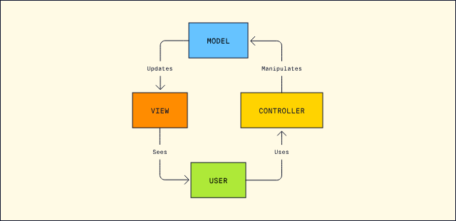

# Development patterns

## 1. Context

It's imperative to ensure that the team is aligned with and adheres to the technical constraints and concerns of the
project. This involves recognizing and addressing factors such as technological limitations, compatibility requirements,
security considerations, and performance metrics. By prioritizing this aspect, we aim to mitigate risks, optimize
resource utilization, and ensure the successful execution of the project within defined parameters.

### 2. Applied Patterns
#### Model View Controller (MVC):

* Reference: https://www.codecademy.com/article/mvc

#### Domain Driven Design:

* Reference: https://domaindrivendesign.org/ddd-domain-driven-design/

#### Onion Architecture/VCRM:

* Reference: https://www.codeguru.com/csharp/understanding-onion-architecture/

#### C4 model

* Used C4 model for visualising software architecture.
* Reference: https://c4model.com/

#### Repository Pattern (Fowler)URL:

* A Repository mediates between the domain and data mapping layers, acting like an in-memory domain object collection.
  Client objects construct query specifications declaratively and submit them to Repository for satisfaction. Objects
  can be added to and removed from the Repository, as they can from a simple collection of objects, and the mapping code
  encapsulated by the Repository will carry out the appropriate operations behind the scenes.
* Reference: https://martinfowler.com/eaaCatalog/repository.html

#### UML Pattern:

* Reference: https://www.developer.com/design/using-design-patterns-in-uml/