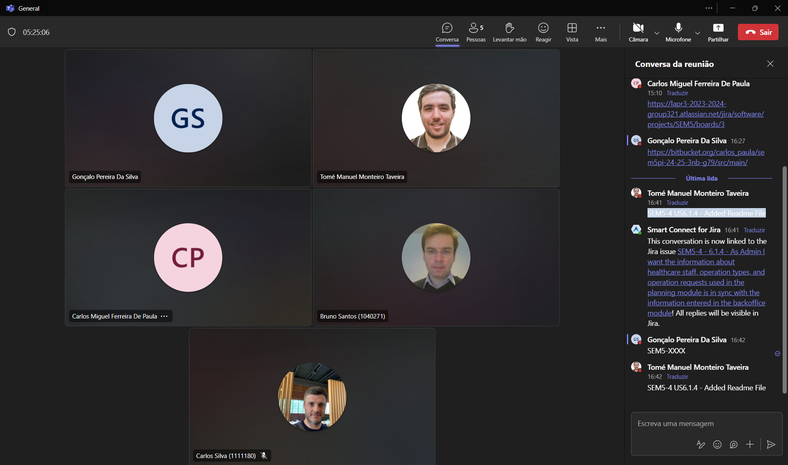
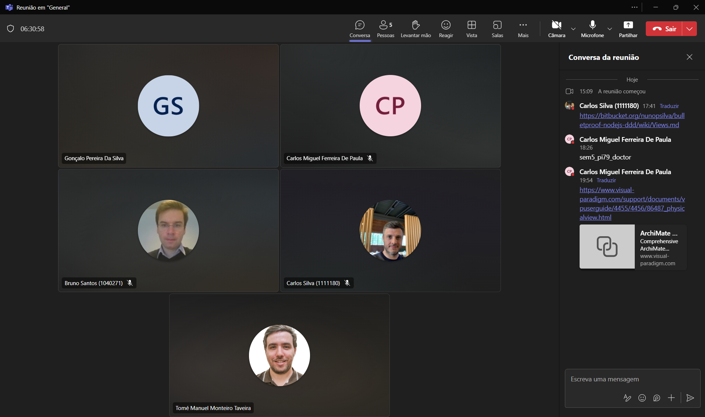
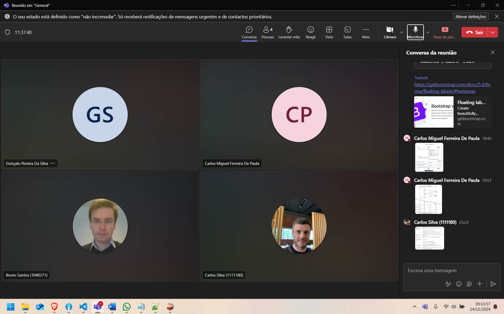
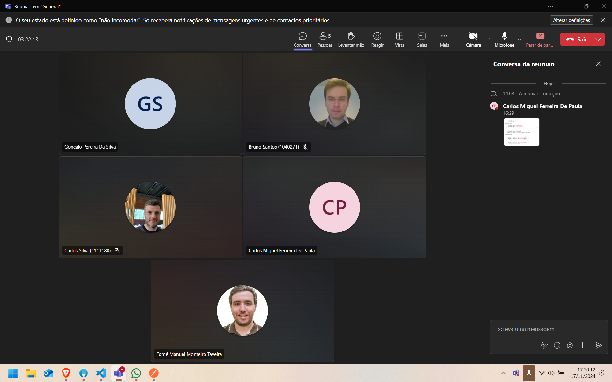
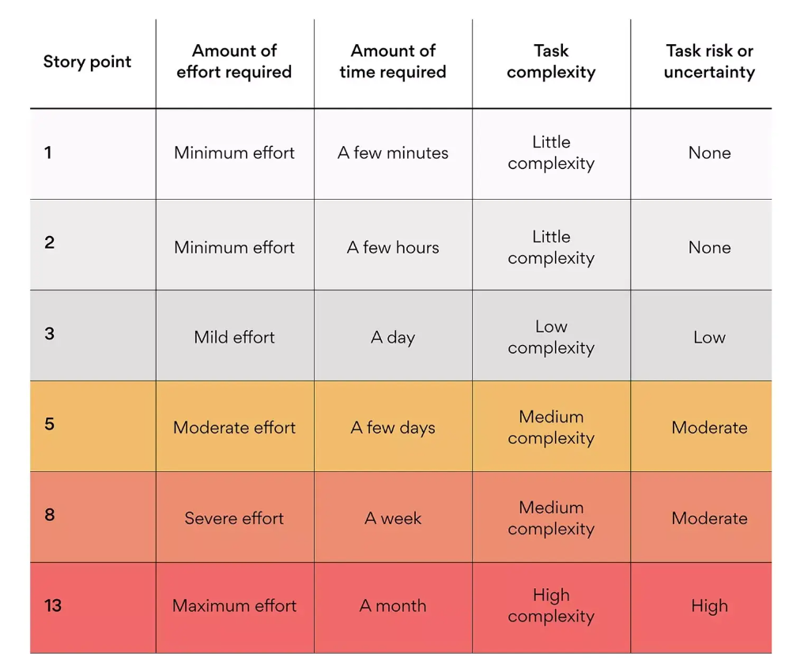

# Project Planning

## 1. Group Members

The members of the group:

| Student Nr. | Name            |
|-------------|-----------------|
| **1221719** | Gonçalo Silva    |
| **1040271** | Bruno Santos    |
| **1221721** | Tomé Taveira	|
| **1212032** | Carlos Paula |
| **1111180** | Miguel Silva     |

## 2. Task Assignment

The assignment of tasks (requirements/user stories/use cases) during the project.

| Student Nr. | Sprint 1 | Sprint 2 | Sprint 3 |
|-------------|----------|----------|----------|
| **1221719**   | [US 5.1.3](../Sprint&#32;1/US03/readme.md)    [US 5.1.4](../Sprint&#32;1/US04//readme.md)      [US 5.1.7](../Sprint&#32;1/US07//readme.md)    [US 5.1.15](../Sprint&#32;1/US15//readme.md)    [US 5.1.23](../Sprint&#32;1/US23//readme.md)|  US 6.1.3    [US 6.2.1](../Sprint&#32;2/6.2.1/readme.md)    [US 6.2.2](../Sprint&#32;2/6.2.2/readme.md)    [US 6.2.3](../Sprint&#32;2/6.2.3/readme.md)      [US 6.2.4](../Sprint&#32;2/6.2.4/readme.md)     [US 6.2.5](../Sprint&#32;2/6.2.5/readme.md)   US 6.3.3   US 6.4.2    US 6.4.3    US 6.5.1    US 6.5.4    US 6.6.1   US 6.6.2    | |
| **1040271**   | [US 5.1.1](../Sprint&#32;1/US01/readme.md)    [US 5.1.2](../Sprint&#32;1/US02//readme.md)   [US 5.1.20](../Sprint&#32;1/US20//readme.md)  [US 5.1.21](../Sprint&#32;1/US21//readme.md)  [US 5.1.22](../Sprint&#32;1/US22//readme.md)|  [US 6.1.2](../Sprint&#32;2/6.1.2/readme.md)    [US 6.2.18](../Sprint&#32;2/6.2.18/readme.md)     [US 6.2.19](../Sprint&#32;2/6.2.19/readme.md)     [US 6.2.20](../Sprint&#32;2/6.2.20/readme.md)      [US 6.2.21](../Sprint&#32;2/6.2.21/readme.md)    US 6.6.1   US 6.6.2    ||
| **1221721**   | [US 5.1.5](../Sprint&#32;1/US05/readme.md)    [US 5.1.12](../Sprint&#32;1/US12//readme.md)   [US 5.1.13](../USprint&#32;1/S13//readme.md)  [US 5.1.14](../Sprint&#32;1/US14//readme.md)  | US 6.1.4    [US 6.2.10](../Sprint&#32;2/6.2.10/readme.md)    [US 6.2.11](../Sprint&#32;2/6.2.11/readme.md)    [US 6.2.12](../Sprint&#32;2/6.2.12/readme.md)    [US 6.2.13](../Sprint&#32;2/6.2.13/readme.md)    US 6.4.1   US 6.4.5 | |          
| **1212032**	 | [US 5.1.6](../Sprint&#32;1/US06/readme.md)    [US 5.1.16](../Sprint&#32;1/US16//readme.md)   [US 5.1.17](../Sprint&#32;1/US17//readme.md)  [US 5.1.18](../Sprint&#32;1/US18//readme.md)  [US 5.1.19](../Sprint&#32;1/US19//readme.md)|[US 6.1.1](../Sprint&#32;2/6.1.1/readme.md)    [US 6.2.14](../Sprint&#32;2/6.2.14/readme.md)    [US 6.2.15](../Sprint&#32;2/6.2.15/readme.md)    [US 6.2.16](../Sprint&#32;2/6.2.16/readme.md)    [US 6.2.17](../Sprint&#32;2/6.2.17/readme.md)    US 6.3.1   US 6.4.6     US 6.4.7   US 6.5.3   US 6.6.1   US 6.6.2     | |
| **1111180**   | [US 5.1.8](../Sprint&#32;1/US08/readme.md)    [US 5.1.9](../Sprint&#32;1/US09//readme.md)   [US 5.1.10](../Sprint&#32;1/US10//readme.md)  [US 5.1.11](../Sprint&#32;1/US11//readme.md)|US 6.1.5   [US 6.2.6](../Sprint&#32;2/6.2.6/readme.md)   [US 6.2.7](../Sprint&#32;2/6.2.7/readme.md)    [US 6.2.8](../Sprint&#32;2/6.2.8/readme.md)    [US 6.2.9](../Sprint&#32;2/6.2.9/readme.md)    US 6.3.2   US 6.4.4   US 6.4.8   US 6.5.2   US 6.6.1   US 6.6.2    | |

## 3. Meetings

* Sprint 2
    * 03/11/2024:
        * General discussion about sprint 2 user stories.
        * User stories distribution and story points definition.
        * Setup of base installations for sprint 2.
        

    * 10/11/2024:
        * Discussion about general progress.
        * Testing with IAM login and roles.
        * Corrections of small details from the previous sprint that required changing to allow the front end development.
        * Documentation of planned logical, implementation and physical views.
        

    * 17/11/2024:
        * Discussion about general progress.
        * Peer help with ARQSI user stories.
        * Finalization of SGRAI user stories.
        * Start of development of ALGAV and ASIST user stories.
        

    * 23/11/2024:
        * Discussion about finalization of user stories and testing.
        * Group reading of documentation.
        * Elaboration of video for GDPR.
        * Elaboration of peer evaluation.
        * Sprint submission.
        

## 4. Story Points Definition

