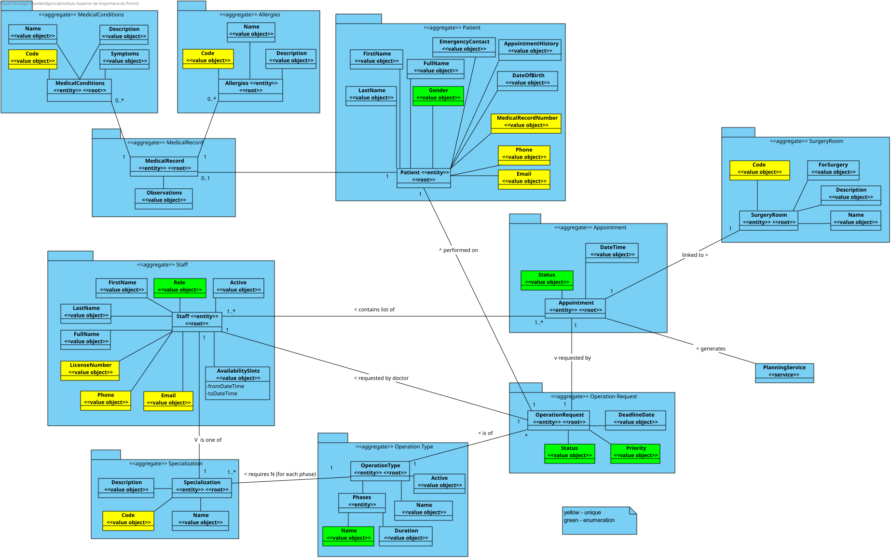

# Global Documentation

The scope of this project is to develop a prototype system for surgical requests, appointment, and resource management. The system will enable hospitals and clinics to manage surgery appointments, and patient records. It will also offer real-time 3D visualization of resource availability within the facility and optimize scheduling and resource usage. Furthermore, the project will address GDPR compliance, ensuring the system meets data protection and consent management requirements.

## Logical View
#### Level 1

#### Level 2

#### Level 3 (BackEnd)

#### Level 3 (BackEnd2)

#### Level 3 (FrontEnd)

## Implementation View
#### Level 2

#### Level 3 (BackEnd)

#### Level 3 (BackEnd2)

#### Level 3 (FrontEnd)

## Physical View
#### Level 2

## Mapping
#### Level 2

## Domain Model

## Development Patterns

[Development Patterns](./DevelopmentPatterns/readme.md)

## Glossary
[Glossary](./Glossary/glossary.md)

