# US 01

## 1. Context

* The Microsoft Entra ID application was chosen to carry out the process of registering users in the system. The Microsoft Entra ID application ensures that each user accesses the system with the correct role profile. 

## 2. Requirements

**US 01** 
As an Admin, I want to register new backoffice users (e.g., doctors, nurses, 
technicians, admins) via an out-of-band process, so that they can access the 
backoffice system with appropriate permissions. #2

**Acceptance criteria:**
* Backoffice users (e.g., doctors, nurses, technicians) are registered by an Admin via an internal 
process, not via self-registration.
* Admin assigns roles (e.g., Doctor, Nurse, Technician) during the registration process.
* Registered users receive a one-time setup link via email to set their password and activate their 
  account.
* The system enforces strong password requirements for security.
* A confirmation email is sent to verify the user’s registration.

## 3. Analysis

* Q: Can a user have both patient and healthcare staff profiles? 
  * A: No, a user cannot have both profiles. Staff and patients have separate identifications. 

***

* Q: How are duplicate patient profiles handled when registered by both the patient and admin? 
  * A: The system checks the email for uniqueness. The admin must first create the patient record, and then the patient can register using the same email.

***

* Q: Is it mandatory for patients to have a user account to schedule a surgery? 
  * A: No, patients are not required to have a user account. The system administrator creates patient profiles. 

***

* Q: Can users hold multiple roles? 
  * A: No, each user can have only one role. 

***

* Q: Do we always need to create an associated user when recording a patient profile in a medical facility? 
  * A: No. A patient profile can be created without an associated user unless it's easier technically to create an inactive user.

***

* Q: Can patients update both their user and patient profile information? 
  * A: Patients can update contact information but not medical details. Changes must be verified and validated.

***

* Q: Is authentication the primary focus of the system?
  * A: No, authentication is necessary but not the main focus. The critical functionalities of the system revolve around the other features like surgery scheduling and patient management.

## 4. Design

### 4.1. Realization

#### Level 1
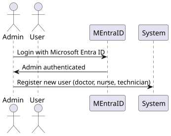
##### Level 2
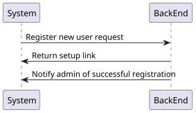
##### Level 3
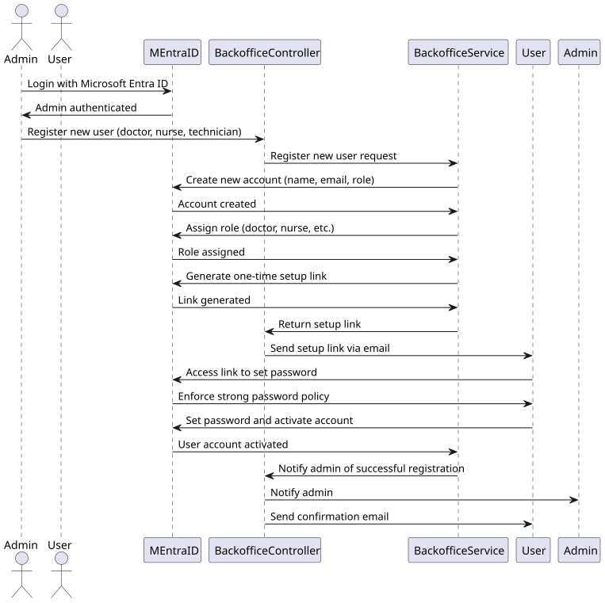

### 4.2. Class Diagram

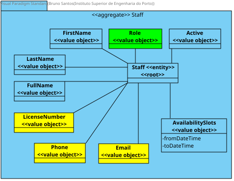

### 4.3. Applied Patterns

Applied Patterns description in [DevelopmentPatterns](../Global/DevelopmentPatterns/readme.md)

### 4.4. Tests

NA

## 5. Implementation

* Login "Microsfot Entra admin center" and select all users
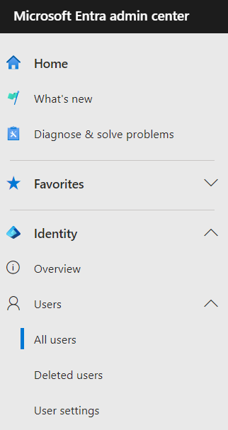

* In the user's list, select "New user"
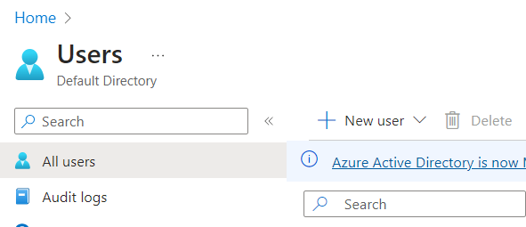

* In the drop down select "Invite external user" or "Create new user"
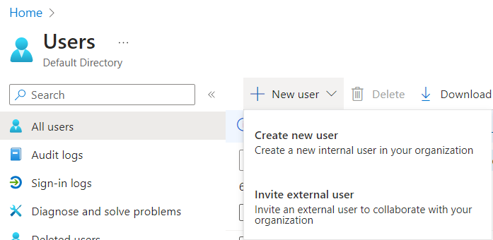

* Fill out the user information in the "Basics" tab
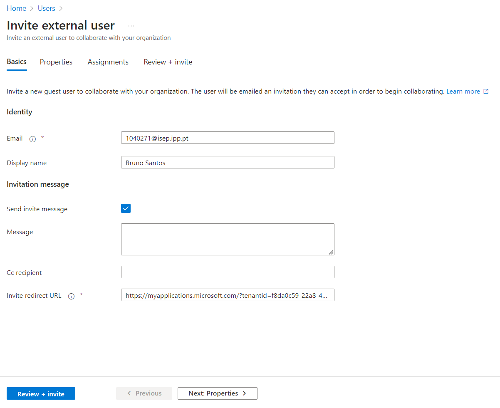

* In the "Properties" tab select the user type "Member", then click "Review + invite" to finish the invite
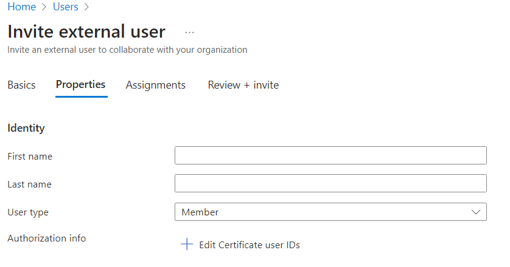

* Go to enterprise applications and select the application
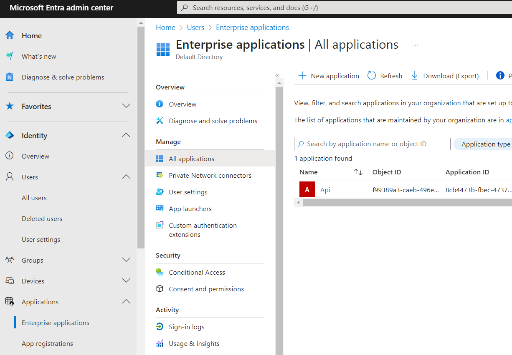

* Inside the application select "Users and groups" and then select "Add user/group"
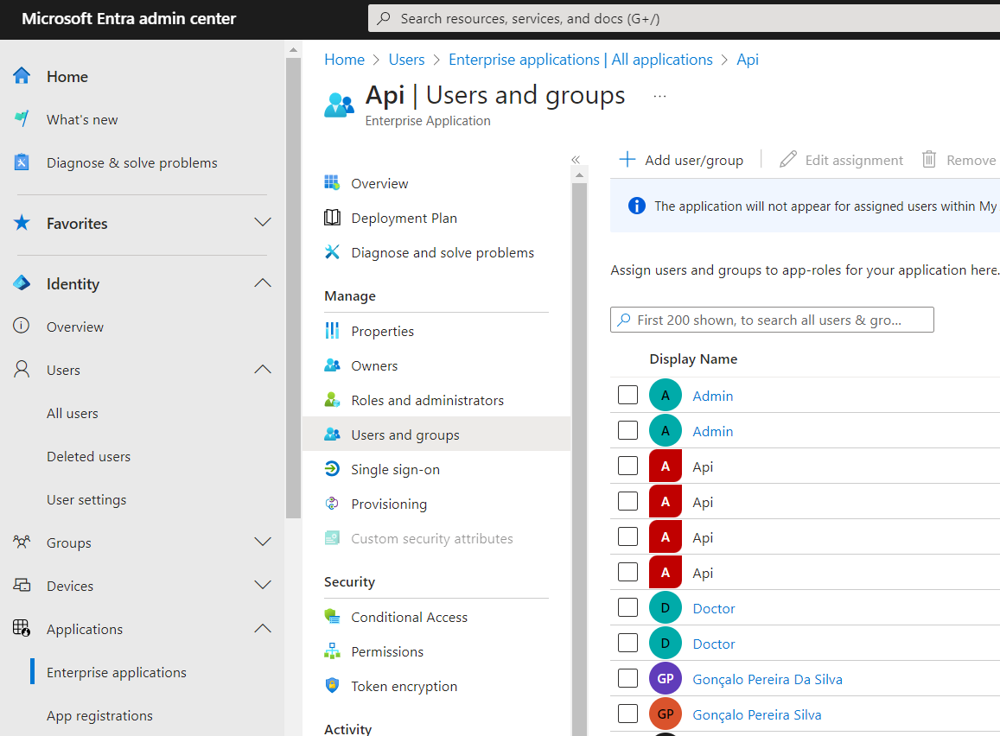

* Select the user and their role
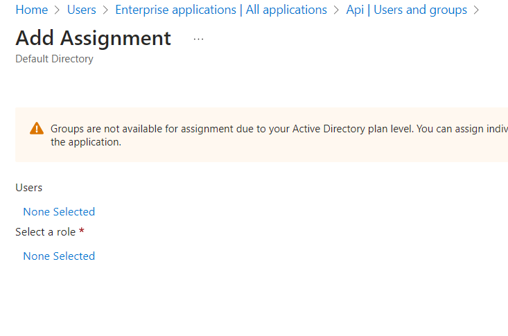

* Click "Assign"
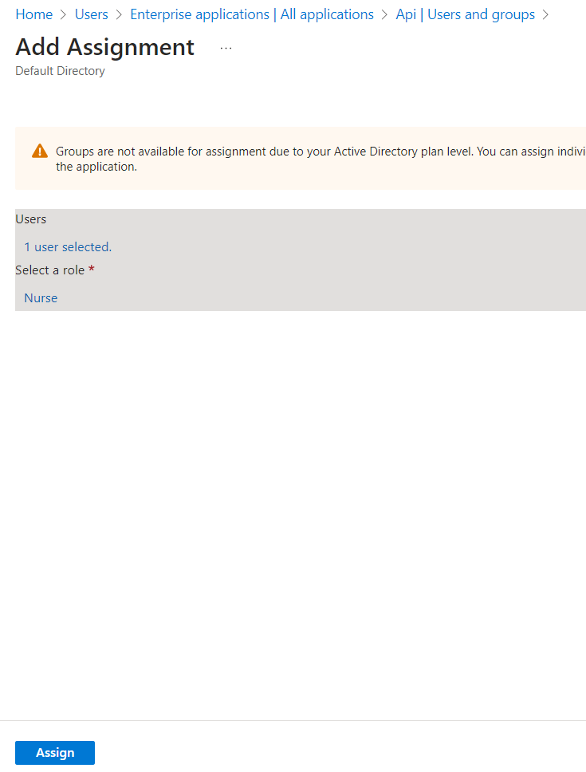

* Confirmation
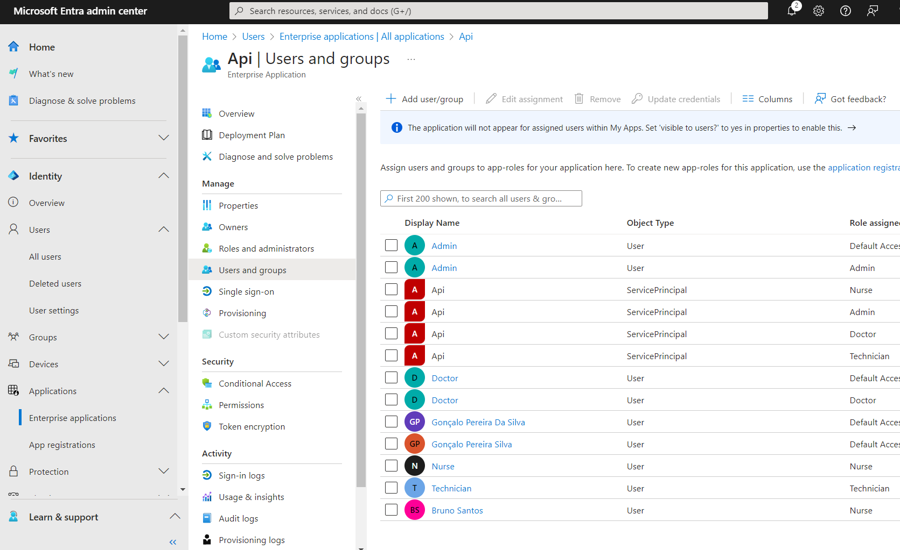

* Invite link received by the user
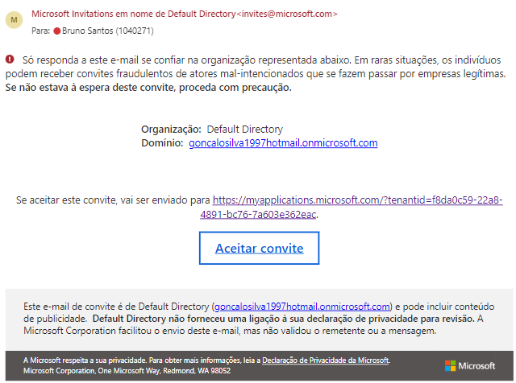

* Requested permissions
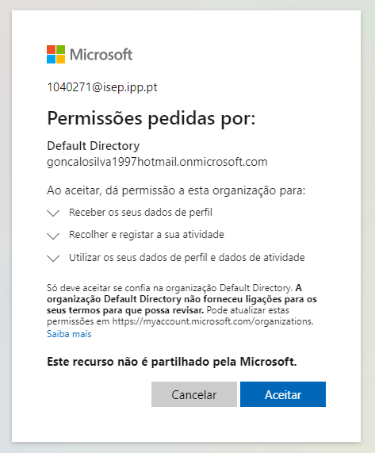

## 6. Integration/Demonstration

* To run this feature you must log in to the system as a backoffice Admin.