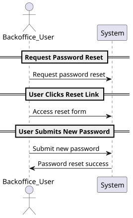
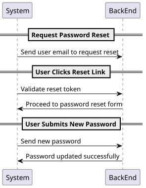
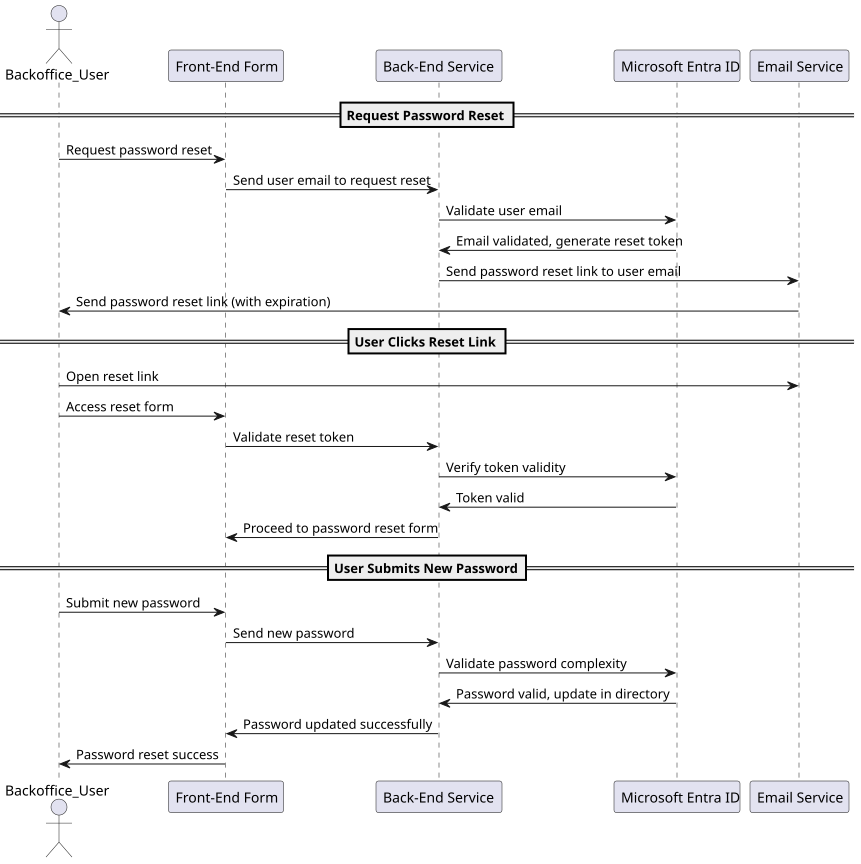
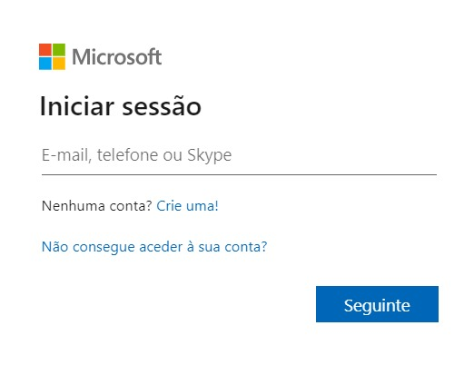
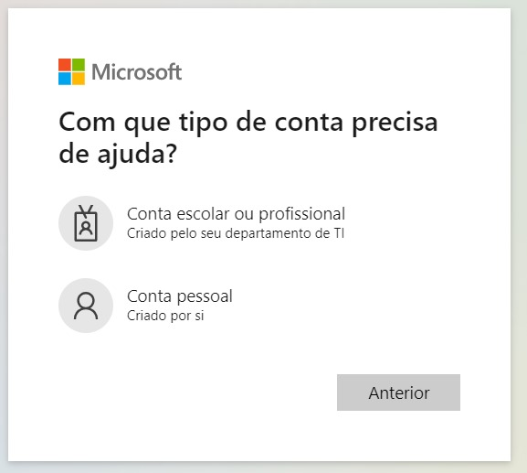
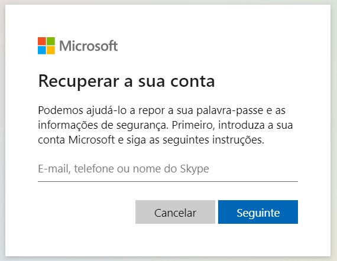

# US 02

## 1. Context

* The process of recovering access to an account that has already been 
registered is carried out in Microsoft Entra ID. Access to the account is
recovered as soon as the user's identity is confirmed. 

## 2. Requirements

**US 02** 
As a Backoffice User (Admin, Doctor, Nurse, Technician), I want to reset my
password if I forget it, so that I can regain access to the system securely. #3

**Acceptance criteria:**
* Backoffice users can request a password reset by providing their email.
* The system sends a password reset link via email.
* The reset link expires after a predefined period (e.g., 24 hours) for security.
* Users must provide a new password that meets the system’s password complexity rules.

## 3. Analysis

* There has been no need to clarify this use case with the customer so far.

***

## 4. Design

### 4.1. Realization

#### Level 1

##### Level 2

##### Level 3

### 4.2. Class Diagram

### 4.3. Applied Patterns

Applied Patterns description in [DevelopmentPatterns](../Global/DevelopmentPatterns/readme.md)

### 4.4. Tests

N/A

## 5. Implementation

* In the Login Page select "You can't access your account?"

* Choose if your account is an personal or business account.

* Specify your email and follow the instructions. 

## 6. Integration/Demonstration

* To run this feature you can log in to the system to reset the account of Admin, Doctor, Nurse or Technician in backoffice.