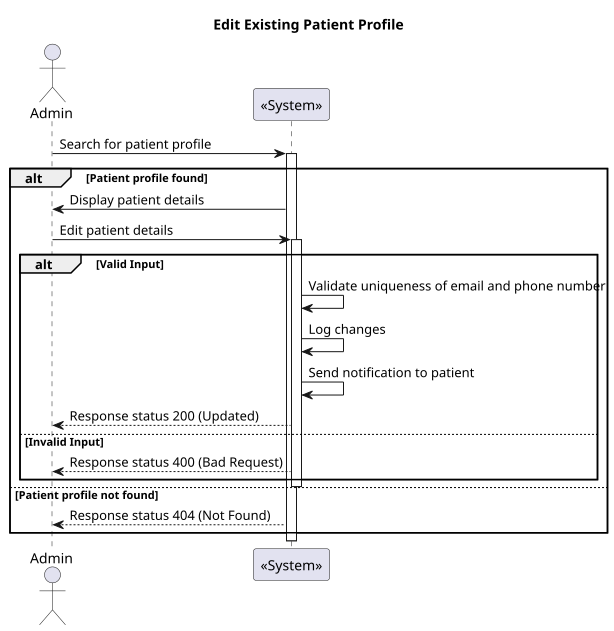
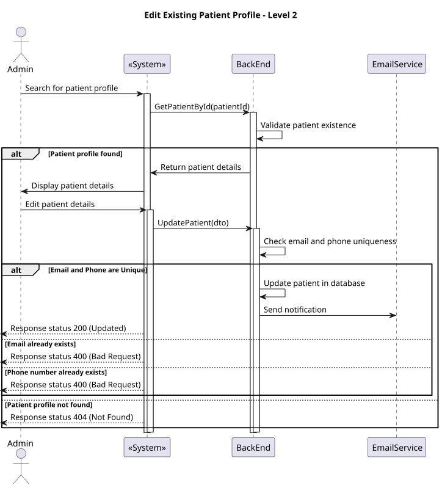
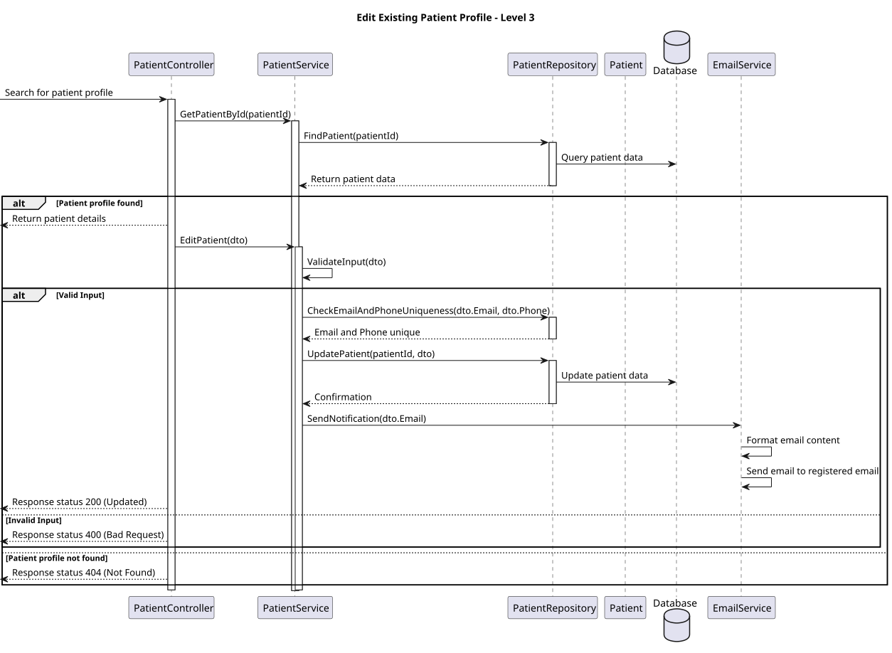

# US 09

## 1. Context

* The admin wants to update patient profiles.

## 2. Requirements

**US 09** 

As an Admin, I want to edit an existing patient profile, so that I can update their information when needed.

**Acceptance criteria:**

* Admins can search for and select a patient profile to edit.
* Editable fields include name, contact information, medical history, and allergies.
* Changes to sensitive data (e.g., contact information) trigger an email notification to the patient.
* The system logs all profile changes for auditing purposes.


## 3. Analysis

* Q: Can the administrator edit all personal details of the patient?
*  A: Yes, the administrator can edit all personal details of the patient, including name, contact information, medical history, and allergies.

***

* Q: How does the system handle changes to sensitive data?
*  A: When changes are made to sensitive data, such as contact information, the system triggers an email notification to the patient, informing them of the changes.

***

* Q: Is there a way to track changes made to a patient's profile?
*  A: Yes, the system logs all changes made to the patient's profile for auditing purposes, allowing administrators to track who made changes and when.

***

* Q: How does the system ensure the uniqueness of the email and phone number after editing?
*  A: The system checks that the changes do not compromise the uniqueness of the email and phone number, ensuring that no duplicates exist.


## 4. Design

### 4.1. Realization

#### Level 1



##### Level 2



##### Level 3



### 4.2. Class Diagram


### 4.3. Applied Patterns

Applied Patterns description in [DevelopmentPatterns](../Global/DevelopmentPatterns/readme.md)

### 4.4. Tests


```
[Fact]
public async Task UpdateAsync_ShouldUpdatePatient()
{
    // Arrange
    var createPatientDto = new CreatePatientDto
    {
        FirstName = "Carlos",
        LastName = "Paula",
        FullName = "Carlos Paula",
        MedicalRecord = "Medical History",
        EmergencyContact = "911235478",
        Gender = "Man",
        DateOfBirth = new DateTime(1998, 08, 2),
        Email = "email@email.com",
        Phone = "1234567890",
        Address = "Rua dos macacos"
    };
    var patient = new Patient(
        createPatientDto.FirstName,
        createPatientDto.LastName,
        createPatientDto.FullName,
        createPatientDto.MedicalRecord,
        createPatientDto.EmergencyContact,
        createPatientDto.Gender,
        createPatientDto.DateOfBirth,
        createPatientDto.Email,
        createPatientDto.Phone,
        createPatientDto.Address
    );
    //SetUp
    _mockRepo.Setup(repo => repo.AddAsync(It.IsAny<Patient>())).ReturnsAsync(patient);

    // Act
    var patientPersisted = await _service.AddAsync(createPatientDto);

    var newFirstName = "Max";
    var newLastName = "Verstappen";
    var newFullName = "Max Verstappen";
    var newEmergencyContact = "912345612";
    var newGender = "Man";
    var newDateOfBirth = new DateTime(1998, 02, 10);
    var newEmail = "email2@email.com";
    var newPhone = "1234567890";
    var newAddress = "Rua dos ursos";
    patient.UpdatePersonalInfo(newFirstName, newLastName, newFullName, newEmergencyContact, newGender, newDateOfBirth, newEmail, newPhone, newAddress);

    await _service.UpdateAsync(patientPersisted);

    _mockRepo.Setup(repo => repo.GetByIdAsync(new PatientMedicalRecordNumber("CP123"))).ReturnsAsync(patient);

    var result = await _service.GetByIdAsync(new PatientMedicalRecordNumber("CP123"));
    // Assert
    Assert.NotNull(result);
    Assert.Equal(newFirstName, result.FirstName);
    Assert.Equal(newLastName, result.LastName);
    Assert.Equal(newFullName, result.FullName);
    Assert.Equal(newEmergencyContact, result.EmergencyContact);
    Assert.Equal(newGender, result.Gender);
    Assert.Equal(newDateOfBirth, result.DateOfBirth);
    Assert.Equal(newEmail, result.Email);
    Assert.Equal(newPhone, result.Phone);
    Assert.Equal(newAddress, result.Address);
}
```

## 6. Integration/Demonstration

* To use this funcionality you must login the system as an Admin.
