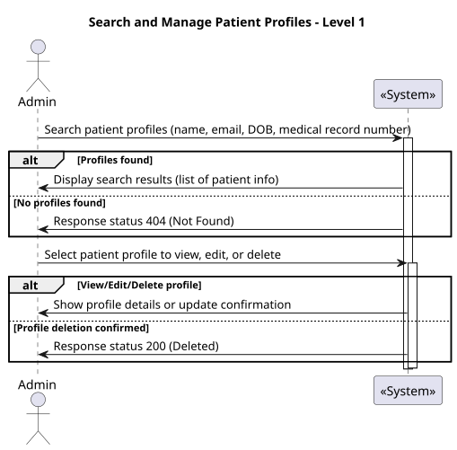
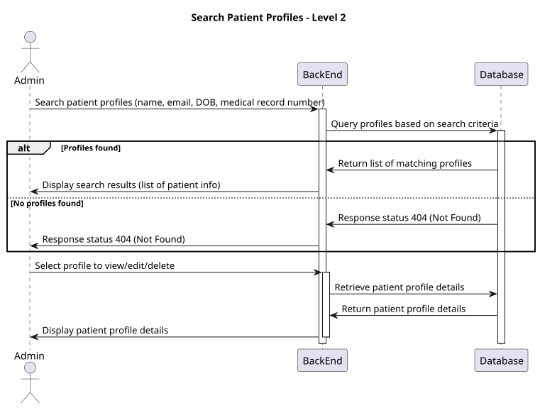
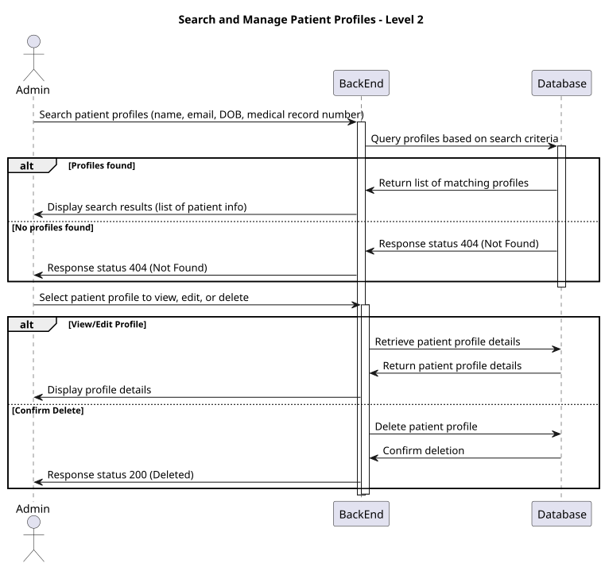

# US 11

## 1. Context

In the healthcare system, it is essential for administrators to have the ability to manage patient profiles efficiently. This includes the capability to search for, view, edit, and delete patient records. By enabling administrators to search by various attributes, the system enhances the efficiency of patient management and ensures that patient information can be updated or removed as necessary. This user story focuses on providing a user-friendly interface for searching patient profiles, ensuring compliance with data management standards.

## 2. Requirements

**US 11** 

As an Admin, I want to list/search patient profiles by different attributes, so that I can view the details, edit, and remove patient profiles.

**Acceptance criteria:**

* Admins can search patient profiles by various attributes, including name, email, date of birth, or medical record number.
* The system displays search results in a list view with key patient information (name, email, date of birth).
* Admins can select a profile from the list to view, edit, or delete the patient record.
* The search results are paginated, and filters are available to refine the search results.


## 3. Analysis

* Q: Can the administrator search for patient profiles using multiple attributes at once?
  * A: Yes, the administrator can use multiple attributes to refine their search for patient profiles.

***

* Q: How are the search results displayed to the administrator?
  * A: The system presents search results in a list view, showing key patient information for easy reference.

***

* Q: Is there a limit to how many profiles can be displayed in the search results?
  * A: Yes, the search results are paginated to ensure a manageable number of profiles are displayed at once.

***

* Q: Can the administrator edit or delete a patient profile directly from the search results?
  * A: Yes, the administrator can select a patient profile from the search results to view, edit, or delete the record.

***


## 4. Design

### 4.1. Realization

#### Level 1



##### Level 2



##### Level 3



### 4.2. Class Diagram


### 4.3. Applied Patterns

Applied Patterns description in [DevelopmentPatterns](../Global/DevelopmentPatterns/readme.md)

### 4.4. Tests


```
public async Task GetByIdAsync_ShouldReturnPatient()
{
    var createPatientDto = new CreatePatientDto
    {
        FirstName = "Carlos",
        LastName = "Paula",
        FullName = "Carlos Paula",
        MedicalRecord = "Medical History",
        EmergencyContact = "911235478",
        Gender = "Man",
        DateOfBirth = new DateTime(1998, 08, 2),
        Email = "email@email.com",
        Phone = "1234567890",
        Address = "Rua dos macacos"
    };
    var patient = new Patient(
        createPatientDto.FirstName,
        createPatientDto.LastName,
        createPatientDto.FullName,
        createPatientDto.MedicalRecord,
        createPatientDto.EmergencyContact,
        createPatientDto.Gender,
        createPatientDto.DateOfBirth,
        createPatientDto.Email,
        createPatientDto.Phone,
        createPatientDto.Address
    );

    _mockRepo.Setup(repo => repo.AddAsync(It.IsAny<Patient>())).ReturnsAsync(patient);
    var resultpatient = await _service.AddAsync(createPatientDto);
    _mockRepo.Setup(repo => repo.GetByIdAsync(new PatientMedicalRecordNumber("CP123"))).ReturnsAsync(patient);
    var result = await _service.GetByIdAsync(new PatientMedicalRecordNumber("CP123"));
    Assert.NotNull(result);
    _mockRepo.Verify(repo => repo.GetByIdAsync(new PatientMedicalRecordNumber("CP123")), Times.Once); //Verifica se so retorna 1 value
    Assert.Equal(patient.FirstName, result.FirstName);
}

[Theory]
[InlineData("Carlos", "email@email.com", null, "CP123", 10, 1)]
[InlineData("Paula", "email1@email.com", null, "CP123", 5, 1)]
public async Task GetByFilterReturnsNoJobsOnInvalidRule(string name, string email,
DateTime? dateOfBirth, string medicalRecordNumber, int pageNumber, int pageSize)
{
    var patients =
    _ = _mockRepo
        .Setup(repo => repo.SearchPatientsAsync(It.IsAny<string>(), It.IsAny<string>(), It.IsAny<DateTime?>(), It.IsAny<string>(), It.IsAny<int>(), It.IsAny<int>()))
        .ReturnsAsync(new List<Patient>());

    var result = await _service.SearchPatientsAsync(name, email, dateOfBirth, medicalRecordNumber, pageNumber, pageSize);
    await _mockUnitOfWork.Object.CommitAsync();
    // Assert
    Assert.NotNull(result);
    Assert.Empty(result);

    // Verify interactions
    _mockRepo.Verify(repo => repo.SearchPatientsAsync(It.IsAny<string>(), It.IsAny<string>(), It.IsAny<DateTime?>(), It.IsAny<string>(), It.IsAny<int>(), It.IsAny<int>()), Times.Once);
    _mockUnitOfWork.Verify(uow => uow.CommitAsync(), Times.Once);
}
```

## 6. Integration/Demonstration

* To use this funcionality you must login the system as an Admin.
