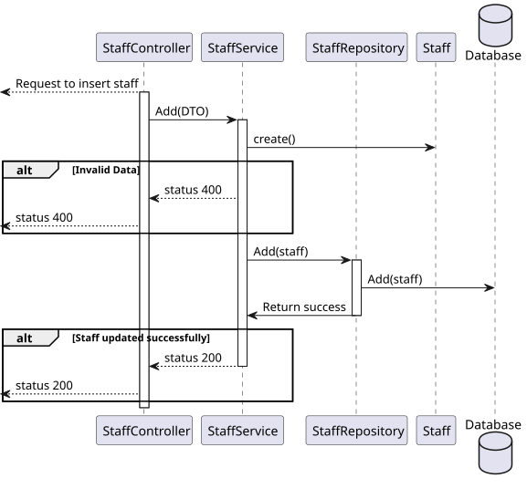

# US 12

## 1. Context

*  Implement functionality for an Admin to create a new staff profile.

## 2. Requirements

**US 12** As an Admin, I want to create a new staff profile, so that I can add them to the hospital’s roster.

**Acceptance criteria:**
- Admins can input staff details such as first name, last name, contact information, and
specialization.
- A unique staff ID (License Number) is generated upon profile creation.
- The system ensures that the staff’s email and phone number are unique.
- The profile is stored securely, and access is based on role-based permissions.


## 3. Analysis

* **Tiago Sousa** – How should the specialization be assigned to a staff?
  * **A**: 
    - the system has a list of specializations.
    - staff is assigned a specialization from that list

* **Gustavo Lima** – Would you like staff lincense number to be generated in any particular format or algorithm of your choice?
  * **A**: 
    - there is a misinformation in the RFP. staff id are unique and generated by the system. License numbers are unique but are not generated by the system.
    - staff id follow the format "(N | D | O)yyyynnnnn"
    - for instance, N202401234
    - N is for nurse, D is for doctor, O is for other.
    - yyyy is the year of recruitment
    - nnnnn is a sequential number
    - License numbers are assigned by the professional guild. the admin will enter the license number and the system records it

## 4. Design

### 4.1. Realization

##### Level 1


##### Level 2


##### Level 3


### 4.2. Class Diagram


### 4.3. Applied Patterns

Applied Patterns description in [DevelopmentPatterns](../Global/DevelopmentPatterns/readme.md)

### 4.4. Tests


```
[Theory]
[InlineData("D202400001", "email", "918596542", "Carlos", "Sainz", "Doctor")]
[InlineData("N202400009", "email", "912023415", "Max", "Verstappen", "Nurse")]
public void EnsureIsAnEmail(string licenseNumber, string email, string phone, string firstName, string lastName,
    string role)
{
    Specialization specialization = new Specialization("Genecologist");
    var availabilitySlots = new List<DateTimeTuple>
    {
        new DateTimeTuple(DateTime.Now, DateTime.Now.AddHours(1))
    };

    Assert.Throws<BusinessRuleValidationException>(() => new Staff(licenseNumber, email, phone, firstName, lastName, role, availabilitySlots, specialization));

}
```

```
[Theory]
[InlineData("D202400001", null, "918596542", "Carlos", "Sainz", "Doctor")]
[InlineData("N202400009", null, "912023415", "Max", "Verstappen", "Nurse")]
public void EnsureEmailNotNull(string licenseNumber, string email, string phone, string firstName, string lastName,
    string role)
{
    Specialization specialization = new Specialization("Genecologist");
    var availabilitySlots = new List<DateTimeTuple>
    {
        new DateTimeTuple(DateTime.Now, DateTime.Now.AddHours(1))
    };

    Assert.Throws<BusinessRuleValidationException>(() => new Staff(licenseNumber, email, phone, firstName, lastName, role, availabilitySlots, specialization));
}
```

```
[Theory]
[InlineData("D202400001", "email@email.com", null, "Carlos", "Sainz", "Doctor")]
[InlineData("N202400009", "email",null, "Max", "Verstappen", "Nurse")]
public void EnsurePhoneNotNull(string licenseNumber, string email, string phone, string firstName, string lastName,
    string role)
{
    Specialization specialization = new Specialization("Genecologist");
    var availabilitySlots = new List<DateTimeTuple>
    {
        new DateTimeTuple(DateTime.Now, DateTime.Now.AddHours(1))
    };
    Assert.Throws<BusinessRuleValidationException>(() => new Staff(licenseNumber, email, phone, firstName, lastName, role, availabilitySlots, specialization));
}
```

```
[Theory]
[InlineData("D202400001", "email@email.com", "918596542", null, "Sainz", "Doctor")]
[InlineData("N202400009", "email", "912023415", null, "Verstappen", "Nurse")]
public void EnsureFirstNameNotNull(string licenseNumber, string email, string phone, string firstName, string lastName,
    string role)
{
    Specialization specialization = new Specialization("Genecologist");
    var availabilitySlots = new List<DateTimeTuple>
    {
        new DateTimeTuple(DateTime.Now, DateTime.Now.AddHours(1))
    };
    Assert.Throws<BusinessRuleValidationException>(() => new Staff(licenseNumber, email, phone, firstName, lastName, role, availabilitySlots, specialization));
}
```

```
[Theory]
[InlineData("D202400001", "email@email.com", "918596542", "Carlos", null, "Doctor")]
[InlineData("N202400009", "email", "912023415", "Max", null, "Nurse")]
public void EnsureLastNameNotNull(string licenseNumber, string email, string phone, string firstName, string lastName,
    string role)
{
    Specialization specialization = new Specialization("Genecologist");
    var availabilitySlots = new List<DateTimeTuple>
    {
        new DateTimeTuple(DateTime.Now, DateTime.Now.AddHours(1))
    };
    Assert.Throws<BusinessRuleValidationException>(() => new Staff(licenseNumber, email, phone, firstName, lastName, role, availabilitySlots, specialization));
}
```

```
[Theory]
[InlineData("D202400001", "email@email.com", "918596542", "Carlos", "Sainz", null)]
[InlineData("N202400009", "email", "912023415", "Max", "Verstappen", null)]
public void EnsureRoleNotNull(string licenseNumber, string email, string phone, string firstName, string lastName,
    string role)
{
    Specialization specialization = new Specialization("Genecologist");
    var availabilitySlots = new List<DateTimeTuple>
    {
        new DateTimeTuple(DateTime.Now, DateTime.Now.AddHours(1))
    };
    Assert.Throws<BusinessRuleValidationException>(() => new Staff(licenseNumber, email, phone, firstName, lastName, role, availabilitySlots, specialization));
}
```

```
[Fact]
public async Task AddAsync_ShouldAddStaff()
{
    Tuple<Staff, CreatingStaffDto> tuple = await DummyStaff("123", "mail@mail.com", "123456789", "Nome", "Apelido", "Doctor");

    // Act
    _mockStaffRepo.Setup(repo => repo.AddAsync(It.IsAny<Staff>())).ReturnsAsync(tuple.Item1);
    StaffDto result = await _service.AddAsync(tuple.Item2);

    // Assert
    Assert.NotNull(result);
    _mockStaffRepo.Verify(repo => repo.AddAsync(It.IsAny<Staff>()), Times.Once);//Verifica se so retorna 1 value
    Assert.Equal(tuple.Item2.FirstName, result.FirstName);
}
```

## 5. Implementation

* Controller
```
var dto = await _service.AddAsync(creatingDto);
return dto;
```

* Service
```
...
Staff staff = new Staff(dto.LicenseNumber, dto.Email, dto.Phone, dto.FirstName, dto.LastName, dto.Role, availabilitySlots, specialization);

staff = await this._staffRepo.AddAsync(staff);
await this._unitOfWork.CommitAsync();

staff.AddPrefix();
...
await this._unitOfWork.CommitAsync();

return staff.ToDto();
```


## 6. Integration/Demonstration

* To use this funcionality you must log in the system as an Admin.
