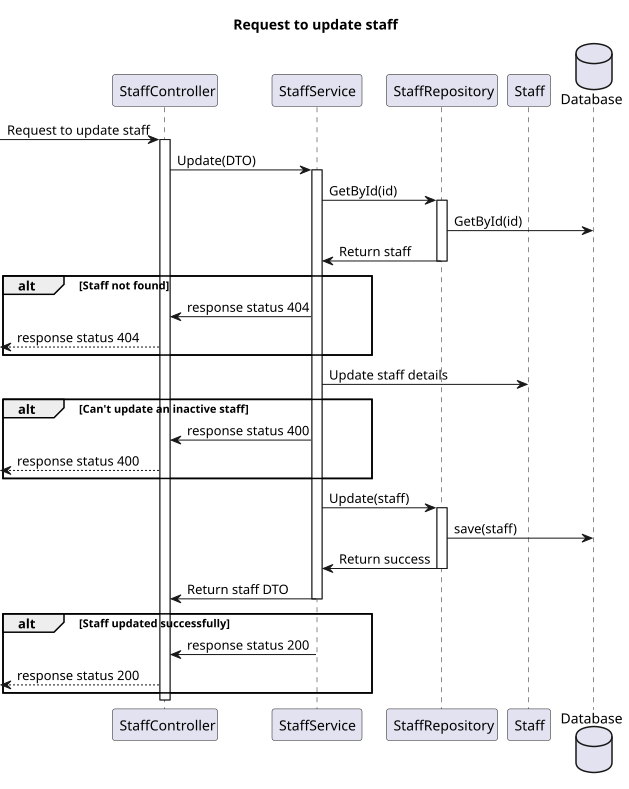
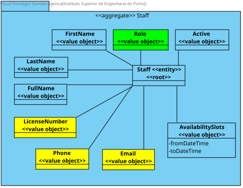

# US 13

## 1. Context

*  Implement functionality for an Admin to edit a staff profile.

## 2. Requirements

**US 13** As an Admin, I want to edit a staff’s profile, so that I can update their information.

**Acceptance criteria:**
- Admins can search for and select a staff profile to edit.
- Editable fields include contact information, availability slots, and specialization.
- The system logs all profile changes, and any changes to contact information trigger a
confirmation email to the staff member.
- The edited data is updated in real-time across the system.


## 3. Analysis

* **Fábio Borges** – Boa tarde, Qual é o critério de pesquisa pretendido para encontrar o perfil do funcionário? Obrigado
  * **A**: 
    - deve ser possivel pesquisar funcionários pelo seu numero mecanografico, numero de licença, nome, especializacao, ou numero de telefone

## 4. Design

### 4.1. Realization

##### Level 1


##### Level 2


##### Level 3


### 4.2. Class Diagram



### 4.3. Applied Patterns

Applied Patterns description in [DevelopmentPatterns](../Global/DevelopmentPatterns/readme.md)

### 4.4. Tests


```
[Theory]
[InlineData("D202400001", "email@email.com", "918596542", "Carlos", "Sainz", "Doctor")]
public void EnsureUpdateWorks(string licenseNumber, string email, string phone, string firstName, string lastName, string role)
{
    Specialization specialization = new Specialization("Genecologist");
    var availabilitySlots = new List<DateTimeTuple>
    {
        new DateTimeTuple(DateTime.Now, DateTime.Now.AddHours(1))
    };

    var staff = new Staff(licenseNumber, email, phone, firstName, lastName, role, availabilitySlots, specialization);
    
    var newEmail = "email2@email.com";
    var newPhone = "918596543";
    var newFirstName = "Max";
    var newLastName = "Verstappen";
    var newavailabilitySlots = new List<DateTimeTuple>
    {
        new DateTimeTuple(DateTime.Now, DateTime.Now.AddHours(1))
    };

    staff.Update(newEmail, newPhone, newFirstName, newLastName, newavailabilitySlots);

    Assert.Equal(newEmail, staff.Email);
    Assert.Equal(newPhone, staff.Phone);
    Assert.Equal(newFirstName, staff.FirstName);
    Assert.Equal(newLastName, staff.LastName);
    Assert.Equal(newavailabilitySlots, staff.AvailabilitySlots);
}
```

```
[Fact]
public async Task UpdateAsync_ShouldUpdateStaff()
{
    Tuple<Staff, CreatingStaffDto> tuple = await DummyStaff("123", "mail@mail.com", "123456789", "Nome", "Apelido", "Doctor");

    _mockStaffRepo.Setup(repo => repo.AddAsync(It.IsAny<Staff>())).ReturnsAsync(tuple.Item1);
    await _service.AddAsync(tuple.Item2);

    _mockStaffRepo.Setup(repo => repo.GetByIdAsync(tuple.Item1.Id)).ReturnsAsync(tuple.Item1);
    await _service.GetByIdAsync(tuple.Item1.Id.AsString());

    string updatedEmail = "updatedmail@mail.com";
    string updatedPhone = "987654321";
    string updatedFirstName = "Nome 2";
    string updatedLastName = "Apelido 2";
    tuple.Item1.Update(updatedEmail, updatedPhone, updatedFirstName, updatedLastName, DummyStaffAvailabilitySlots());

    _mockStaffRepo.Setup(repo => repo.GetByIdAsync(tuple.Item1.Id)).ReturnsAsync(tuple.Item1);
    StaffDto result = await _service.GetByIdAsync(tuple.Item1.Id.AsString());

    // Assert
    Assert.NotNull(result);
    Assert.Equal(updatedEmail, result.Email);
    Assert.Equal(updatedPhone, result.Phone);
    Assert.Equal(updatedFirstName, result.FirstName);
    Assert.Equal(updatedLastName, result.LastName);
}
```

## 5. Implementation

* Controller
```
var updatedDto = await _service.UpdateAsync(dto);
if (updatedDto == null)
{
    return NotFound();
}
return Ok(updatedDto);
```

* Service
```
Staff staff = await this._staffRepo.GetByIdAsync(new StaffId(dto.Id));
if (staff == null)
    return null;

List<DateTimeTuple> availabilitySlots = new();
foreach (Tuple<DateTime, DateTime> tuple in dto.AvailabilitySlots)
{
    availabilitySlots.Add(new DateTimeTuple(tuple.Item1, tuple.Item2));
}
staff.Update(dto.Email, dto.Phone, dto.FirstName, dto.LastName, availabilitySlots);
await this._unitOfWork.CommitAsync();

return staff.ToDto();
```

## 6. Integration/Demonstration

* To use this funcionality you must log in the system as an Admin.
