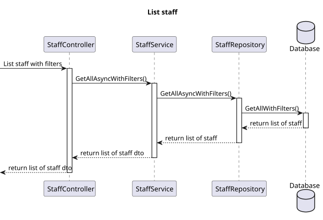
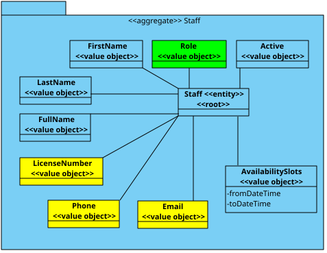

# US 15

## 1. Context

* The admin wants to list/search staff by their details.

## 2. Requirements

**US 15** US15- As an Admin, I want to list/search staff profiles, so that I can see the details, edit, and remove staff profiles.

**Acceptance criteria:**
- Admins can search staff profiles by attributes such as name, email, or specialization.
- The system displays search results in a list view with key staff information (name, email, specialization).
- Admins can select a profile from the list to view, edit, or deactivate.
- The search results are paginated, and filters are available for refining the search results.


## 3. Analysis

* **Q** – What types of filters can be applied when searching for profiles?
  * **A**: Filters can include doctor specialization, name, or email to refine search results.

## 4. Design

### 4.1. Realization
#### Level 1

##### Level 2

##### Level 3


### 4.2. Class Diagram



### 4.3. Applied Patterns

Applied Patterns description in [DevelopmentPatterns](../Global/DevelopmentPatterns/readme.md)

### 4.4. Tests


```
[Fact]
public async Task GetByIdAsync_ShouldReturnStaff()
{
    Tuple<Staff, CreatingStaffDto> tuple = await DummyStaff("123", "mail@mail.com", "123456789", "Nome", "Apelido", "Doctor");

    _mockStaffRepo.Setup(repo => repo.AddAsync(It.IsAny<Staff>())).ReturnsAsync(tuple.Item1);
    await _service.AddAsync(tuple.Item2);

    _mockStaffRepo.Setup(repo => repo.GetByIdAsync(tuple.Item1.Id)).ReturnsAsync(tuple.Item1);
    StaffDto result = await _service.GetByIdAsync(tuple.Item1.Id.AsString());

    // Assert
    Assert.NotNull(result);
    _mockStaffRepo.Verify(repo => repo.GetByIdAsync(tuple.Item1.Id), Times.Once); //Verifica se so retorna 1 value
    Assert.Equal(tuple.Item1.FirstName, result.FirstName);
}
```

## 5. Implementation

* Controller (get by id)
```
var dto = await _service.GetByIdAsync(id);
if (dto == null)
    return NotFound();
return dto;
```

* Service (get by id)
```
var staff = await this._staffRepo.GetByIdAsync(new StaffId(id));
if (staff == null)
    return null;
return staff.ToDto();
```

* Controller (get by filter)
```
return await _service.GetAllAsyncWithFilters(name, phone, email, licenseNumber, specialization, role);
```

* Service (get by filter)
```
 List<Staff> list = await this._staffRepo.GetAllAsyncWithFilters(name, phone, email, licenseNumber, specialization, role);
List<StaffDto> listDto = [];
foreach (Staff staff in list)
{
    listDto.Add(staff.ToDto());
}
return listDto;
```

## 6. Integration/Demonstration

* To use this funcionality you must log in the system as an Admin.
