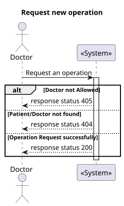
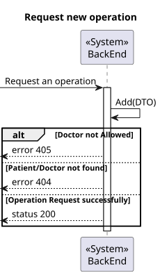
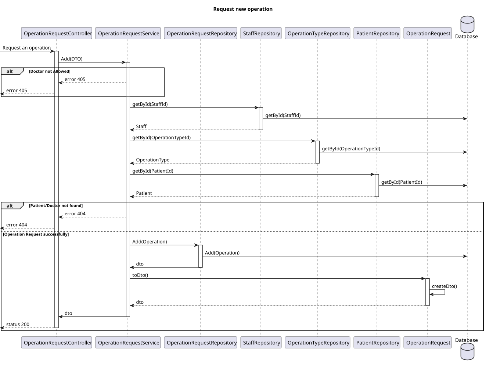

# US 16

## 1. Context

- Implement functionality for a Doctor to be able to request an operation.

## 2. Requirements

**US 16** As a Doctor, I want to request an operation, so that the Patient has access to the necessary healthcare.

**Acceptance criteria:**

- Doctors can create an operation request by selecting the patient, operation type, priority, and
  suggested deadline.
- The system validates that the operation type matches the doctor’s specialization.
- The operation request includes:
- Patient ID
- Doctor ID
- Operation Type
- Deadline
- Priority
- The system confirms successful submission of the operation request and logs the request in
  the patient’s medical history.

## 3. Analysis

- **Q Varela**: In the project document it mentions that each operation has a priority. How is a operation's priority defined? Do they have priority levels defined? Is it a scale? Or any other system?
  - **A**:
    - Elective Surgery: A planned procedure that is not life-threatening and can be scheduled at a convenient time (e.g., joint replacement, cataract surgery).
    - Urgent Surgery: Needs to be done sooner but is not an immediate emergency. Typically within days (e.g., certain types of cancer surgeries).
    - Emergency Surgery: Needs immediate intervention to save life, limb, or function. Typically performed within hours (e.g., ruptured aneurysm, trauma).
- **Q**: Can the same doctor who requests a surgery perform it?
  - **A**: Not necessarily. The planning module may assign different doctors based on availability and optimization.
- **Q**: What does “status” refer to in the context of searching for operating requisitions?
  - **A**: Status refers to whether the operation is planned or requested.

---

## 4. Design

### 4.1. Realization

##### Level 1



##### Level 2



##### Level 3



### 4.2. Class Diagram


### 4.3. Applied Patterns

Applied Patterns description in [DevelopmentPatterns](../Global/DevelopmentPatterns/readme.md)

### 4.4. Tests
- **Postman tests** 


- **OperationRequest test**
```
  public void OperationRequestValidArguments(){}
  public void OperationRequestInvalidPriorityThrowsException(){}
```
- **OperationRequestService test**

```
[Fact]
public async Task AddAsync_ShouldAddOperationRequest()
{
  ...

  //SetUp
  _mockoperationRepo.Setup(repo => repo.AddAsync(It.IsAny<OperationRequest>())).ReturnsAsync(operationRequest);

  // Act
  var result = await _service.AddAsync(createOperationRequestDto);

  // Assert
  Assert.NotNull(result);
  _mockoperationRepo.Verify(repo => repo.AddAsync(It.IsAny<OperationRequest>()), Times.Once);//Verifica se so retorna 1 value
  Assert.Equal(createOperationRequestDto.Priority, result.Priority);
}
```

## 5. Implementation

- **OperationRequestController - Create()**

```
var operationTypeDto = await _service.AddAsync(dto);
return operationTypeDto;
```

- **OperationRequestService - AddAsync()**

```
...
var operationRequest = new OperationRequest(
    DateTime.Parse(dto.DeadlineDate),
    dto.Priority,
    requestedByDoctor,
    operationType,
    patient
);

operationRequest = await _operationRepo.AddAsync(operationRequest);
await _unitOfWork.CommitAsync();
...
```

## 6. Integration/Demonstration

* Para executar esta funcionalidade deve fazer login no sistema como Doctor.
