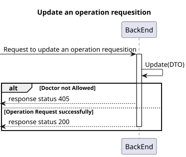
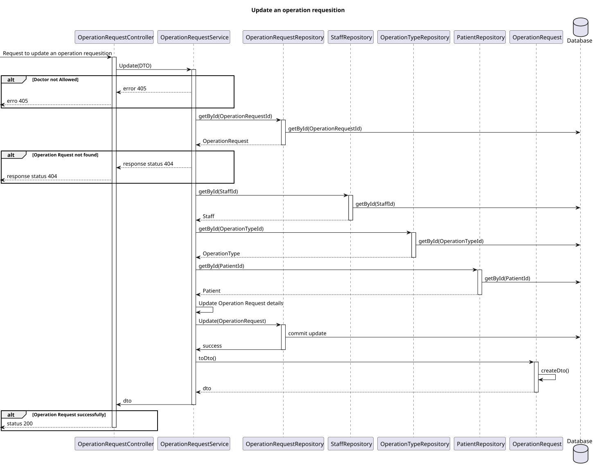
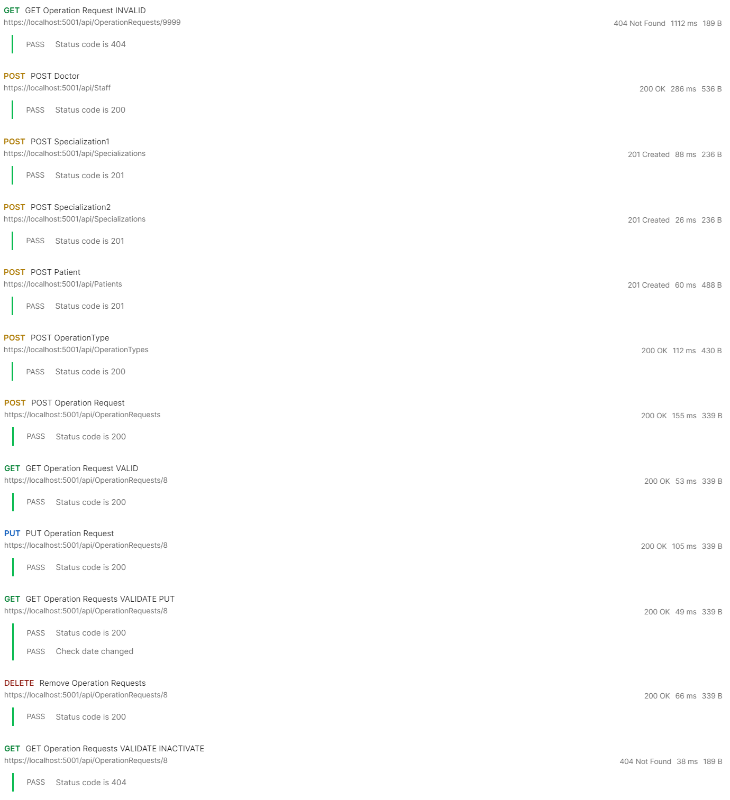

# US 17

## 1. Context

* Implement functionality for a Doctor to be able to update an operation requisition.

## 2. Requirements

**US 17** As a Doctor, I want to update an operation requisition, so that the Patient has access to the necessary healthcare.

**Acceptance criteria:**
- Doctors can update operation requests they created (e.g., change the deadline or priority).
- The system checks that only the requesting doctor can update the operation request.
- The system logs all updates to the operation request (e.g., changes to priority or deadline).
- Updated requests are reflected immediately in the system and notify the Planning Module of
any changes.


## 3. Analysis

* **Q Varela** – In the project document it mentions that each operation has a priority. How is a operation's priority defined? Do they have priority levels defined? Is it a scale? Or any other system?
  * **A**: 
    - Elective Surgery: A planned procedure that is not life-threatening and can be scheduled at a convenient time (e.g., joint replacement, cataract surgery).
    - Urgent Surgery: Needs to be done sooner but is not an immediate emergency. Typically within days (e.g., certain types of cancer surgeries).
    - Emergency Surgery: Needs immediate intervention to save life, limb, or function. Typically performed within hours (e.g., ruptured aneurysm, trauma).
* **Q**: Can the same doctor who requests a surgery perform it?
  * **A**: Not necessarily. The planning module may assign different doctors based on availability and optimization.
* **Q**: What does “status” refer to in the context of searching for operating requisitions?
  * **A**: Status refers to whether the operation is planned or requested.
***


## 4. Design

### 4.1. Realization
#### Level 1

##### Level 2


##### Level 3


### 4.2. Class Diagram


### 4.3. Applied Patterns

Applied Patterns description in [DevelopmentPatterns](../Global/DevelopmentPatterns/readme.md)

### 4.4. Tests
- **Postman tests** 


- **OperationRequest test**
```
[Fact]
public void UpdateOperationRequest(){}
```
- **OperationRequestService test**

```
[Fact]
public async Task UpdateAsync_ShouldUpdateOperationRequest()
{
  ...

  var newDeadlineDate = new DateTime(1999, 10, 02);
  var newPriority = "Elective";

  operationRequest.Update(newDeadlineDate, newPriority, doctor, operationType, patient);

  _mockoperationRepo.Setup(repo => repo.GetByIdAsync(new OperationRequestId(1))).ReturnsAsync(operationRequest);
  var resultOperationRequest = await _service.GetByIdAsync(new OperationRequestId(1));

  Assert.NotNull(resultOperationRequest);
  Assert.Equal(newPriority, resultOperationRequest.Priority.ToString());
  Assert.Equal(newDeadlineDate.ToString(), resultOperationRequest.DeadlineDate);
}
```

## 5. Implementation

- **OperationRequestController - Update()**

```
var operationTypeDto = await _service.UpdateAsync(dto);

if (operationTypeDto == null)
{
    return NotFound();
}
return Ok(operationTypeDto);
```

- **OperationRequestService - Update()**

```
...
operationRequest.Update(DateTime.Parse(dto.DeadlineDate), dto.Priority, requestedByDoctor, operationType, patient);

var newValues = operationRequest.ToString();
var changeLog = new SystemChangeLog(
    tableId: operationRequest.Id.AsString(),
    table: TABLE_NAME,
    oldValues: oldValues,
    newValues: newValues,
    changedBy: "Doctor",
    logType: "Edit"
);

await _changeLogRepository.AddAsync(changeLog);

await this._unitOfWork.CommitAsync();
...
```

## 6. Integration/Demonstration

* Para executar esta funcionalidade deve fazer login no sistema como Doctor.