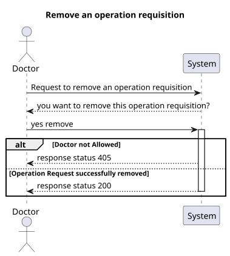
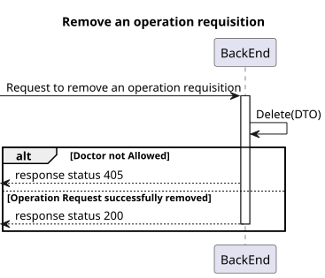
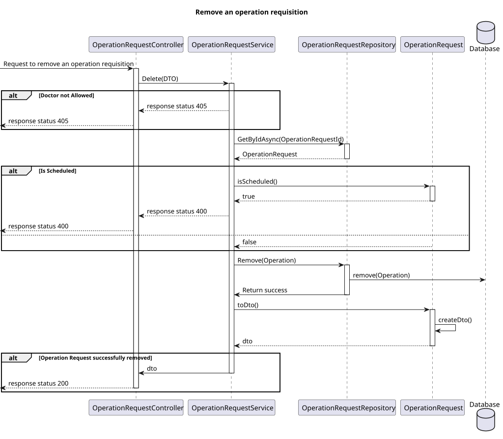

# US 18

## 1. Context

*  Implement functionality for a Doctor to be able to remove an operation requisition.

## 2. Requirements

**US 18** As a Doctor, I want to remove an operation requisition, so that the healthcare activities are provided as necessary.

**Acceptance criteria:**
- Doctors can delete operation requests they created if the operation has not yet been
scheduled.
- A confirmation prompt is displayed before deletion.
- Once deleted, the operation request is removed from the patient’s medical record and cannot
be recovered.
- The system notifies the Planning Module and updates any schedules that were relying on this
request.


## 3. Analysis

* **Q Varela** – In the project document it mentions that each operation has a priority. How is a operation's priority defined? Do they have priority levels defined? Is it a scale? Or any other system?
  * **A**: 
    - Elective Surgery: A planned procedure that is not life-threatening and can be scheduled at a convenient time (e.g., joint replacement, cataract surgery).
    - Urgent Surgery: Needs to be done sooner but is not an immediate emergency. Typically within days (e.g., certain types of cancer surgeries).
    - Emergency Surgery: Needs immediate intervention to save life, limb, or function. Typically performed within hours (e.g., ruptured aneurysm, trauma).
* **Q**: Can the same doctor who requests a surgery perform it?
  * **A**: Not necessarily. The planning module may assign different doctors based on availability and optimization.
* **Q**: What does “status” refer to in the context of searching for operating requisitions?
  * **A**: Status refers to whether the operation is planned or requested.
***


## 4. Design

### 4.1. Realization
##### Level 1


##### Level 2


##### Level 3


### 4.2. Class Diagram


### 4.3. Applied Patterns

Applied Patterns description in [DevelopmentPatterns](../Global/DevelopmentPatterns/readme.md)

### 4.4. Tests
- **Postman tests** 


- **OperationRequest test**
```
[Fact]
public void IsScheduledReturnsTrueWhenStatusIsScheduled(){}
```
- **OperationRequestService test**

```
[Fact]
public async Task GetByIdAsync_ShouldReturnOperationRequest()
{
  ...
  _mockoperationRepo.Setup(repo => repo.AddAsync(It.IsAny<OperationRequest>())).ReturnsAsync(operationRequest);
  await _service.AddAsync(createOperationRequestDto);

  _mockoperationRepo.Setup(repo => repo.GetByIdAsync(new OperationRequestId(1))).ReturnsAsync(operationRequest);
  var resultOperationRequest = await _service.GetByIdAsync(new OperationRequestId(1));


  Assert.NotNull(resultOperationRequest);
  _mockoperationRepo.Verify(repo => repo.GetByIdAsync(new OperationRequestId(1)), Times.Once); //Verifica se so retorna 1 value
  Assert.Equal(operationRequest.Priority.ToString(), resultOperationRequest.Priority.ToString());
}
```

## 5. Implementation

- **OperationRequestController - Delete()**

```
var operationRequestDto = await _service.DeleteAsync(id);
if (operationRequestDto == null)
{
    return NotFound();
}

return Ok(operationRequestDto);
```

- **OperationRequestService - Update()**

```
...

this._operationRepo.Remove(operationRequest);
await this._unitOfWork.CommitAsync();

return operationRequest.ToDto();
```
## 6. Integration/Demonstration

* Para executar esta funcionalidade deve fazer login no sistema como Doctor.