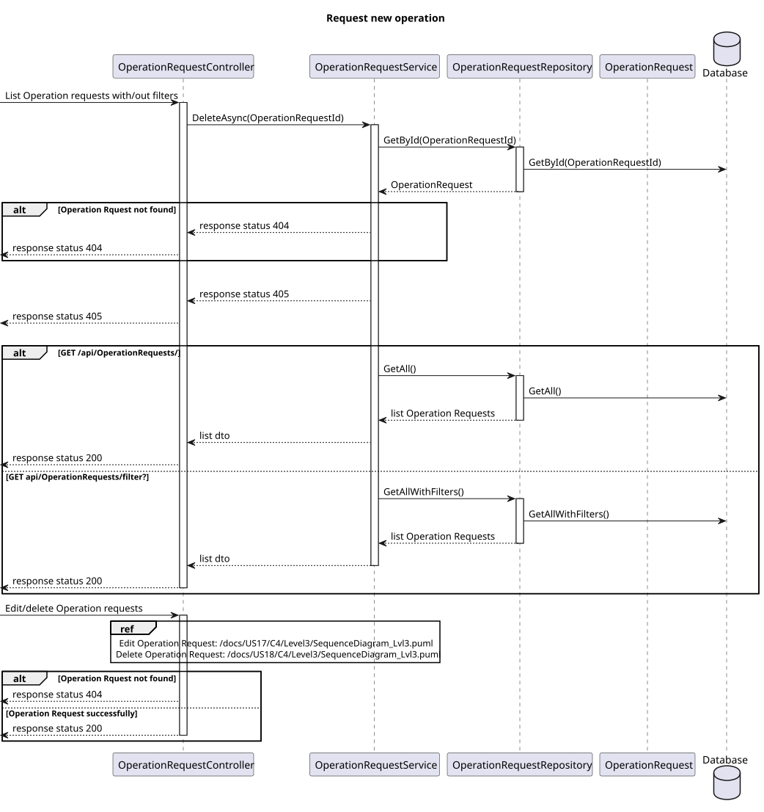
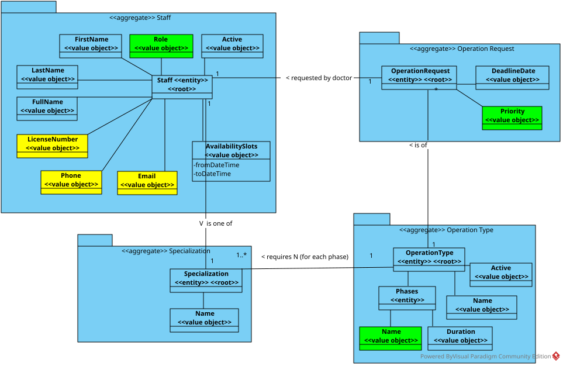

# US 19

## 1. Context

* Implement functionality for a Doctor to be able to list/search operation requisitions to be able to see the detalils, edit and remove operation requisitions.

## 2. Requirements

**US 19** As a Doctor, I want to list/search operation requisitions, so that I see the details, edit, and remove operation requisitions.

**Acceptance criteria:**
- Doctors can search operation requests by patient name, operation type, priority, and status.
- The system displays a list of operation requests in a searchable and filterable view.
- Each entry in the list includes operation request details (e.g., patient name, operation type,
status).
- Doctors can select an operation request to view, update, or delete it.


## 3. Analysis

* **Q** – In the project document it mentions that each operation has a priority. How is a operation's priority defined? Do they have priority levels defined? Is it a scale? Or any other system?
  * **A**: 
    - Elective Surgery: A planned procedure that is not life-threatening and can be scheduled at a convenient time (e.g., joint replacement, cataract surgery).
    - Urgent Surgery: Needs to be done sooner but is not an immediate emergency. Typically within days (e.g., certain types of cancer surgeries).
    - Emergency Surgery: Needs immediate intervention to save life, limb, or function. Typically performed within hours (e.g., ruptured aneurysm, trauma).
* **Q**: Can the same doctor who requests a surgery perform it?
  * **A**: Not necessarily. The planning module may assign different doctors based on availability and optimization.
* **Q**: What does “status” refer to in the context of searching for operating requisitions?
  * **A**: Status refers to whether the operation is planned or requested.
* **Q**: Good afternoon, 
  In the acceptance criteria for US19 - "As a Doctor, I want to list/search operation requisitions, so that I can see the details, edit, and remove operation requisitions," one of the criteria specifies: "- The system displays a list of operation requests in a searchable and filterable view." 
  Could you please clarify which filters the doctor can apply to the Operation Requisition search?
  * **A**: the doctor can search and filter by operation type, patient name, patient medical record number, date range.
* **Q**: When listing operation requests, should only the operation requests associated to the logged-in doctor be displayed?
  * **A**: a doctor can see the operation requests they have submitted as well as the operation requests of a certain patient.
an Admin will be able to list all operation requests and filter by doctor
it should be possible to filter by date of requeste, priority and expected due date


***


## 4. Design

### 4.1. Realization
#### Level 1

##### Level 2


##### Level 3


### 4.2. Class Diagram



### 4.3. Applied Patterns

Applied Patterns description in [DevelopmentPatterns](../Global/DevelopmentPatterns/readme.md)

### 4.4. Tests
- **Postman tests** 


- **OperationRequest test**
```
  public void OperationRequestValidArguments(){}
  public void OperationRequestInvalidPriorityThrowsException(){}
```
- **OperationRequestService test**

```
[Theory]
[InlineData("Urgent", null, "Ze", "202410000001", false, false)]
[InlineData("Urgent", 1, "Ze", "202410000001", false, false)]
[InlineData("Urgent", null, "Ze", "202410000001", true, false)]
[InlineData("Urgent", null, "Ze", "202410000001", false, true)]
[InlineData("Urgent", null, "Ze", "202410000001", true, true)]
public async Task GetAllAsyncWithFiltersReturnsOperationRequestList(){
  ...
  var result = await _service.GetAllAsyncWithFilters(priority, operationtype, patientName, patientMedicalRecordNumber, startDateTime, endDateTime);

  // Assert
  Assert.NotNull(result);
  Assert.Empty(result);
}
```

## 5. Implementation

- **OperationRequestController - GetAllWithFilters()**

```
return await _service.GetAllAsyncWithFilters(priority, operationtype, patientName, patientMedicalRecordNumber, startDate, endDate);
```

- **OperationRequestService - GetAllAsyncWithFilters()**

```
List<OperationRequest> list = await this._operationRepo.GetAllAsyncWithFilters(priority, operationtype, patientName, patientMedicalRecordNumber, startDate, endDate);
            List<OperationRequestDto> listDto = new List<OperationRequestDto>();
            foreach (OperationRequest operationRequest in list)
            {
                OperationRequestDto opRequestDto = operationRequest.ToDto();
                listDto.Add(opRequestDto);
            }
            return listDto;
```
## 6. Integration/Demonstration

* Para executar esta funcionalidade deve fazer login no sistema como Doctor.