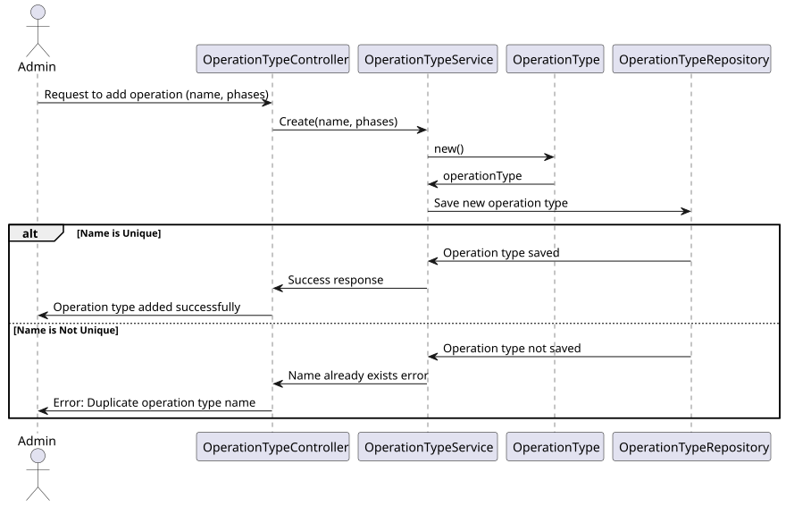

# US 20

## 1. Context

* The new types of operations were created by the Admin user in the system and considering the acceptance criteria bellow.

## 2. Requirements

**US 20** 
As an Admin, I want to add new types of operations, so that I can reflect the available medical procedures in the system. #21

**Acceptance criteria:**
* Admins can add new operation types with attributes like:
* Operation Name
* Required Staff by Specialization
* Estimated Duration
* The system validates that the operation name is unique.
* The system logs the creation of new operation types and makes them available for scheduling
  immediately.


## 3. Analysis

* Q: What factors should be considered for surgery scheduling? 
  * A: A combination of professional seniority, surgery duration, and urgency will be considered.
  Scheduling will occur in the second sprint.  

***

* Q: What is the difference between appointment, surgery, and operation? 
  * A: Surgery is a medical procedure (e.g., hip surgery), while an operation request is when a doctor schedules that surgery for a patient. An appointment is the scheduled date for the operation, determined by the planning module.

***

* Q: Can surgeries be rescheduled? 
  * A: Yes, surgeries can be rescheduled due to various reasons like emergencies or changes in staff availability. 

***


## 4. Design

### 4.1. Realization

#### Level 1

##### Level 2

##### Level 3


### 4.2. Class Diagram


### 4.3. Applied Patterns

Applied Patterns description in [DevelopmentPatterns](../Global/DevelopmentPatterns/readme.md)

### 4.4. Tests


```
[Fact]
public void OperationTypeValidArguments()
{
    // Given
    string name = "Operation type test";
    List<OperationTypePhase> operationTypePhases = DummyOperationTypePhases();
    int version = 1;

    // When
    OperationType operationType = new OperationType(name, operationTypePhases, version);

    // Then
    Assert.NotNull(operationType);
    Assert.Equal(name, operationType.Name);
    Assert.Equal(operationTypePhases, operationType.Phases);
    Assert.Equal(version, operationType.Version);
}
```
```
[Fact]
public void OperationTypeInvalidNameThrowsException()
{
    // Given
    List<OperationTypePhase> operationTypePhases = DummyOperationTypePhases();
    int version = 1;

    // When & Then
    Assert.Throws<BusinessRuleValidationException>(() => new OperationType(null, operationTypePhases, version));
}
```
```
[Fact]
public void OperationTypeInvalidVersionThrowsException()
{
    // Given
    string name = "Operation type test";
    List<OperationTypePhase> operationTypePhases = DummyOperationTypePhases();
    int version = -1;

    // When & Then
    Assert.Throws<BusinessRuleValidationException>(() => new OperationType(name, operationTypePhases, version));
}  
```
```
[Fact]
public void OperationTypeInvalidPhasesThrowsException()
{
    // Given
    string name = "Operation type test";
    int version = 1;

    // When & Then
    Assert.Throws<BusinessRuleValidationException>(() => new OperationType(name, null, version));
}
```

## 5. Implementation

* Controller
```
var operationTypeDto = await _service.AddAsync(dto);
return operationTypeDto;
```

* Service
```
OperationTypeVersion++;
OperationType operationType = new OperationType(dto.Name, phases, OperationTypeVersion);

await this._operationTypeRepo.AddAsync(operationType);

await this._unitOfWork.CommitAsync();

return operationType.ToDto();
```

## 6. Integration/Demonstration

* To use this funcionality you must log in the system as an Admin.
