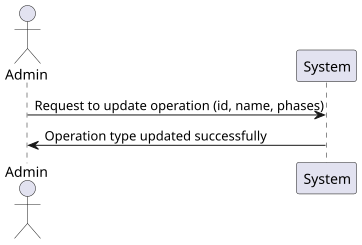
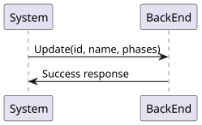
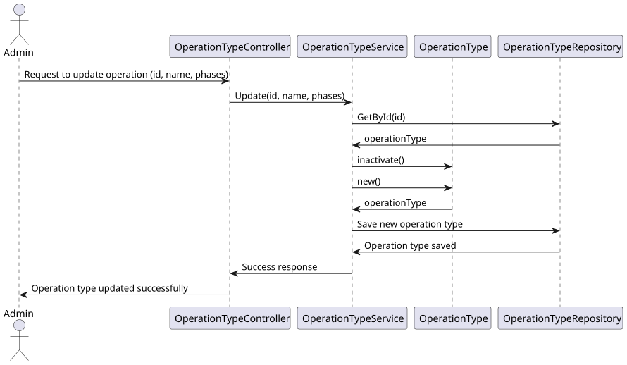
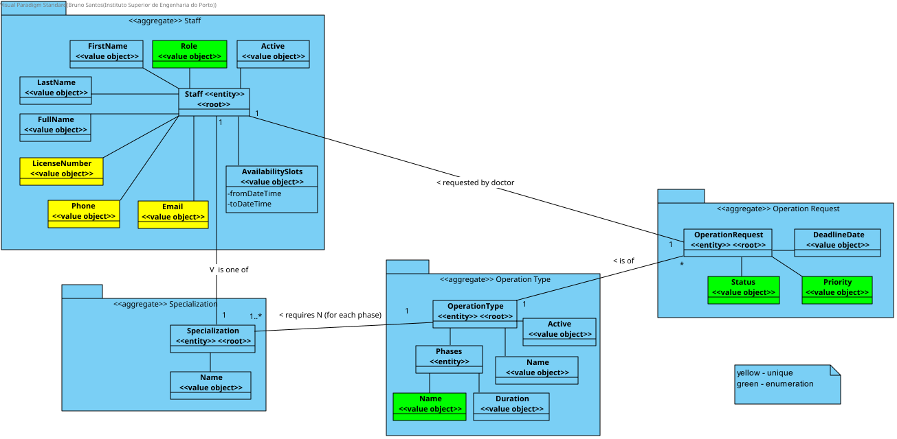

# US 21

## 1. Context

* New information is added to each type of operation to improve the procedure.  

## 2. Requirements

**US 21** 
As an Admin, I want to edit existing operation types, so that I can update or 
correct information about the procedure. #22

**Acceptance criteria:**
* Admins can search for and select an existing operation type to edit.
* Editable fields include operation name, required staff by specialization, and estimated
  duration.
* Changes are reflected in the system immediately for future operation requests.
* Historical data is maintained, but new operation requests will use the updated operation type information.


## 3. Analysis

* There has been no need to clarify this use case with the customer so far.

***


## 4. Design

### 4.1. Realization

#### Level 1

##### Level 2

##### Level 3


### 4.2. Class Diagram




### 4.3. Applied Patterns

Applied Patterns description in [DevelopmentPatterns](../Global/DevelopmentPatterns/readme.md)

### 4.4. Tests


## 5. Implementation

* Controller
```
var operationTypeDto = await _service.UpdateAsync(dto);
if (operationTypeDto == null)
    return NotFound();
return Ok(operationTypeDto);
```

* Service
```
OperationType operationType = await this._operationTypeRepo.GetByIdAsync(new OperationTypeId(dto.Id));

if (operationType == null)
    return null;

operationType.Inactivate();
await this._unitOfWork.CommitAsync();

OperationTypeVersion = this._operationTypeRepo.GetMaxVersionByName(operationType.Name);
return await AddAsync(dto);
```

## 6. Integration/Demonstration

* To use this funcionality you must log in the system as an Admin.
