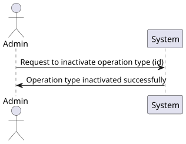

# US 22

## 1. Context

* Operation types can be deactivated and deleted by Admin and a log of these actions is kept.

## 2. Requirements

**US 22** 
As an Admin, I want to remove obsolete or no longer performed operation types, so that the 
system stays current with hospital practices. #23


**Acceptance criteria:**
* Admins can search for and mark operation types as inactive (rather than deleting them) to
preserve historical records.
* Inactive operation types are no longer available for future scheduling but remain in historical
data.
* A confirmation prompt is shown before deactivating an operation type.


## 3. Analysis

* Q: Should actions like removing an operation type be accessed only through specific methods? 
  * A: Yes, operations like removal or deactivation should be available via specific API methods. 
 
***

* Q: Is removing an operation type the same as deactivating it? 
  * A: Yes, deactivating makes the operation type unavailable for future use but retains historical data. 

***


## 4. Design

### 4.1. Realization

#### Level 1

##### Level 2

##### Level 3


### 4.2. Class Diagram


### 4.3. Applied Patterns

Applied Patterns description in [DevelopmentPatterns](../Global/DevelopmentPatterns/readme.md)

### 4.4. Tests


```
[Fact]
public void InactivateOperationType()
{
    // Given
    string name = "Operation type test";
    List<OperationTypePhase> operationTypePhases = DummyOperationTypePhases();
    int version = 1;
    OperationType operationType = new OperationType(name, operationTypePhases, version);

    // When
    operationType.Inactivate();

    // Then
    Assert.False(operationType.Active);
}
```

## 5. Implementation

* Controller
```
var operationTypeDto = await _service.InactivateAsync(id);
if (operationTypeDto == null)
    return NotFound();
return Ok(operationTypeDto);
```

* Service
```
OperationType operationType = await this._operationTypeRepo.GetByIdAsync(new OperationTypeId(id));

if (operationType == null)
    return null;

operationType.Inactivate();
await this._unitOfWork.CommitAsync();

return operationType.ToDto();
```

## 6. Integration/Demonstration

* To use this funcionality you must log in the system as an Admin.
