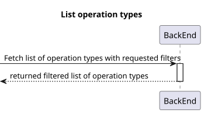
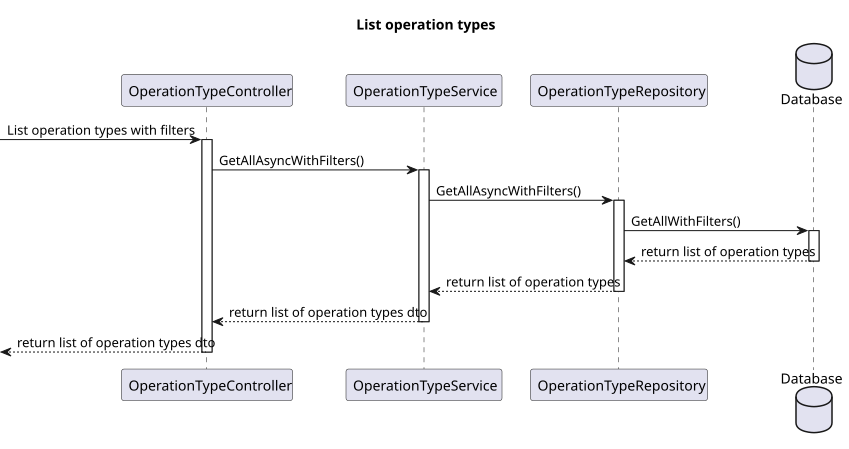
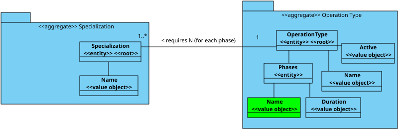

# US 23

## 1. Context

* The admin wants to list/search operation types by their details.

## 2. Requirements

**US 23** US23- As an Admin, I want to list/search operation types, so that I can see the details, edit, and remove operation types.

**Acceptance criteria:**
- Admins can search and filter operation types by name, specialization, or status (active/inactive).
- The system displays operation types in a searchable list with attributes such as name, required staff, and estimated duration.
- Admins can select an operation type to view, edit, or deactivate it.

## 3. Analysis

* he operation type should be searchable by name, specializations and status (active/inactive).
* The returned list should contain all of the operation type data.

## 4. Design

### 4.1. Realization
#### Level 1

##### Level 2

##### Level 3


### 4.2. Class Diagram



### 4.3. Applied Patterns

Applied Patterns description in [DevelopmentPatterns](../Global/DevelopmentPatterns/readme.md)

### 4.4. Tests


## 5. Implementation

* Controller (get by id)
```
var operationTypeDto = await _service.GetByIdAsync(id);
if (operationTypeDto == null)
    return NotFound();
return operationTypeDto;
```

* Service (get by id)
```
var operationType = await this._operationTypeRepo.GetByIdAsync(new OperationTypeId(id));
if (operationType == null)
    return null;
return operationType.ToDto();
```

* Controller (get with filters)
```
return await _service.GetAllAsyncWithFilters(name, specialization, active);
```

* Service (get with filters)
```
List<OperationType> list = await this._operationTypeRepo.GetAllAsyncWithFilters(name, specialization, active);
List<OperationTypeDto> listDto = [];
foreach (OperationType operationType in list)
{
    listDto.Add(operationType.ToDto());
}
return listDto;
```

## 6. Integration/Demonstration

* To use this funcionality you must log in the system as an Admin.
