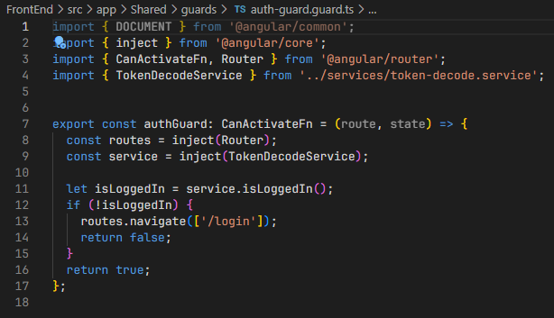
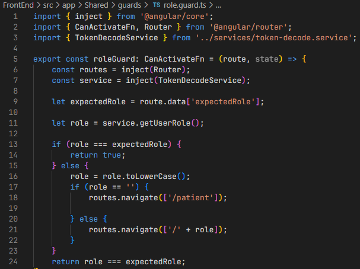
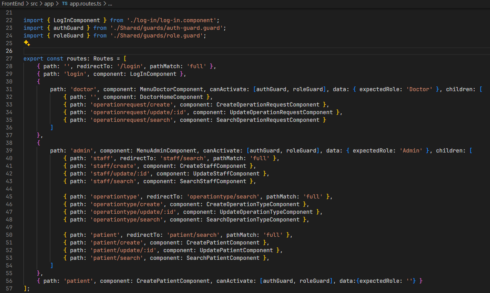

# US6.1.2 | SEM5-2

## 1. Context

* The application uses the ‘auth-guard’ authentication and authorisation system.
  Authentication for each user to authenticate in the application.
  Authorisation for each user, once authenticated, to view the menu options according to their ‘roles’.

* The menu and routes are dynamically adjusted for users with different roles such as ‘Admin’, ‘Doctor’ or ‘Patient User’.

## 2. Requirements

**US6.1.2** 
As user I want the application menu to adjust according to my role so that it only presents me the options I may access.

**Acceptance criteria:**

* The menu should only show the options relevant to the user's role.

* Access to each route must be protected, blocking unauthorised users.

* The application must redirect the user if they try to access a route or functionality for which they do not have permission.

## 3. Analysis

* Use of Guards:
  Two guards were used: authGuard and roleGuard, defined in Shared/guards.
  The authGuard validates that the user is authenticated.
  The roleGuard checks that the user's role corresponds to that expected by the route.

* Route configuration:
  Each route is configured with canActivate to protect access. Example:
  {
      path: ‘doctor’, 
      component: MenuDoctorComponent, 
      canActivate: [authGuard, roleGuard], 
      data: { expectedRole: ‘Doctor’ }
  }
  The properties data: { expectedRole: ‘...’ } determine which role can access the route.

* Dynamic Menu:
  The menu is generated dynamically based on the user's role after login.
  Specific menu components, such as MenuDoctorComponent and MenuAdminComponent, are displayed based on the authorised role.
  
* BackEnd:
  The user's role is defined during authentication in BackEnd and sent as part of the token, JSON response.
  Implementation related to authentication and roles is in the Startup.cs file and the corresponding Controllers, such as StaffController.cs.

## 4. Design

### 4.2. Class Diagram

### 4.3. Applied Patterns

Applied Patterns description in [DevelopmentPatterns](../Global/DevelopmentPatterns/readme.md)

## 5. Implementation

* Solid security and modularity practices are used, ensuring that the menu and routes are dynamic and secure. 

* We have an auth-guard to ensure that the user is logged in.

* We have a role-guard with one role per user.

* File where Auth-Guard is implemented.

## 6. Integration/Demonstration

* To run this feature you must log in to the system as a backoffice Admin.