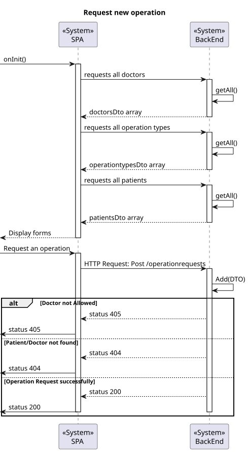

# US 6.1.4

## 1. Context

*  Implement functionality for an Admin to have specific information in the planning module to be in sync with the information entered in the backoffice module .

## 2. Requirements

**US 6.1.4** As Admin I want the information about healthcare staff, operation types, and operation requests used in the planning module is in sync with the information entered in the backoffice module


## 3. Analysis

* **Person** – Question
  * **A**: 
    - Answer

## 4. Design

### 4.1. Realization

##### Level 1


##### Level 2


##### Level 3


### 4.2. Class Diagram


### 4.3. Applied Patterns

Applied Patterns description in [DevelopmentPatterns](../Global/DevelopmentPatterns/readme.md)

### 4.4. Tests


```
[Theory]
[InlineData("D202400001", "email", "918596542", "Carlos", "Sainz", "Doctor")]
[InlineData("N202400009", "email", "912023415", "Max", "Verstappen", "Nurse")]
public void EnsureIsAnEmail(string licenseNumber, string email, string phone, string firstName, string lastName,
    string role)
{
    Specialization specialization = new Specialization("Genecologist");
    var availabilitySlots = new List<DateTimeTuple>
    {
        new DateTimeTuple(DateTime.Now, DateTime.Now.AddHours(1))
    };

    Assert.Throws<BusinessRuleValidationException>(() => new Staff(licenseNumber, email, phone, firstName, lastName, role, availabilitySlots, specialization));

}
```


## 5. Implementation

* Controller
```
var dto = await _service.AddAsync(creatingDto);
return dto;
```

* Service
```
...
Staff staff = new Staff(dto.LicenseNumber, dto.Email, dto.Phone, dto.FirstName, dto.LastName, dto.Role, availabilitySlots, specialization);

staff = await this._staffRepo.AddAsync(staff);
await this._unitOfWork.CommitAsync();

staff.AddPrefix();
...
await this._unitOfWork.CommitAsync();

return staff.ToDto();
```


## 6. Integration/Demonstration

* To use this funcionality you must log in the system as an Admin.
