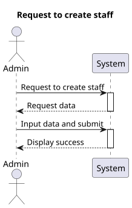
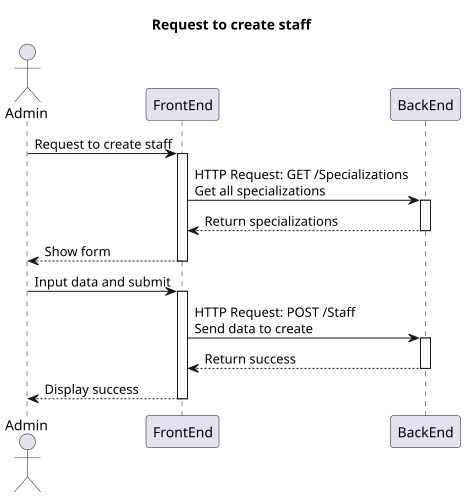
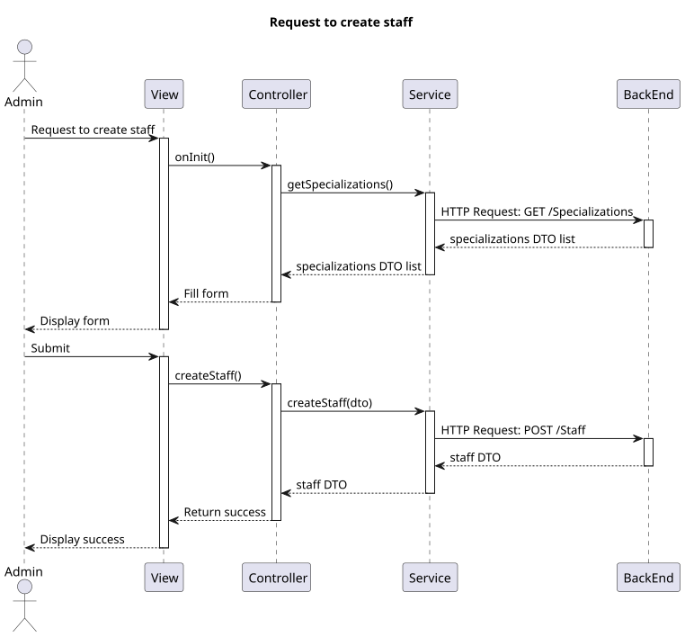

# US 6.2.10

## 1. Context

*  Implement UI functionality for an Admin to create a new staff profile.

## 2. Requirements

**US 6.2.10** As an Admin, I want to create a new staff profile, so that I can add them to the hospital’s roster.

**Acceptance criteria:**
- Admins can input staff details such as first name, last name, contact information, and specialization.
- A unique staff ID (License Number) is generated upon profile creation.
- The system ensures that the staff’s email and phone number are unique.
- The profile is stored securely, and access is based on role-based permissions.

## 3. Analysis

- The option to create a staff should be available only to admin accounts.
- On staff creation, the specialization must be selectable and a variable number of availability slots should be insertable (from date time to date time).

## 4. Design

### 4.1. Realization

##### Level 1


##### Level 2


##### Level 3


### 4.2. Class Diagram


### 4.3. Applied Patterns

Applied Patterns description in [DevelopmentPatterns](../Global/DevelopmentPatterns/readme.md)

### 4.4. Tests

* Create staff component test
```
it('should create', () => {...});
it('should call getAllSpecializations on init', () => {...});
it('should initialize form with default values', () => {...});
it('should update form with values', () => {...});
it('should create staff dto', () => {...});
it('should call createStaff on form submit', () => {...});
it('should show success toastr on successful staff creation', () => {...});
it('should show error toastr on invalid staff creation', ()=>{...});
```

* Staff service test
```
it('should create a new staff member', () => {...});
```

## 5. Implementation

* Create staff component
    ```
    createStaff() {
        this.staff = this.createDto();

        if (this.staff == null)
            return alert("Staff invalid, unexpected error!");

        this.service.createStaff(this.staff).subscribe({
            next: () => {
                this.toastr.success('Staff created successfully', 'Success');
                this.staffForm.reset();

                const availabilitySlotsForm = this.staffForm.get('availabilitySlots') as FormArray;
                for (let i = 1; i < availabilitySlotsForm.length; i++) {
                    availabilitySlotsForm.removeAt(i);
                }
            },
            error: (err: HttpErrorResponse) => {
                this.toastr.error('Failed to create staff\n' + err.error.message, 'Error');
            }
        })
    }
    ```
* Staff service
    ```
    createStaff(staff: CreatingStaffDto): Observable<StaffDto> {
        let req: Observable<StaffDto>;
        req = this.http.post<StaffDto>(this.staffUrl, staff);
        return req.pipe(
            catchError((error: HttpErrorResponse) => {
                return throwError(() => error);
            })
        );
    }
    ```

## 6. Integration/Demonstration

* Log in the system with an admin account and select the create staff option in the sidebar
