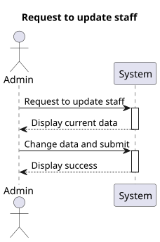
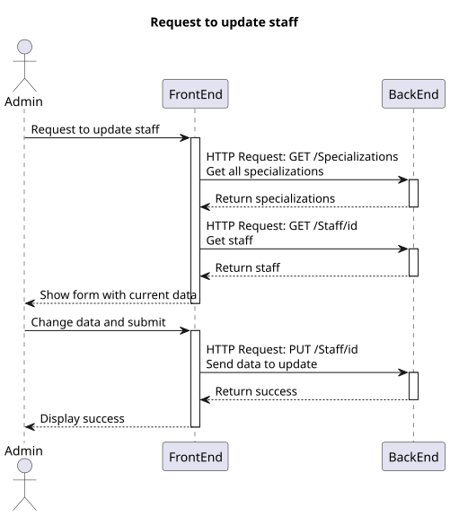
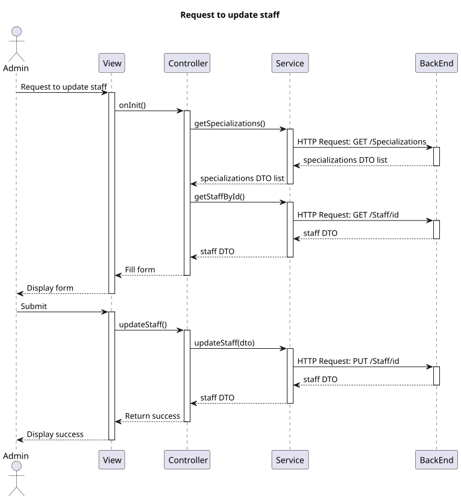

# US 6.2.11

## 1. Context

*  Implement UI functionality for an Admin to update a staff profile.

## 2. Requirements

**US 6.2.11** As an Admin, I want to edit a staff’s profile, so that I can update their information.

**Acceptance criteria:**
- Admins can search for and select a staff profile to edit.
- Editable fields include contact information, availability slots, and specialization.
- The system logs all profile changes, and any changes to contact information trigger a confirmation email to the staff member.
- The edited data is updated in real-time across the system.

## 3. Analysis

- The option to update a staff should be available after listing the staff and selecting one.
- On staff update, the specialization must be selectable and a variable number of availability slots should be insertable (from date time to date time).

## 4. Design

### 4.1. Realization

##### Level 1



##### Level 2



##### Level 3



### 4.2. Class Diagram


### 4.3. Applied Patterns

Applied Patterns description in [DevelopmentPatterns](../Global/DevelopmentPatterns/readme.md)

### 4.4. Tests

* Update staff componenet test
```
it('should create', () => {...});
it('should call getAllSpecializations on init', async () => {...});
it('should call getStaffById on init', () => {...});
it('should handle error when getAllSpecializations fails', async () => {...});
it('should handle error when getStaffById fails', async () => {...});
it('should update form on getStaffById success', async () => {...});
it('should handle error when update staff fails', () => {...});
it('should navigate to search on update success', () => {...});
```

* Staff service test
```
it('should update an existing staff member', () => {...});
```

## 5. Implementation

* Update staff component
    ```
    getStaff() {
        this.service.getStaffById(this.staffId).subscribe({
            next: (resultStaff: StaffDto | null) => {
                if (resultStaff != null) {
                    this.staffForm.controls['licenseNumber'].setValue(resultStaff.licenseNumber);
                    this.staffForm.controls['email'].setValue(resultStaff.email);
                    this.staffForm.controls['phone'].setValue(resultStaff.phone);
                    this.staffForm.controls['firstName'].setValue(resultStaff.firstName);
                    this.staffForm.controls['lastName'].setValue(resultStaff.lastName);
                    this.staffForm.controls['role'].setValue(resultStaff.role);
                    this.staffForm.controls['specialization'].setValue(resultStaff.specialization);

                    let formArray = this.staffForm.get('availabilitySlots') as FormArray;
                    for (let i = 0; i < resultStaff.availabilitySlots.length; i++) {
                        formArray.push(this.createSlotFormGroupWithValues(
                            resultStaff.availabilitySlots[i].item1,
                            resultStaff.availabilitySlots[i].item2,
                        ));
                    }
                } else {
                    this.toastr.error('Staff not found', 'Error');
                    this.sendToSearch();
                }
            },
            error: (err: HttpErrorResponse) => {
                this.toastr.error('Staff not found', 'Error');
                this.sendToSearch();
            }
        });
    }
    ```
* Staff service
    ```
    updateStaff(staff: UpdatingStaffDto): Observable<StaffDto> {
        let req: Observable<StaffDto>;
        req = this.http.put<StaffDto>(this.staffUrl + '/' + staff.id, staff)
        return req.pipe(
            catchError((error: HttpErrorResponse) => {
                return throwError(() => error);
            })
        )
    }
    ```


## 6. Integration/Demonstration

* Log in the system with an admin account and select the search staff option in the sidebar, find the staff to update and then click on the pencil button.
