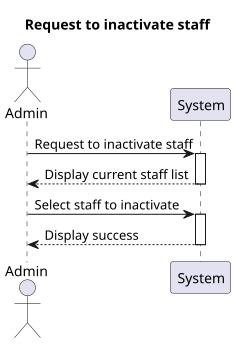
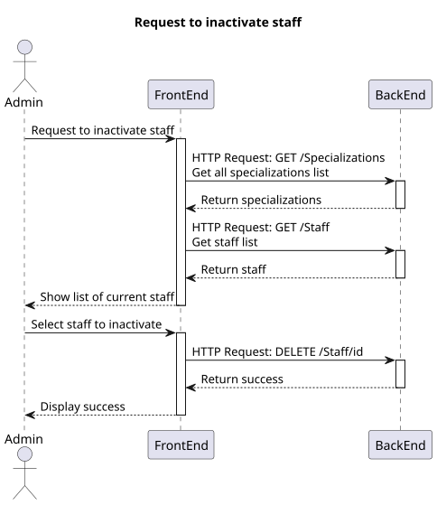
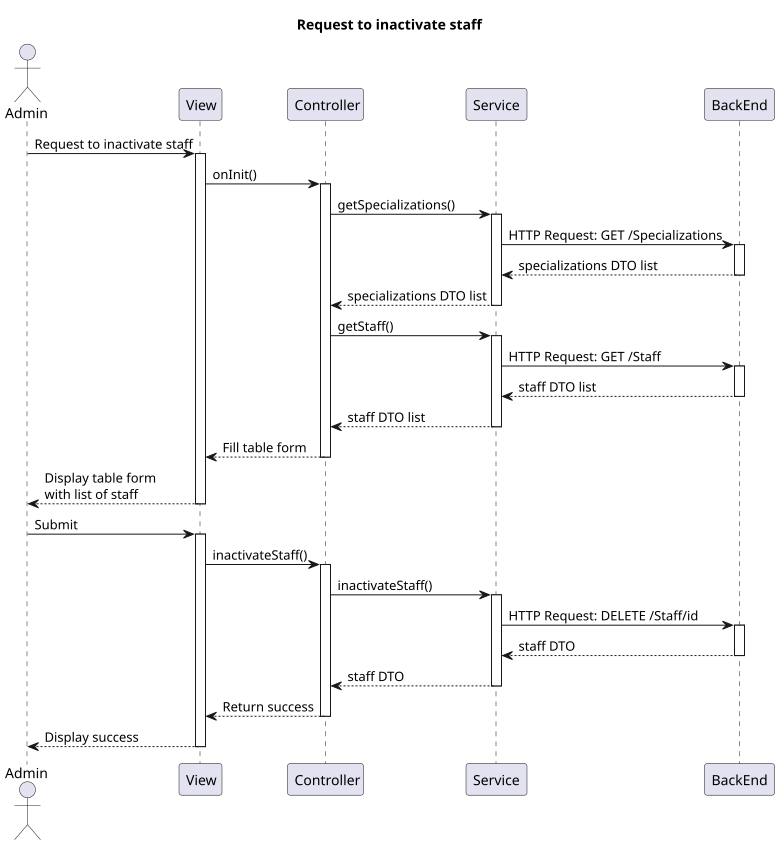
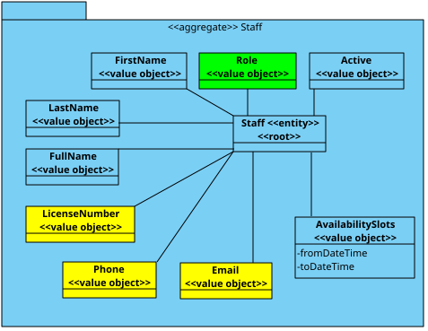

# US 6.2.12

## 1. Context

*  Implement UI functionality for an Admin to inactivate a staff profile.

## 2. Requirements

**US 6.2.12** As an Admin, I want to deactivate a staff profile, so that I can remove them from the hospital’s active roster without losing their historical data.

**Acceptance criteria:**
- Admins can search for and select a staff profile to deactivate.
- Deactivating a staff profile removes them from the active roster, but their historical data (e.g., appointments) remains accessible.
- The system confirms deactivation and records the action for audit purposes.

## 3. Analysis

- The option to inactivate a staff should be available after listing the staff and selecting one.
- On staff inactivate, a confirmation popup should be displayed.

## 4. Design

### 4.1. Realization

##### Level 1



##### Level 2



##### Level 3



### 4.2. Class Diagram



### 4.3. Applied Patterns

Applied Patterns description in [DevelopmentPatterns](../Global/DevelopmentPatterns/readme.md)

### 4.4. Tests

* Inactivate staff component test
```
it('should inactivate staff', async () => {...});
```

* Staff service test
```
it('should inactivate a staff member', () => {...});
```

## 5. Implementation

* Search staff component
    ```
    inactivateStaff() {
        this.service.inactivateStaff(this.selectedStaffId)
            .subscribe({
                next: (response) => {
                    this.toastr.success('Staff inactivated successfully', 'Success');
                    this.getStaff();
                },
                error: (err: HttpErrorResponse) => {
                    this.toastr.error(err.error.message, 'Error');
                }
            });
    }
    ```
* Staff service
    ```
    inactivateStaff(id: string) {
        let req: Observable<StaffDto>;
        req = this.http.delete<StaffDto>(this.staffUrl + '/' + id)
        return req.pipe(
            catchError((error: HttpErrorResponse) => {
                return throwError(() => error);
            })
        )
    }
    ```


## 6. Integration/Demonstration

* Log in the system with an admin account and select the search staff option in the sidebar, find the staff to inactivate and then click on the delete button.
