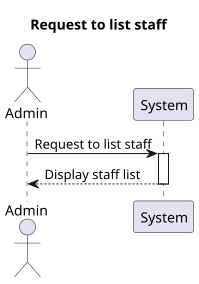
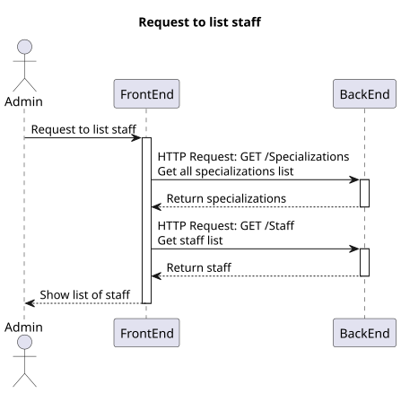
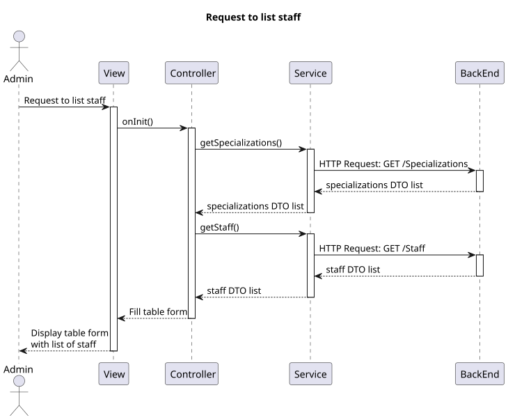

# US 6.2.13

## 1. Context

*  Implement UI functionality for an Admin to list staff profiles with filters.

## 2. Requirements

**US 6.2.13** As an Admin, I want to list/search staff profiles, so that I can see the details, edit, and remove staff profiles.

**Acceptance criteria:**
- Admins can search staff profiles by attributes such as name, email, or specialization.
- The system displays search results in a list view with key staff information (name, email, specialization).
- Admins can select a profile from the list to view, edit, or deactivate.
- The search results are paginated, and filters are available for refining the search results.

## 3. Analysis

- There should be various filters to precisely find the desired staff.
- The presented list of staff must have an option to modify or inactivate the staff.

* **Q** – What types of filters can be applied when searching for profiles?
  * **A**: Filters can include doctor specialization, name, or email to refine search results.

## 4. Design

### 4.1. Realization

##### Level 1



##### Level 2



##### Level 3



### 4.2. Class Diagram


### 4.3. Applied Patterns

Applied Patterns description in [DevelopmentPatterns](../Global/DevelopmentPatterns/readme.md)

### 4.4. Tests

* Search staff component test
```
it('should create', () => {...});
it('should sort data correctly', () => {... });
```

* Staff service test
```
it('should fetch all specializations', () => {...});
it('should fetch all staff', () => {...});
it('should fetch staff by filters', () => {...});
it('should fetch staff by ID', () => {...});
it('should handle HTTP errors', () => {...});
```

## 5. Implementation

* Search staff component
    ```
    getStaff() {
        let licenseNumber = this.filtersForm.value.licenseNumber;
        let name = this.filtersForm.value.name;
        let role = this.filtersForm.value.role;
        let specialization = this.filtersForm.value.specialization;
        let active = this.filtersForm.value.active;

        this.service.getStaff(licenseNumber, name, role, specialization, active)
            .subscribe({
                next: (resultStaff) => {
                    if (resultStaff != null) {
                        this.staffList = resultStaff;
                        for (let i = 0; i < this.staffList.length; i++) {
                            let specialization: SpecializationDto | undefined;
                            specialization = this.specializations.find(spec => spec.id === this.staffList[i].specialization == null);
                            if (specialization != null) {
                                this.staffList[i].specializationName = specialization.name;
                            }
                        }
                    }
                }
            });
    }
    ```
* Staff service
    ```
    getStaff(licenseNumber: string, fullName: string, role: string, specialization: number, active: boolean): Observable<StaffDto[]> {
        let filters = new HttpParams();
        if (licenseNumber != null && licenseNumber != '') {
            filters = filters.set('licenseNumber', licenseNumber);
        }
        if (fullName != null && fullName != '') {
            filters = filters.set('name', fullName);
        }
        if (role != null && role != '') {
            filters = filters.set('role', role);
        }
        if (specialization != null && specialization > 0) {
            filters = filters.set('specialization', specialization);
        }
        if (active != null) {
            filters = filters.set('active', active);
        }
        let req: Observable<StaffDto[]>;
        req = this.http.get<StaffDto[]>(this.staffUrl, { params: filters });
        return req.pipe(
            catchError((error: HttpErrorResponse) => {
                return throwError(() => error);
            })
        )
    }
    ```

## 6. Integration/Demonstration

* Log in the system with an admin account and select the search staff option in the sidebar, input any filters and then click on the search button.
