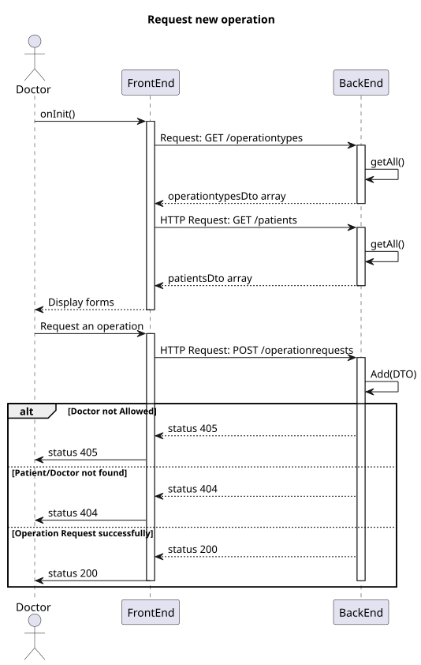
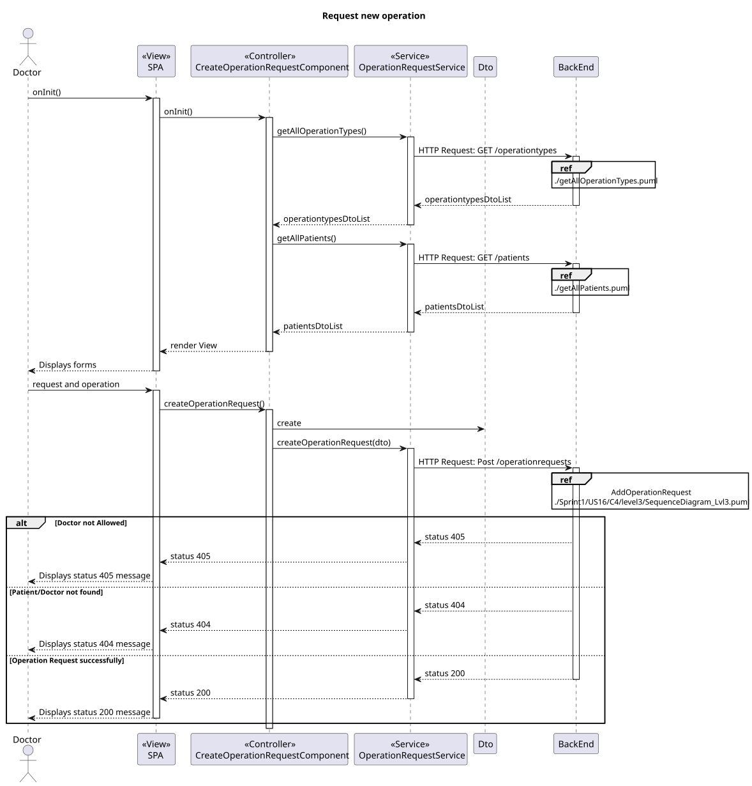
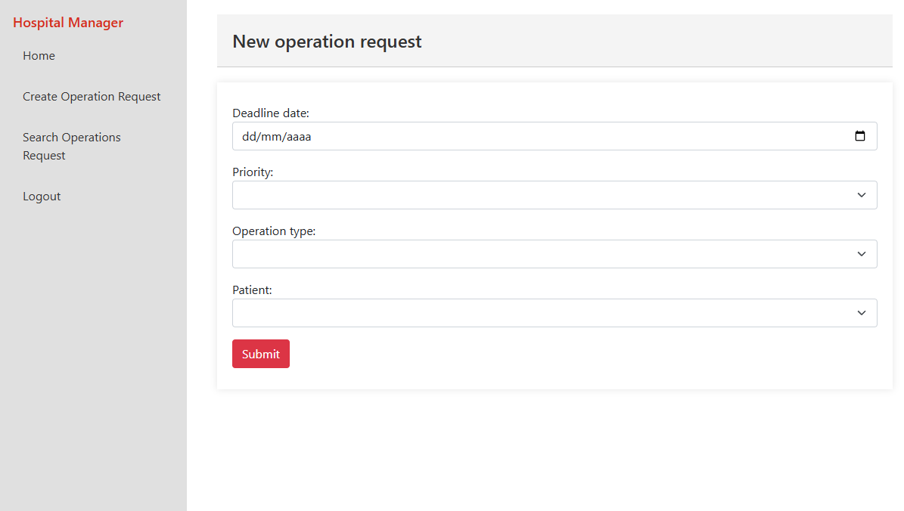

# US 6.2.14

## 1. Context

- Implement functionality in the frontend so that the doctor can fill the form to request an operation.

## 2. Requirements

**US 6.2.14** As a Doctor, I want to request an operation, so that the Patient has access to the necessary healthcare.

**Acceptance criteria:**

- Doctors can create an operation request by selecting the patient, operation type, priority, and suggested deadline.
- The system validates that the operation type matches the doctor’s specialization.
- The operation request includes:
- Patient ID
- Doctor ID
- Operation Type
- Deadline
- Priority
- The system confirms successful submission of the operation request and logs the request in
  the patient’s medical history.

## 3. Analysis

- **Q Varela**: In the project document it mentions that each operation has a priority. How is a operation's priority defined? Do they have priority levels defined? Is it a scale? Or any other system?
  - **A**:
    - Elective Surgery: A planned procedure that is not life-threatening and can be scheduled at a convenient time (e.g., joint replacement, cataract surgery).
    - Urgent Surgery: Needs to be done sooner but is not an immediate emergency. Typically within days (e.g., certain types of cancer surgeries).
    - Emergency Surgery: Needs immediate intervention to save life, limb, or function. Typically performed within hours (e.g., ruptured aneurysm, trauma).
- **Q**: Can the same doctor who requests a surgery perform it?
  - **A**: Not necessarily. The planning module may assign different doctors based on availability and optimization.
- **Q**: What does “status” refer to in the context of searching for operating requisitions?
  - **A**: Status refers to whether the operation is planned or requested.

## 4. Design

### 4.1. Realization

##### Level 1


##### Level 2



##### Level 3



### 4.2. Class Diagram


### 4.3. Tests

- **Create OperationRequest test**

```
  it('should create', () => {});
  it('should call getAllPatients on init', async () => {});
  it('should call getAllOperationTypes on init', async () => {...});
  it('should initialize form with default values', () => {...});
  it('should update form with values', () => {...});
  it('should create operation request dto', () => {...});
  it('should call createOperationRequest on form submit', () => {...});
  it('should show success toastr on successful operation request creation', () => {...});
```

- **OperationRequestService test**

```
describe('OperationRequestService', () => {
  it('should be created', () => {...});

  it('should fetch all operation types', () => {...});
  it('should fetch all patients', () => {...});

  it('should create a new operation request', () => {...});
}
```

## 5. Implementation

- **OperationRequestController - createOperationRequest()**

```
...
  this.service.createOperationRequest(this.operationRequest).subscribe({
        next: (response) => {
          this.toastr.success('Operation request created successfully', 'Success');
          this.operationRequestForm.reset();
        },
        error: (err) => {
          this.toastr.error('Failed to create operation request\n'+ err.error.messages, 'Error');
        }
      });
...
```

- **OperationRequestService - createOperationRequest()**

```
let req: Observable<OperationRequestDto>;
        req = this.http.post<OperationRequestDto>(this.operationRequestsUrl, operationRequest); //
        return req.pipe(
            catchError((error) => {
                if (error.status == 500) {
                    return throwError(() => 'Invalid Date format, please fill with dd/mm/yyyy hh:mm:ss');
                }
                return throwError(() => error);
            })
        );
```

## 6. Integration/Demonstration

- To execute this functionality you must login into the system as Doctor and navigate to Create Operation Request.
  
