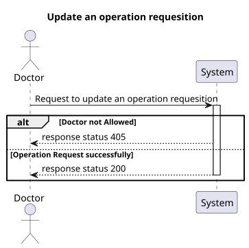
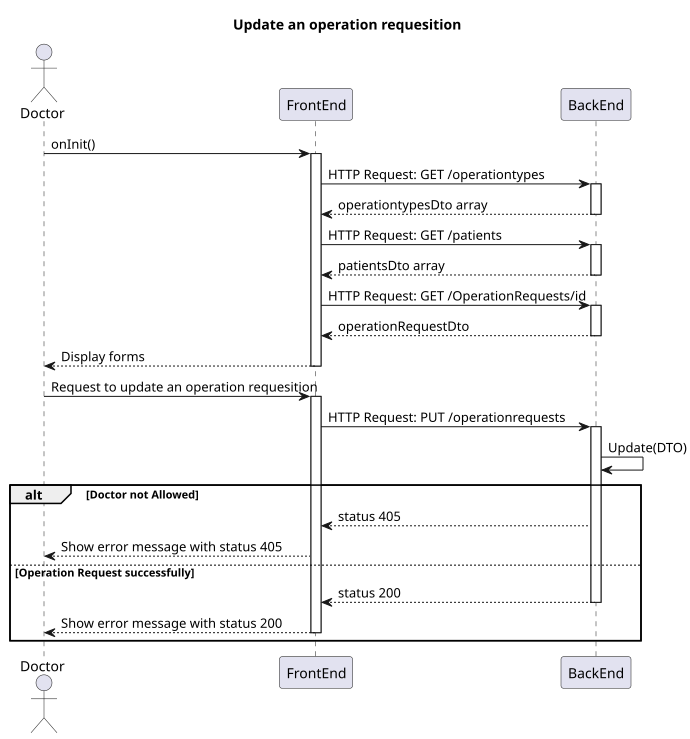
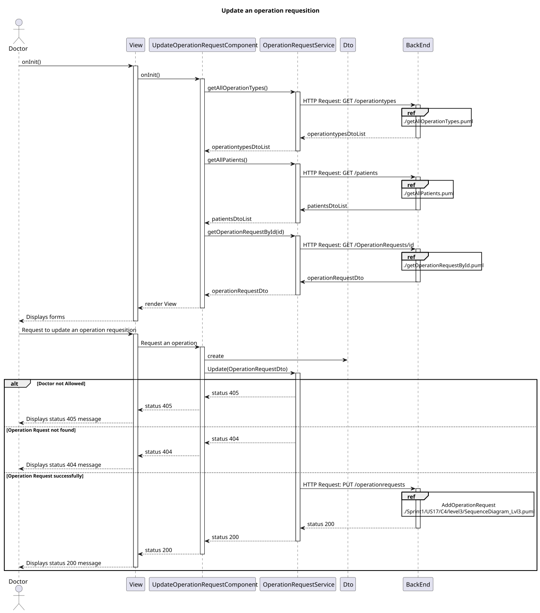
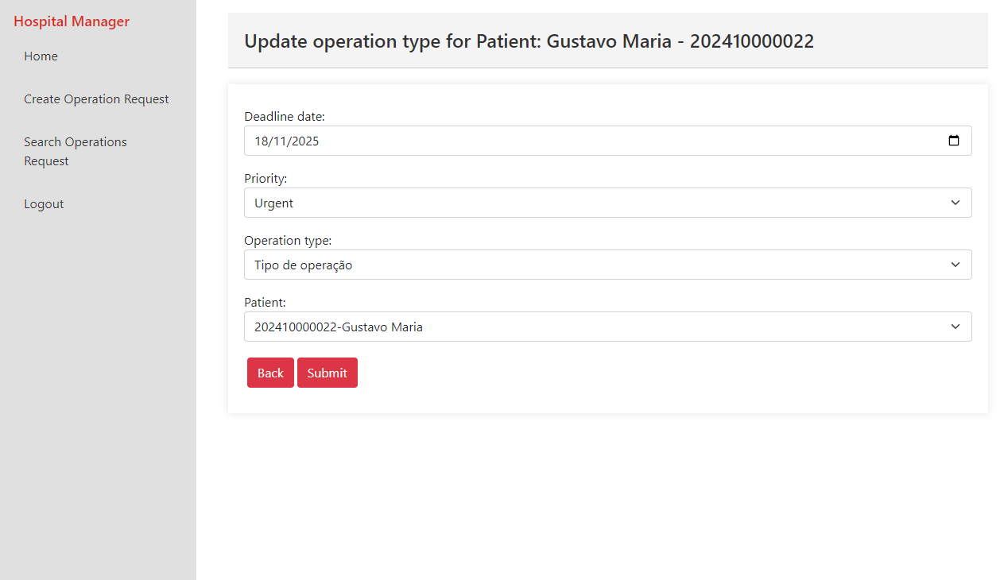

# US 6.2.15

## 1. Context

* Implement functionality in the frontend so that the doctor can fill the form to update an operation.

## 2. Requirements

**US 6.2.15** As a Doctor, I want to update an operation requisition, so that the Patient has access to the necessary healthcare.

**Acceptance criteria:**
- Doctors can update operation requests they created (e.g., change the deadline or priority).
- The system checks that only the requesting doctor can update the operation request.
- The system logs all updates to the operation request (e.g., changes to priority or deadline).
- Updated requests are reflected immediately in the system and notify the Planning Module of
any changes.


## 3. Analysis

* **Q Varela** – In the project document it mentions that each operation has a priority. How is a operation's priority defined? Do they have priority levels defined? Is it a scale? Or any other system?
  * **A**: 
    - Elective Surgery: A planned procedure that is not life-threatening and can be scheduled at a convenient time (e.g., joint replacement, cataract surgery).
    - Urgent Surgery: Needs to be done sooner but is not an immediate emergency. Typically within days (e.g., certain types of cancer surgeries).
    - Emergency Surgery: Needs immediate intervention to save life, limb, or function. Typically performed within hours (e.g., ruptured aneurysm, trauma).
* **Q**: Can the same doctor who requests a surgery perform it?
  * **A**: Not necessarily. The planning module may assign different doctors based on availability and optimization.
* **Q**: What does “status” refer to in the context of searching for operating requisitions?
  * **A**: Status refers to whether the operation is planned or requested.
***


## 4. Design

### 4.1. Realization
#### Level 1

##### Level 2


##### Level 3


### 4.2. Class Diagram


### 4.3. Tests

- **Update OperationRequest test**
```
  it('should create', () => {...});
  it('should call getAllPatients on init', async () => {..});
  it('should call getAllOperationTypes on init', async () => {...});
  it('should call getOperationRequestById on init', async () => {...});
  it('should handle error when getAllPatients fails', async () => {...});
  it('should handle error when getAllOperationTypes fails', async () => {...});
  it('should update form on getOperationRequestById success', async () => {...});
  it('should call updateOperationRequest on updateOnSubmit', () => {...});
  it('should handle error when updateOperationRequest fails', () => {...});
  it('should handle error when no change is detected on form fails', () => {...});
  it('should navigate to search on update success', () => {...});
  it('should initialize operationRequestForm with default values', () => {...});
  it('should update operationRequestForm when updateOperationRequestForm is called', () => {...});
  it('should create operationRequestDto correctly', () => {...});
```
- **OperationRequestService test**

```
describe('OperationRequestService', () => {
  it('should be created', () => {...});
  it('should fetch all operation types', () => {...});
  it('should fetch all patients', () => {...});
  it('should fetch operation request by id', () => {...});

  it('should update an operation request', () => {
    ...
    const req = httpMock.expectOne(operationRequestsUrl + '/1');
    expect(req.request.method).toBe('PUT');
    req.flush(updatedOperationRequest);
  });
  
  
}
```

## 5. Implementation

- **UpdateOperationRequestComponent - updateOnSubmit()**

```
...
 this.service.updateOperationRequest(creatingOP).subscribe({
      next: (response) => {
        this.toastr.success('Operation request updated successfully', 'Success');
        this.sendToSearch();
        this.changed = false;
      },
      error: (err) => {
        this.toastr.error(err.error.message, 'Error');

      }
    })
...
```
- **OperationRequestService - updateOperationRequest()**

```
  let req: Observable<OperationRequestDto>;
          req = this.http.put<OperationRequestDto>(this.operationRequestsUrl + '/' + operationRequest.id, operationRequest)
          return req.pipe(
              catchError((error) => {
                  if (error.status == 500) {
                      return throwError(() => 'Invalid Date format, please fill with dd/mm/yyyy hh:mm:ss');
                  }
                  //catch all errors 
                  return throwError(() => error);
              })
          )
```

## 6. Integration/Demonstration

- To execute this functionality you must login into the system as Doctor and navigate to Search Operations Request.


- Click on the pencil to edit the operation request, then update all the information you want.




