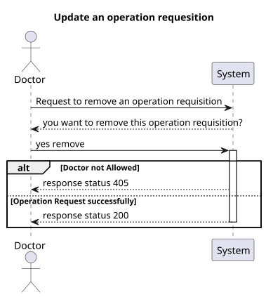
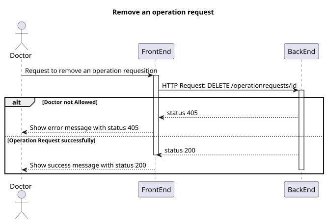
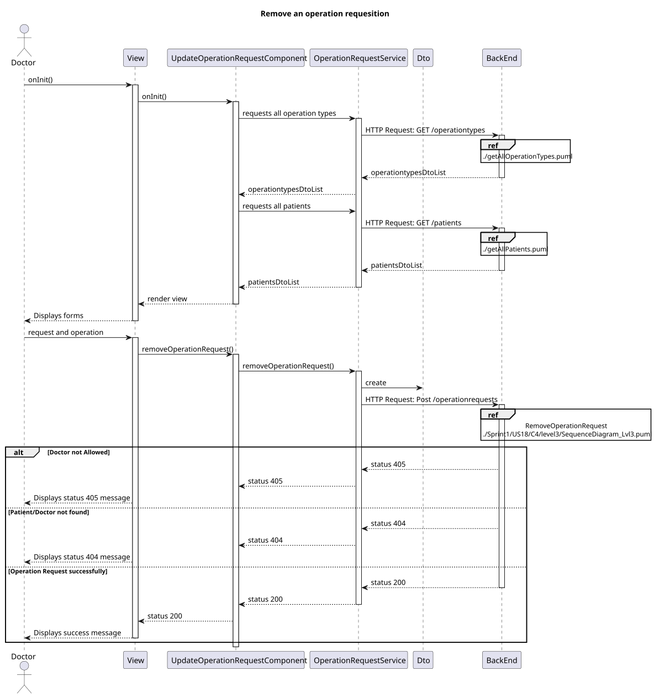
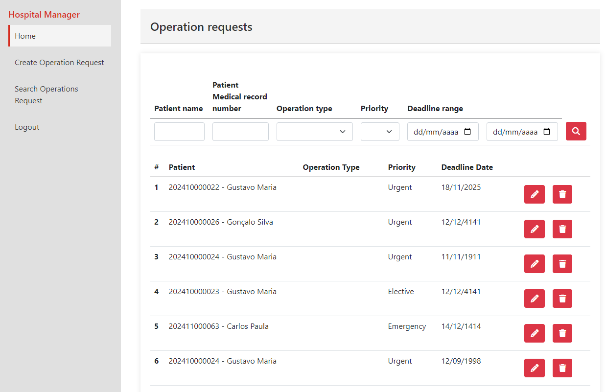
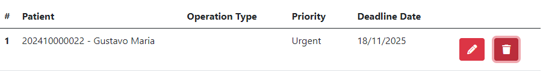
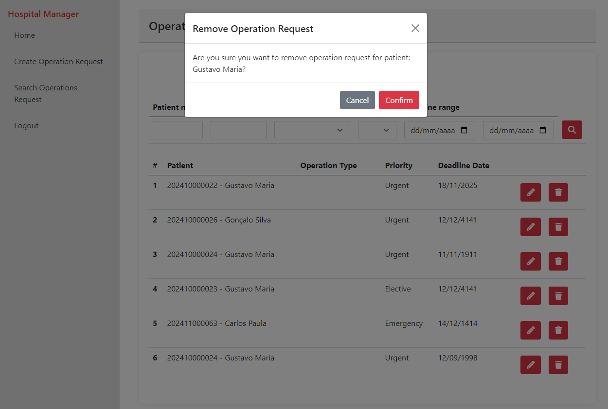

# US 6.2.16

## 1. Context

* Implement functionality in the frontend so that the doctor can remove an operation requisition.

## 2. Requirements

**US 6.2.16** 6.2.16 - As a Doctor, I want to remove an operation requisition, so that the healthcare activities are provided as necessary.

**Acceptance criteria:**
- Doctors can delete operation requests they created if the operation has not yet been
scheduled.
- A confirmation prompt is displayed before deletion.
- Once deleted, the operation request is removed from the patient’s medical record and cannot
be recovered.
- The system notifies the Planning Module and updates any schedules that were relying on this
request.


## 3. Analysis

* **Q Varela** – In the project document it mentions that each operation has a priority. How is a operation's priority defined? Do they have priority levels defined? Is it a scale? Or any other system?
  * **A**: 
    - Elective Surgery: A planned procedure that is not life-threatening and can be scheduled at a convenient time (e.g., joint replacement, cataract surgery).
    - Urgent Surgery: Needs to be done sooner but is not an immediate emergency. Typically within days (e.g., certain types of cancer surgeries).
    - Emergency Surgery: Needs immediate intervention to save life, limb, or function. Typically performed within hours (e.g., ruptured aneurysm, trauma).
* **Q**: Can the same doctor who requests a surgery perform it?
  * **A**: Not necessarily. The planning module may assign different doctors based on availability and optimization.
* **Q**: What does “status” refer to in the context of searching for operating requisitions?
  * **A**: Status refers to whether the operation is planned or requested.
***


## 4. Design

### 4.1. Realization
#### Level 1

##### Level 2


##### Level 3


### 4.2. Class Diagram


### 4.3. Applied Patterns

Applied Patterns description in [DevelopmentPatterns](../Global/DevelopmentPatterns/readme.md)

### 4.4. Tests

- **Remove OperationRequests test**
```
  it('should create', () => {...});
  it('should sort data correctly', () => {...});
  it('should create operation request DTO correctly', () => {...});

  describe('Remove Operation Request', () => {
    it('should remove operation request', () => {
      ...
      component.removeOperationRequest();

      expect(mockService.removeOperationRequest).toHaveBeenCalled();
      expect(component.operationRequestModelList.length).toBe(0);
      expect(mockToastrService.success).toHaveBeenCalledWith('Operation request removed successfully', 'Success');
    
    });
  }
  
  
```

- **OperationRequestService test**

```
describe('OperationRequestService', () => {
  it('should be created', () => {...});
  it('should fetch all operation types', () => {...});
  it('should fetch all patients', () => {...});
  
  it('should delete an operation request', () => {
    ...
    service.removeOperationRequest(1).subscribe(operationRequest => {
      expect(operationRequest).toEqual(dummyOperationRequest);
    });

    const req = httpMock.expectOne(operationRequestsUrl + '/1');
    expect(req.request.method).toBe('DELETE');
    req.flush(dummyOperationRequest);
  
  });
}
```

## 5. Implementation

- **SearchOperationRequestComponent - removeOperationRequest()**

```
this.service.removeOperationRequest(this.selectedOperationRequest.id).subscribe({
            next: (response) => {
                if (this.operationRequestModelList) {
                    this.operationRequestModelList.splice(this.selectedIndex, 1);
                }
                this.toastr.success('Operation request removed successfully', 'Success');
            },
            error: (err) => {
                this.toastr.error(err.error.message, 'Error');
            }
        });
```

- **OperationRequestService - removeOperationRequest()**

```
let req: Observable<OperationRequestDto>;
        req = this.http.delete<OperationRequestDto>(this.operationRequestsUrl + '/' + id
        )
        return req.pipe(
            catchError((error) => {

                //catch all errors 
                return throwError(() => error);
            })
        )
```

## 6. Integration/Demonstration

- To execute this functionality you must login into the system as Doctor and navigate to Search Operations Request.

- Then click on the delete(trash icon) button to remove desired operation request

- Confirm dialog will pop, confirm and operation is removed with success
