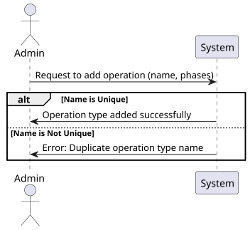
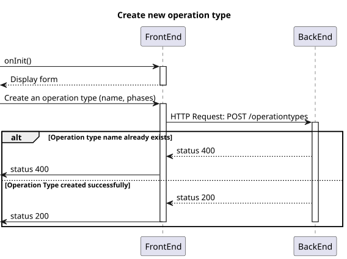
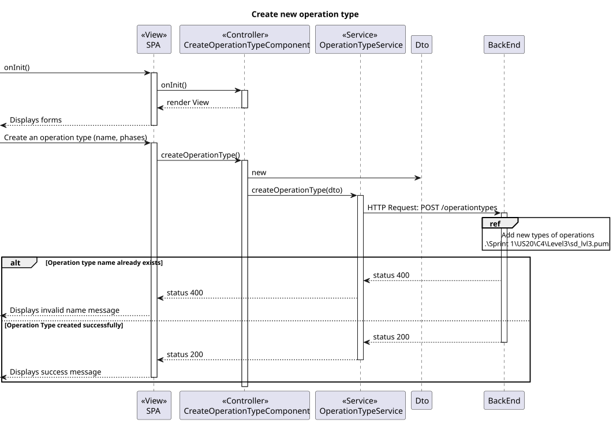

# US6.2.18 SEM5-23

## 1. Context
* The new operations types were created by the Admin user in the system and considering the acceptance criteria.
* Administrators manages the operations types available in the system.
* Administrators have access to a specific endpoint and interface to create the operations types.


## 2. Requirements

**US6.2.18** 
As an Admin, I want to add new types of operations, so that I can reflect on the available medical procedures in the system #SEM5-23

**Acceptance criteria:**
* Admins can edit operation types with attributes like:
    Operation Name
    Required Staff by Specialization
    Estimated Duration
* Admins also be able to:
    create operation types.
    List or view already registered types.
    Inactivate operation types if necessary.
    Only users with an Admin role can access these functionalities.  
* The system validates that the operation type name is unique.
* The system logs the update of new operation types and makes them available for scheduling immediately.


## 3. Analysis
* Q: What factors should be considered for surgery scheduling? 
  * A: A combination of professional seniority, surgery duration, and urgency will be considered.
  Scheduling will occur in the second sprint.  

***

* Q: What is the difference between appointment, surgery, and operation? 
  * A: Surgery is a medical procedure (e.g., hip surgery), while an operation request is when a doctor schedules that surgery for a patient. An appointment is the scheduled date for the operation, determined by the planning module.

***

* Q: Can surgeries be rescheduled? 
  * A: Yes, surgeries can be rescheduled due to various reasons like emergencies or changes in staff availability. 

***


## 4. Design

### 4.1. Realization

#### Level 1

##### Level 2

##### Level 3


### 4.2. Class Diagram


### 4.3. Applied Patterns

Applied Patterns description in [DevelopmentPatterns](../Global/DevelopmentPatterns/readme.md)

### 4.4. Tests

* Create operation type component test
  ```
  it('should create the component', () => {...});
  it('should initialize the form on ngOnInit', () => {...});
  it('should fetch specializations on ngOnInit', () => {...});
  it('should add a new specialization form group', () => {...});
  it('should remove a specialization form group', () => {...});
  it('should show success message when operation type is created successfully', () => {...});
  it('should show error message when creation fails', () => {...});
  ```
  
* Create operation Type service test
  ```
  it('should create a new operation type', () => {...});
  it('should handle HTTP errors', () => {...});
  ```

## 5. Implementation

* Back-End 

  Controller
  ```
  var operationTypeDto = await _service.AddAsync(dto);
  return operationTypeDto;
  ```

  Service
  ```
  OperationTypeVersion++;
  OperationType operationType = new OperationType(dto.Name, phases, OperationTypeVersion);

  await this._operationTypeRepo.AddAsync(operationType);

  await this._unitOfWork.CommitAsync();

  return operationType.ToDto();
  ```

* Front-End 
  Architecture:
  ``` 
  Relevant directory: src/app/OperationTypes.
  ```
  
  Functionalities implemented:
  ```
  Form for creating operation types.
  A table/list to visualise the registered operation types.
  ```

## 6. Integration/Demonstration

* To use this funcionality you must log in the system as an Admin.
* The data is loaded from the BackEnd via API calls.
* The responses from the OperationTypesController controller provide the information needed for FrontEnd to render the interfaces.
