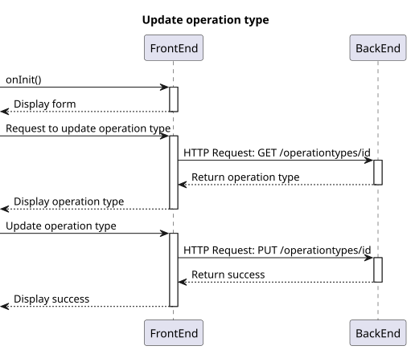
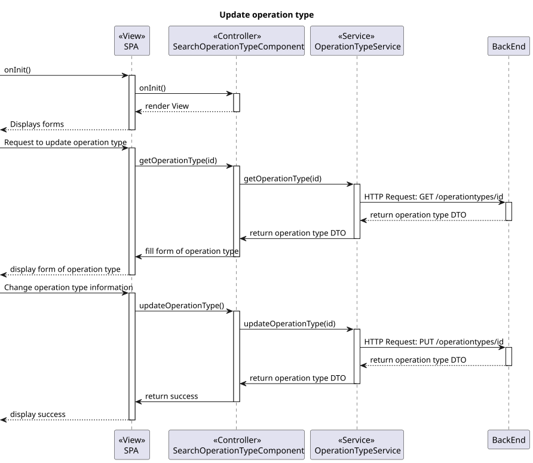

# US6.2.19 SEM5-24

## 1. Context

* New information is added / updated to each type of operation to improve the procedure.  
* The operations types were edited / updated by the Admin user in the system and considering the acceptance criteria.
* Administrators manages the operations types available in the system.
* Administrators have access to a specific endpoint and interface to edit / update the operations types.

## 2. Requirements

**US6.2.19** 
As an Admin, I want to edit existing operation types, so that I can update or correct information about the procedure. #SEM5-24

**Acceptance criteria:**
* Admins can search for and select an existing operation type to edit attributes like:
  Operation Name
  Required Staff by Specialization
  Estimated Duration
* Changes are reflected in the system immediately for future operation requests.
* Historical data is maintained, but new operation requests will use the updated operation type information.


## 3. Analysis

* There has been no need to clarify this use case with the customer so far.

***


## 4. Design

### 4.1. Realization

#### Level 1

##### Level 2

##### Level 3


### 4.2. Class Diagram


### 4.3. Applied Patterns

Applied Patterns description in [DevelopmentPatterns](../Global/DevelopmentPatterns/readme.md)

### 4.4. Tests

* Update operation type component test
  ```
  it('should create the component', () => {...});
  it('should initialize the form on ngOnInit', async () => {...});
  it('should add a specialization form group', () => {...});
  it('should remove a specialization form group', () => {...});
  it('should create a valid DTO', () => {...});
  it('should update the operation type', fakeAsync() => {...});
  it('should show error message when update fails', () => {...});
  ```

* Update operation Type service test
  ```
  it('should fetch all specializations', () => {...});
  it('should fetch all operation types', () => {...});
  it('should fetch operation types with filters', () => {...});
  it('should fetch operation type by ID', () => {...});
  it('should update an existing operation type', () => {...});
  it('should handle HTTP errors', () => {...});
  ```


## 5. Implementation

* Back-End
  Controller
  ```
  var operationTypeDto = await _service.UpdateAsync(dto);
  if (operationTypeDto == null)
      return NotFound();
  return Ok(operationTypeDto);
  ```

  Service
  ```
  OperationType operationType = await this._operationTypeRepo.GetByIdAsync(new OperationTypeId(dto.Id));

  if (operationType == null)
      return null;

  operationType.Inactivate();
  await this._unitOfWork.CommitAsync();

  OperationTypeVersion = this._operationTypeRepo.GetMaxVersionByName(operationType.Name);
  return await AddAsync(dto);
  ```
* Front-End 
  Architecture:
  ``` 
  Relevant directory: src/app/OperationTypes.
  ```
  
  Functionalities implemented:
  ```
  Form for editing / updating operation types.
  A table/list to visualise the registered operation types.
  Action buttons to edit / update each operation type.
  ```

## 6. Integration/Demonstration

* To use this funcionality you must log in the system as an Admin.
