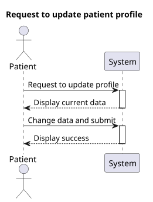
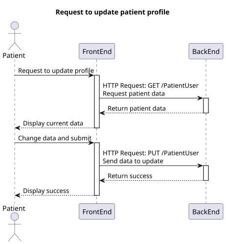
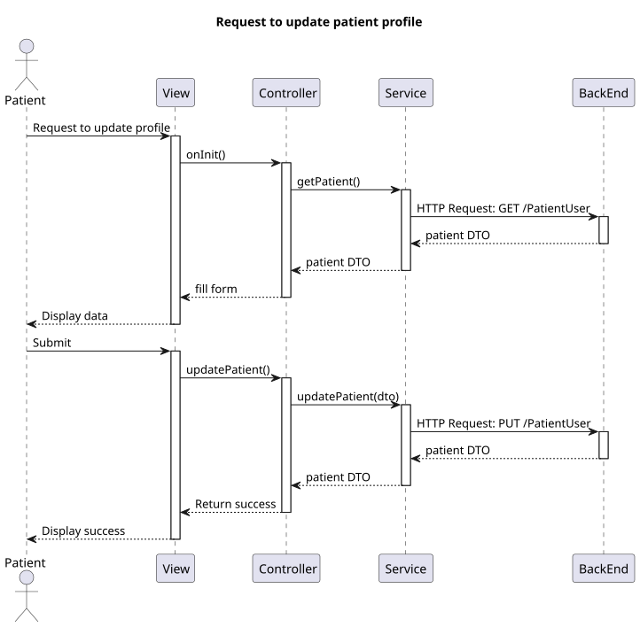

# US 6.2.2

## 1. Context

* This funcionality should allow the patient to view all of their information and update some of it.

## 2. Requirements

**US 6.2.2** As a Patient, I want to update my user profile, so that I can change my personal details and preferences.

## 3. Analysis

- The patient should be able to view all of their information that is stored in the system.
- The patient must be able to update their name, contacts and address.
- Updating the email will not be allowed because it would cause a disconnection between the patient profile and the IAM.

## 4. Design

### 4.1. Realization

##### Level 1



##### Level 2



##### Level 3



### 4.2. Class Diagram


### 4.3. Applied Patterns

Applied Patterns description in [DevelopmentPatterns](../Global/DevelopmentPatterns/readme.md)

### 4.4. Tests

* Update patient user component test
    ```
    it('should create the component', () => {...});
    it('should load patient data on initialization', fakeAsync(() => {...}));
    it('should display error message if patient data fails to load', fakeAsync(() => {...}));
    it('should create a valid DTO from form values', () => {...});
    it('should update patient successfully', fakeAsync(() => {...}));
    it('should display error message if update fails', fakeAsync(() => {...}));
    ```

* Patient user service test
    ```
    it('should fetch patient data', () => {...});
    it('should handle error when fetching patient data', () => {...});
    it('should update patient data', () => {...});
    it('should handle error when updating patient data', () => {...});
    ```

## 5. Implementation

* Update patient user component
    ```
    updatePatient() {
        if (this.currentPatientId == null || this.currentPatientId == "") return;

        this.patient = this.createDto();

        if (this.patient == null)
            return alert("Patient invalid, unexpected error!");

        this.service.updatePatient(this.patient).subscribe({
            next: () => {
                this.toastr.success('Profile updated successfully', 'Success');
            },
            error: (err: HttpErrorResponse) => {
                this.toastr.error('Failed to update profile\n' + err.error.message, 'Error');
            }
        })
    }
    ```
* Patient user service
    ```
    updatePatient(patient: UpdatingPatientDto): Observable<UpdatingPatientDto> {
        let req: Observable<PatientDto>;
        req = this.http.put<PatientDto>(this.patientUrl, patient)
        return req.pipe(
            catchError((error: HttpErrorResponse) => {
                return throwError(() => error);
            })
        )
    }
    ```

## 6. Integration/Demonstration

* Log in the system with a patient account and select the update option in the sidebar
