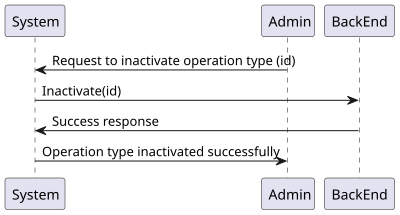
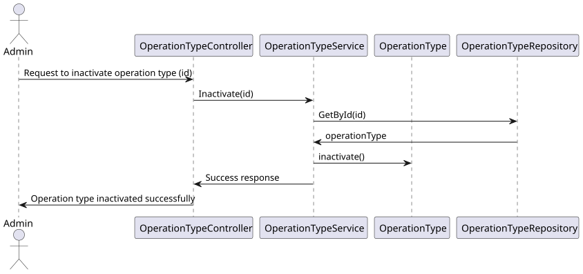

# US6.2.20 | SEM5-25 

## 1. Context

* Operation types can be inactivated by Admin and a log of these actions is kept.
* Administrators manages the operations types available in the system.
* Administrators have access to a specific endpoint and interface to inactivate the operations types.

## 2. Requirements

**US6.2.20** 
As an Admin, I want to remove / inactivate obsolete or no longer performed operation types, so that the system stays current with hospital practices. #SEM5-25

**Acceptance criteria:**
* Admins can search for and mark operation types as inactive (rather than deleting them) to
preserve historical records.
* Inactive operation types are no longer available for future scheduling but remain in historical
data.
* A confirmation prompt is shown before deactivating an operation type.
* Changes are reflected in the system immediately for future operation requests.


## 3. Analysis

* Q: Should actions like removing an operation type be accessed only through specific methods? 
  * A: Yes, operations like removal or deactivation should be available via specific API methods. 
 
***

* Q: Is removing an operation type the same as deactivating it? 
  * A: Yes, deactivating makes the operation type unavailable for future use but retains historical data. 

***


## 4. Design

### 4.1. Realization

#### Level 1

##### Level 2

##### Level 3


### 4.2. Class Diagram


### 4.3. Applied Patterns

Applied Patterns description in [DevelopmentPatterns](../Global/DevelopmentPatterns/readme.md)

### 4.4. Tests

* Inactivate operation type component test
  ```
  it('should create the component', () => {...});
  it('should fetch and populate specializations on ngOnInit', () => {...});
  it('should sort operation types by name', () => {...});
  it('should inactivate operation type successfully', fakeAsync() => {...});
  it('should show error message when inactivation fails', () => {...});
  it('should navigate to update page when updating an operation type', () =>{...});
  it('should set selected operation type correctly', () => {...});
  it('should handle empty operation type list on sort', () => {...});
  ```
* Inactivate operation Type service test
  ```
  it('should fetch all specializations', () => {...});
  it('should fetch all operation types', () => {...});
  it('should fetch operation types with filters', () => {...});
  it('should fetch operation type by ID', () => {...});
  it('should inactivate an operation type', () => {...});
  it('should handle HTTP errors', () => {...});
  ```

## 5. Implementation

  * Back-End
  Controller
  ```
  var operationTypeDto = await _service.InactivateAsync(id);
  if (operationTypeDto == null)
      return NotFound();
  return Ok(operationTypeDto);
  ```

  Service
  ```
  OperationType operationType = await this._operationTypeRepo.GetByIdAsync(new OperationTypeId(id));

  if (operationType == null)
      return null;

  operationType.Inactivate();
  await this._unitOfWork.CommitAsync();

  return operationType.ToDto();
  ```

Front-End 
  Architecture:
  ``` 
  Relevant directory: src/app/OperationTypes.
  ```
  
  Functionalities implemented:
  ```
  Form for inactivating each operation type using action buttons.
  A table/list to visualise the registered operation types.

  ```

## 6. Integration/Demonstration

* To use this funcionality you must log in the system as an Admin.
