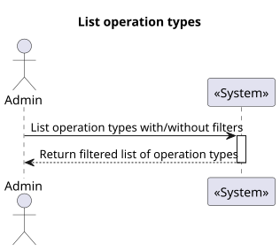
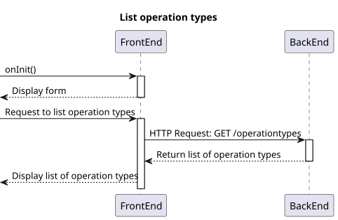
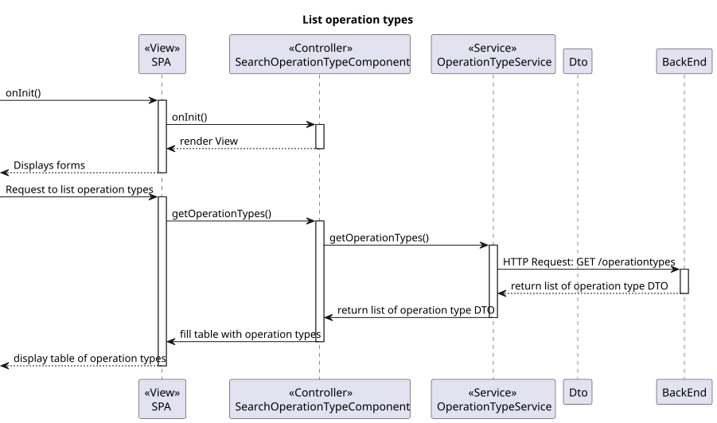

# US6.2.21 | SEM5-26 

## 1. Context

* The admin wants to list/search operation types by their details.
* The operations types were listed by the Admin user in the system and considering the acceptance criteria.
* Administrators manages the operations types available in the system.
* Administrators have access to a specific endpoint and interface to list/search the operations types.

## 2. Requirements

**US6.2.21** 
As an Admin, I want to list/search operation types, so that I can see the details, edit, and remove operation types. #SEM5-26    

**Acceptance criteria:**
- Admins can list/search and filter operation types by name, specialization, or status (active/inactive).
- The system displays operation types in a searchable list with attributes such as name, required staff, and estimated duration.
- Admins can select an operation type to view, edit, or deactivate it.

## 3. Analysis

* he operation type should be searchable by name, specializations and status (active/inactive).
* The returned list should contain all of the operation type data.

## 4. Design

### 4.1. Realization
#### Level 1

##### Level 2

##### Level 3


### 4.2. Class Diagram


### 4.3. Applied Patterns

Applied Patterns description in [DevelopmentPatterns](../Global/DevelopmentPatterns/readme.md)

### 4.4. Tests

* List operation type component test
  ```
  it('should create the component', () => {...});
  it('should fetch and populate specializations on ngOnInit', () => {...});
  it('should sort operation types by name', () => {...});
  it('should inactivate operation type successfully', fakeAsync() => {...});
  it('should show error message when inactivation fails', () => {...});
  it('should navigate to update page when updating an operation type', () => {...});
  it('should set selected operation type correctly', () => {...});
  it('should handle empty operation type list on sort', () => {...});
  ```

* List operation Type service test
  ```
  it('should fetch all specializations', () => {...});
  it('should fetch all operation types', () => {...});
  it('should fetch operation types with filters', () => {...});
  it('should fetch operation type by ID', () => {...});
  it('should handle HTTP errors', () => {...});
  ```


## 5. Implementation


* Back-End
    Controller (get by id)
    ```
    var operationTypeDto = await _service.GetByIdAsync(id);
    if (operationTypeDto == null)
        return NotFound();
    return operationTypeDto;
    ```

    Service (get by id)
    ```
    var operationType = await this._operationTypeRepo.GetByIdAsync(new OperationTypeId(id));
    if (operationType == null)
        return null;
    return operationType.ToDto();
    ```

    Controller (get with filters)
    ```
    return await _service.GetAllAsyncWithFilters(name, specialization, active);
    ```

    Service (get with filters)
    ```
    List<OperationType> list = await this._operationTypeRepo.GetAllAsyncWithFilters(name, specialization, active);
    List<OperationTypeDto> listDto = [];
    foreach (OperationType operationType in list)
    {
        listDto.Add(operationType.ToDto());
    }
    return listDto;
    ```

* Front-End
  Architecture:
  ``` 
  Relevant directory: src/app/OperationTypes.
  ```
  
  Functionalities implemented:
  ```
  Form table to list/searching operation types.
  ```

## 6. Integration/Demonstration

* To use this funcionality you must log in the system as an Admin.
