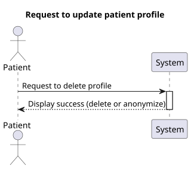
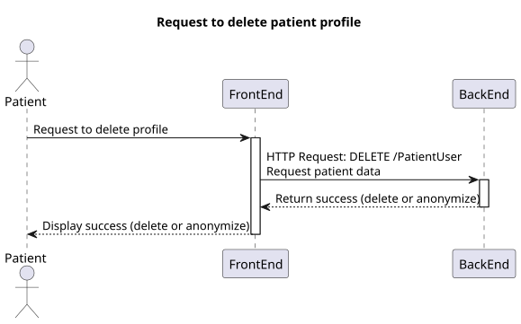
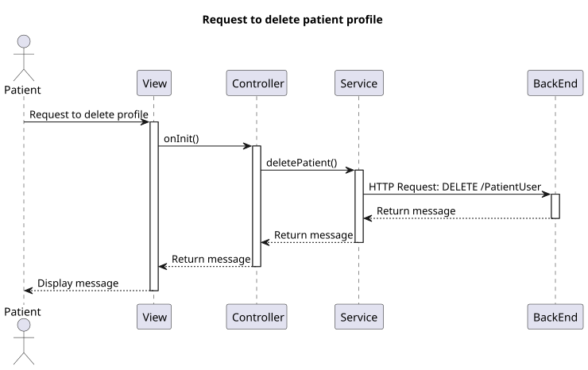
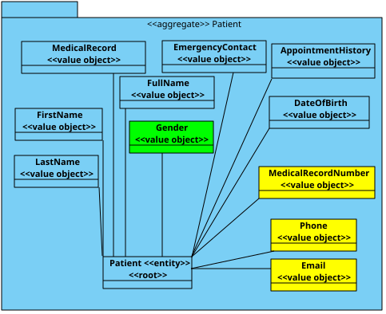

# US 6.2.3

## 1. Context

* This funcionality should allow the patient to delete/anonymize their profile.

## 2. Requirements

**US 6.2.3** As a Patient, I want to delete my account and all associated data, so that I can exercise my right to be forgotten as per GDPR.

## 3. Analysis

- The patient should be able to delete their account if there is no operation history.
- The patient should be able to anonymize their account if the last proccess was 5 or more years ago.

## 4. Design

### 4.1. Realization

##### Level 1



##### Level 2



##### Level 3



### 4.2. Class Diagram



### 4.3. Applied Patterns

Applied Patterns description in [DevelopmentPatterns](../Global/DevelopmentPatterns/readme.md)

### 4.4. Tests
* Delete patient user component test
    ```
    it('should create the component', () => {...});
    it('should fetch patient on initialization', fakeAsync(() => {...}));
    it('should show error message if patient not found', fakeAsync(() => {...}));
    it('should handle error when fetching patient fails', fakeAsync(() => {...}));
    it('should delete patient successfully', fakeAsync(() => {...}));
    it('should handle error when deleting patient fails', fakeAsync(() => {...}));
    ```

* Patient user service test
    ```
    it('should delete patient', () => {...});
    it('should handle error when deleting patient', () => {...});
    ```

## 5. Implementation

* Delete patient user component
    ```
    deletePatient() {
        this.service.deletePatient().subscribe({
            next: (messageDto: MessageDto) => {
                this.toastr.success(messageDto.message, 'Success');
                this.patientFound = false;
            },
            error: (err: HttpErrorResponse) => {
                this.toastr.error('Failed to delete profile\n' + err.error.message, 'Error');
            }
        })
    }
    ```
* Patient user service
    ```
    deletePatient() {
        let req: Observable<MessageDto>;
        req = this.http.delete<MessageDto>(this.patientUrl)
        return req.pipe(
            catchError((error: HttpErrorResponse) => {
                //catch all errors 
                return throwError(() => error);
            })
        )
    }
    ```

## 6. Integration/Demonstration

* Log in the system with a patient account and select the delete option in the sidebar
