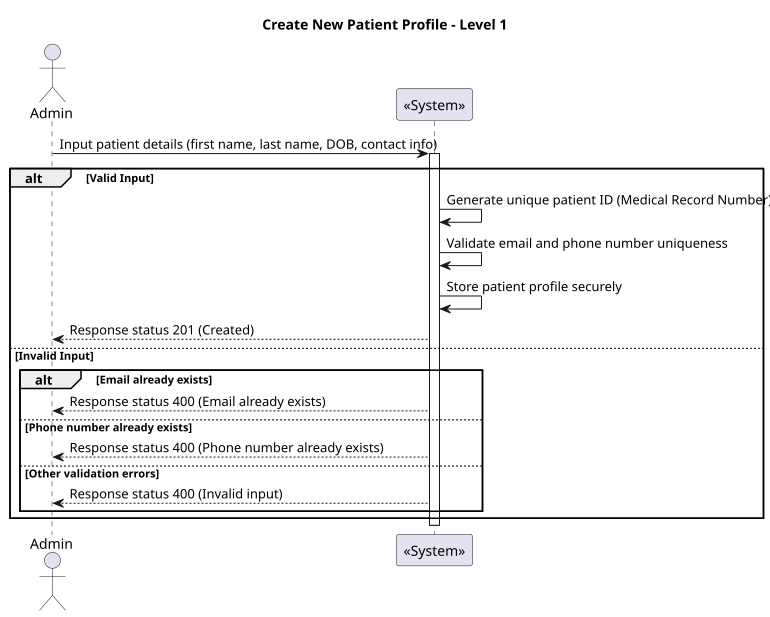
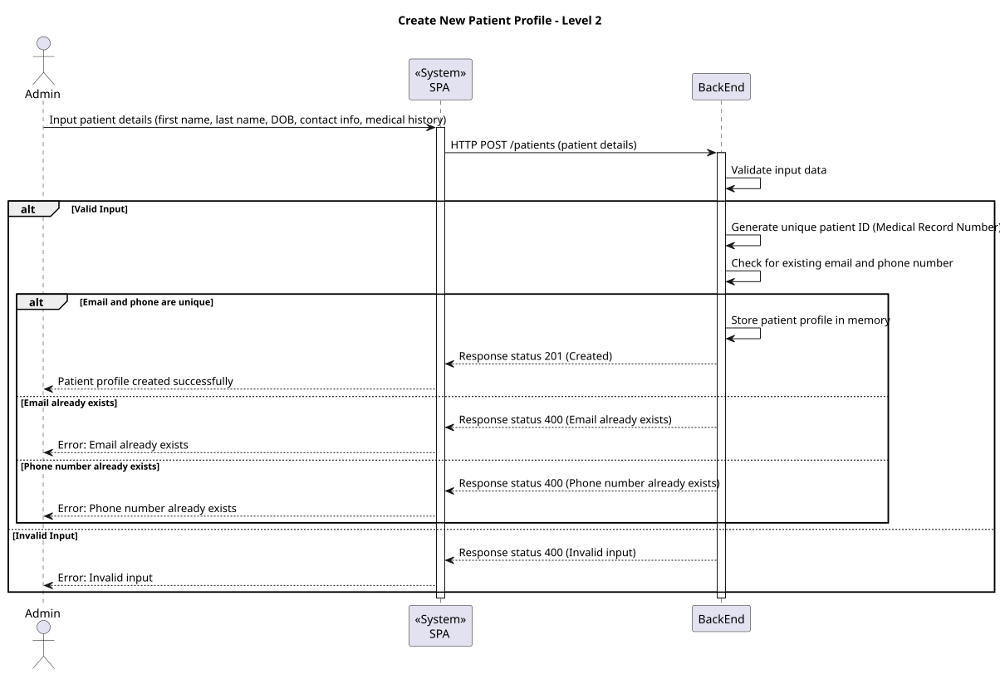
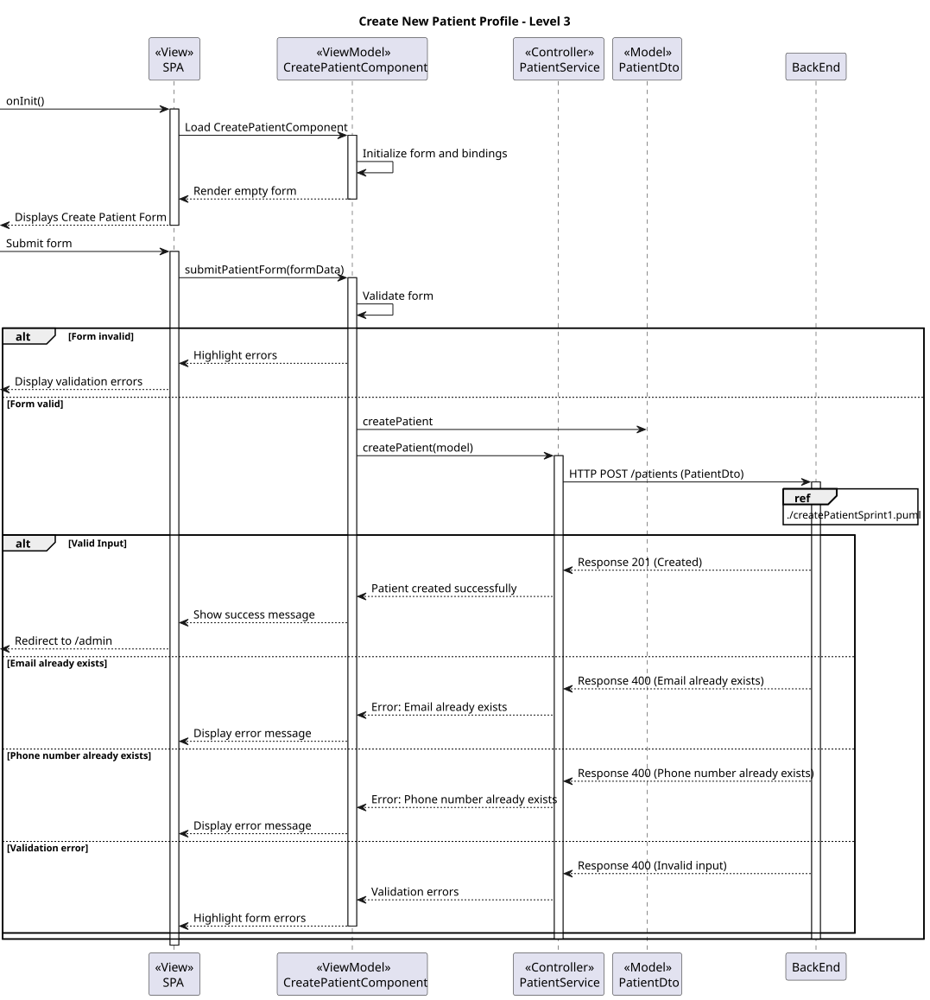

# US 6.2.6

## 1. Context

* The admin requires the ability to create a new patient profile to register the patient's personal details.

## 2. Requirements

* As an Admin, I want to create a new patient profile, so that I can register their personal details and medical history.

**Acceptance criteria:**

* Admins can input patient details such as first name, last name, date of birth, contact information, and medical history.
* A unique patient ID (Medical Record Number) is generated upon profile creation.
* The system validates that the patient’s email and phone number are unique.
* The profile is stored securely in the system, and access is governed by role-based permissions.

## 3. Analysis

* Q: So, when the administrator starts creating the patient profile, what format(s) of the date of birth will they need to enter? Furthermore, what will be the format of the Medical Record Number generated after recording the data?
  * A: From a usability perspective, dates should be presented to the user using the operating system's locale definitions. since for this sprint you are building an API, you should use a standard format like ISO 8601.
  medical record numbers are generated by the system following the format YYYYMMnnnnnn where YYYY and MM are the year and month of the registration and nnnnnn is a sequential number
 
***

* Q: As a patient, do I need to have a profile created by the administrator?
  * A: Yes, you need to have a patient profile already created by the administrator. Patients cannot self-register unless they already exist in the hospital system.

***

* Q: Does this mean that I need to have already had a consultation before I can register?
  * A: Yes, you must have already had a consultation and exist in the system as a patient. The registration is just to create an access account, not to register as a patient for the first time.

***

* Q: Can the patient see their full medical history or only surgeries?
  * A: The patient will only see surgeries, either scheduled or completed, not their full medical history or other appointments.

***

* Q: Can external identity management systems like Google or LinkedIn be used for patient authentication?
  * A: Yes, you can use external identity management systems like Google or LinkedIn. The system will need to match the credentials (email, phone number) with the patient’s record to complete the registration.

***

* Q: Does the system require an additional verification step during registration?
  * A: Yes, there is a second confirmation step to ensure that only the real patient can register. The system sends a confirmation link to the registered email to verify the patient's identity.

***
## 4. Design

### 4.1. Realization

#### Level 1



##### Level 2



##### Level 3



### 4.2. Class Diagram


### 4.3. Applied Patterns

Applied Patterns description in [DevelopmentPatterns](../Global/DevelopmentPatterns/readme.md)

### 4.4. Tests

```
  it('should create the component', () => {...});

  it('should initialize the form with empty values', () => {...});

  it('should mark all fields as touched if form is invalid on submit', () => {...});

  it('should call PatientService.createPatient when form is valid', fakeAsync() => {...});

  it('should show error message if patient creation fails', fakeAsync(() => {...});
```

## 5. Implementation

```
export class CreatePatientComponent {
  patientForm: FormGroup;

  constructor(
    private fb: FormBuilder,
    private patientService: PatientService,
    private router: Router, private toastr: ToastrService
  ) {
    this.patientForm = this.fb.group({
      firstName: ['', Validators.required],
      lastName: ['', Validators.required],
      gender: ['', Validators.required],
      dateOfBirth: ['', Validators.required],
      address: [''],
      phone: ['', [Validators.required]],
      email: ['', [Validators.required, Validators.email]],
      emergencyContact: [''],
    });
  }

  onSubmit() {
    if (this.patientForm.valid) {
      const newPatient: PatientModel = this.patientForm.value;
      this.patientService.createPatient(newPatient).subscribe({
        next: (patient) => {
          this.toastr.success('Patient created successfully', 'Success');
          this.router.navigate(['/admin']);
        },
        error: (error) => {
          this.toastr.error('Error creating patient:\n' + error, 'Error');
        },
      });
    } else {
      this.patientForm.markAllAsTouched();
    }
  }
}
```

## 6. Integration/Demonstration

* Login as Administrator:

Access the system and log in using admin credentials.
* Access the Create Patient Page:

Navigate to the "Create Patient" option in the menu.
* Fill in Patient Details:

Mandatory fields: First Name, Last Name, Gender, Date of Birth (ISO 8601), Phone Number, Email Address.
Optional fields: Address, Emergency Contact, Medical History.
* Submit the Form:

Click "Submit".
Validation:
Success: Display a confirmation message and redirect.
Errors: Show clear error messages in the form.
* Post-Creation Validation:

Ensure the profile appears in the admin's patient list.
Validate role-based access controls.
* Demonstration Scenarios:

Success: Profile creation without issues.
Validation: Test mandatory fields, duplicate email/phone.
Errors: Simulate server-side issues (e.g., network failure).