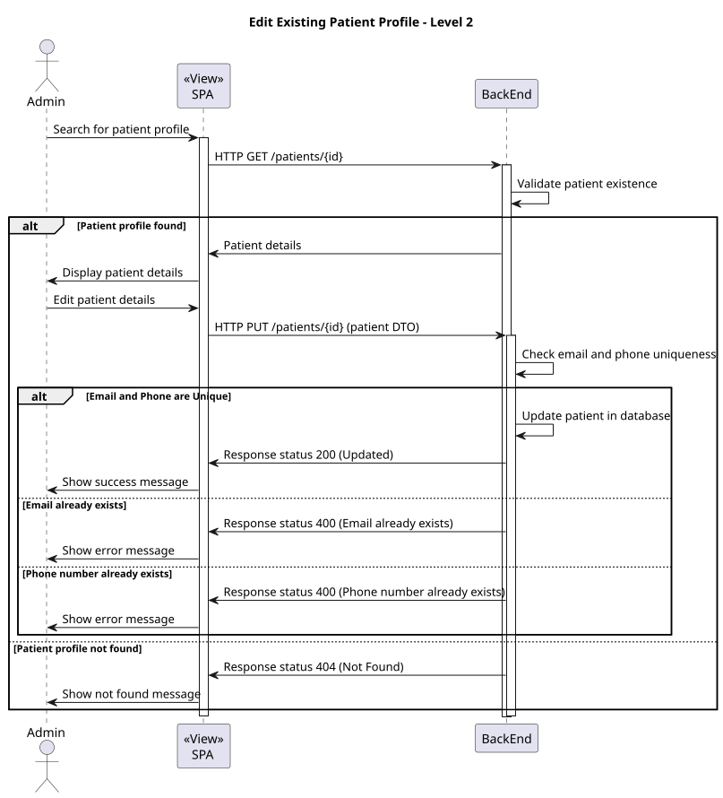
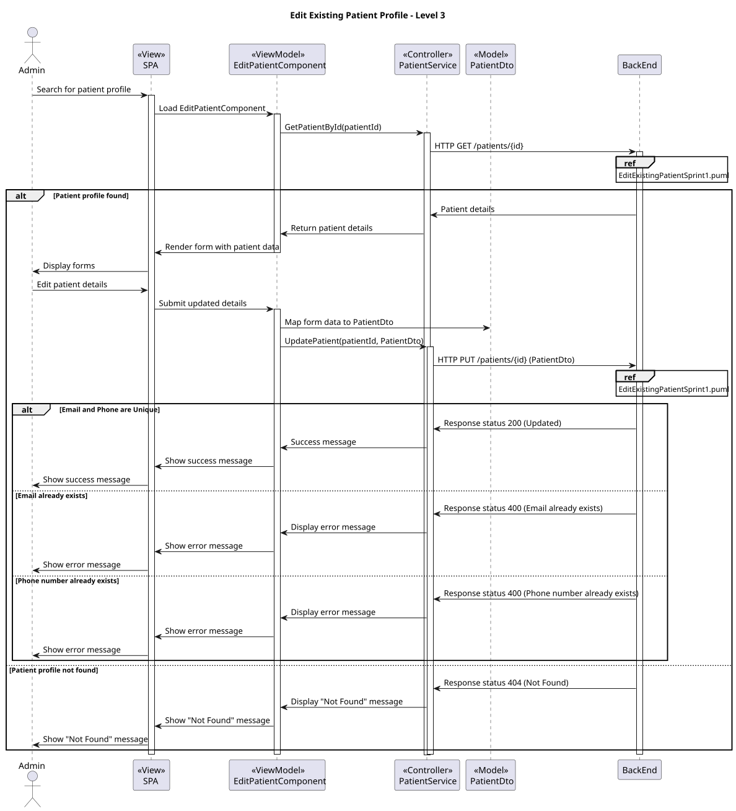

# US 6.2.7

## 1. Context

* Admins need the ability to update patient profiles to keep their information accurate and up-to-date. This includes editing personal details, contact information, medical history, and allergies, while ensuring data security and compliance.

## 2. Requirements

As an Admin, I want to edit an existing patient profile, so that I can update their information when needed.

**Acceptance criteria:**

* Admins can search for and select a patient profile to edit.
* Editable fields include name, contact information, medical history, and allergies.
* Changes to sensitive data (e.g., contact information) trigger an email notification to the patient.
* The system logs all profile changes for auditing purposes.


## 3. Analysis

* Q: Can the administrator edit all personal details of the patient?
*  A: Yes, the administrator can edit all personal details of the patient, including name, contact information, medical history, and allergies.

***

* Q: How does the system handle changes to sensitive data?
*  A: When changes are made to sensitive data, such as contact information, the system triggers an email notification to the patient, informing them of the changes.

***

* Q: Is there a way to track changes made to a patient's profile?
*  A: Yes, the system logs all changes made to the patient's profile for auditing purposes, allowing administrators to track who made changes and when.

***

* Q: How does the system ensure the uniqueness of the email and phone number after editing?
*  A: The system checks that the changes do not compromise the uniqueness of the email and phone number, ensuring that no duplicates exist.


## 4. Design

### 4.1. Realization

#### Level 1


##### Level 2



##### Level 3



### 4.2. Class Diagram


### 4.3. Applied Patterns

Applied Patterns description in [DevelopmentPatterns](../Global/DevelopmentPatterns/readme.md)

### 4.4. Tests


```
  it('should create the component', () => {...});
  it('should initialize the form with empty values', () => {...});
  it('should load patient data on initialization', fakeAsync() => {...});
  it('should display error message if patient data fails to load', fakeAsync() => {...});
  it('should update patient successfully', fakeAsync() => {...});
  it('should show error message if update fails', fakeAsync() =>{...});
  
```

## 5. Implementation

```
  loadPatientData(): void {
    this.patientService.getPatientById(this.patientId).subscribe({
      next: (patient) => {
        const formattedPatient = {
          ...patient,
          dateOfBirth: new Date(patient.dateOfBirth).toISOString().split('T')[0],
        };

        this.patientForm.patchValue(formattedPatient);
      },
      error: (err) => {
        this.toastr.error('Failed to fetch patient data.\n' + err, 'Error');
      }
    });
  }


  updatePatient(): void {
    if (this.patientForm.valid) {
      const updatedPatient: PatientModel = { ...this.patientForm.value, id: this.patientId };

      this.patientService.updatePatient(this.patientId, updatedPatient).subscribe({
        next: () => {
          this.toastr.success('Patient updated successfully!', 'Success');
          this.router.navigate(['/admin/patient/search']);
        },
        error: (err) => {
          this.toastr.error('Error updating patient:\n' + err, 'Error');
        }
      });
    } else {
      this.patientForm.markAllAsTouched();
      this.toastr.error('Please fill out all required fields.', 'Error');
    }
  }
}
```

## 6. Integration/Demonstration

* Login as Administrator:

Access the system and log in with admin credentials.
* Search for a Patient Profile:

Use the search functionality to locate the desired patient profile by name, ID, or contact information.
Select the profile to open the editing interface.
* Edit Patient Details:

Editable fields include:
Name (First Name, Last Name)
Contact Information (Phone, Email, Address)
Make changes to the relevant fields.
* Submit Updates:

Click "Update".
