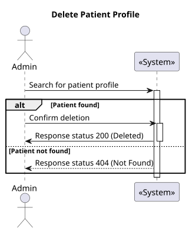
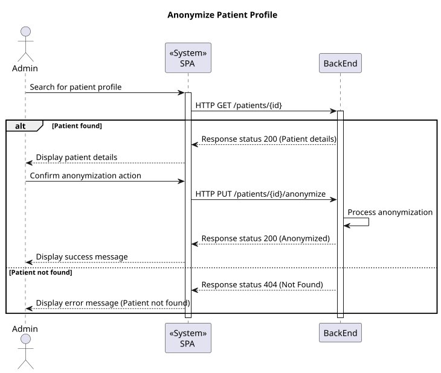

# US 6.2.8

## 1. Context

* The admin must be able to manage patient profiles effectively, including the ability to delete profiles when necessary. This functionality ensures that the system remains updated with only relevant patient data.


## 2. Requirements

As an Admin, I want to delete a patient profile, so that I can remove patients who are no longer under care.

**Acceptance criteria:**

* Admins can search for a patient profile and mark it for deletion.
* Before deletion, the system prompts the admin to confirm the action.
* Once deleted, all patient data is permanently removed from the system within a predefined time frame.
* The system logs the deletion for audit and GDPR compliance purposes.


## 3. Analysis

* **Q:** What steps does the admin need to take to delete a patient profile?
  * **A:** The admin must search for the patient profile, select it, and confirm the deletion when prompted by the system.

***

* **Q:** How does the system ensure that deletion is intentional?
  * **A:** The system prompts the admin for confirmation before proceeding with the deletion.

***

* **Q:** What happens to the patient's data after deletion?
  * **A:** All patient data is permanently removed from the system within a predefined time frame.

***

* **Q:** How is deletion logged for compliance?
  * **A:** The system logs the deletion action for auditing and to comply with GDPR requirements.

***

## 4. Design

### 4.1. Realization

#### Level 1



##### Level 2



##### Level 3


### 4.2. Class Diagram


### 4.3. Applied Patterns

Applied Patterns description in [DevelopmentPatterns](../Global/DevelopmentPatterns/readme.md)

### 4.4. Tests
´´´
´´´


## 5. Implementation

```
  deletePatient(patient: PatientModel) {
    if (confirm(`Are you sure you want to delete ${patient.firstName} ${patient.lastName}?`)) {
      this.patientService.deletePatient(patient.id).subscribe({
        next: () => {
          this.toastr.success('Patient deleted successfully', 'Success');
          this.searchPatients();
        },
        error: (err) => {
          console.error('Error deleting patient:', err);
        },
      });
    }
  }
```

## 6. Integration/Demonstration

* To use this funcionality you must login the system as an Admin.
