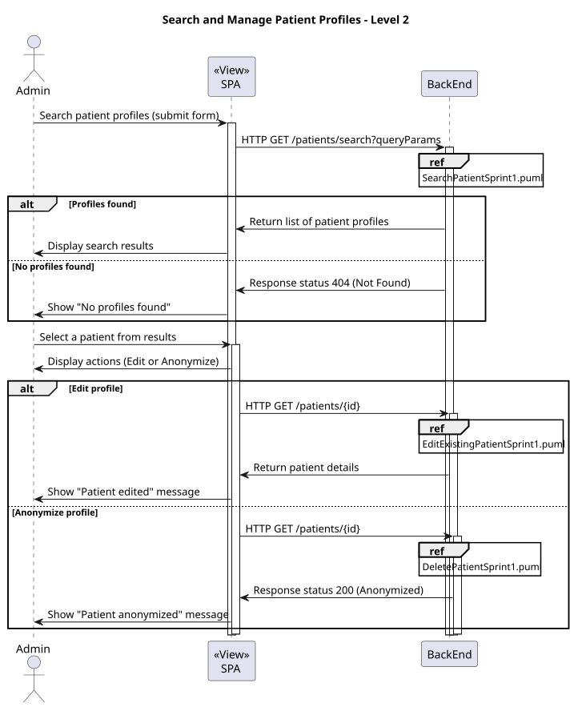
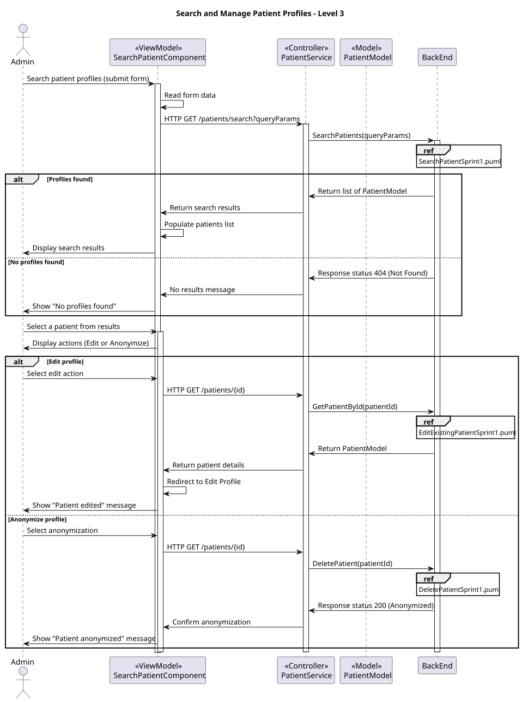
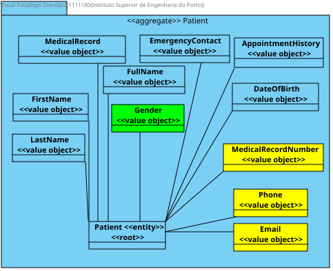

# US 6.2.9

## 1. Context

In the healthcare system, it is essential for administrators to have the ability to manage patient profiles efficiently. This includes the capability to search for, view, edit, and delete patient records. By enabling administrators to search by various attributes, the system enhances the efficiency of patient management and ensures that patient information can be updated or removed as necessary. This user story focuses on providing a user-friendly interface for searching patient profiles, ensuring compliance with data management standards.

## 2. Requirements

As an Admin, I want to list/search patient profiles by different attributes, so that I can view the details, edit, and remove patient profiles.

**Acceptance criteria:**

* Admins can search patient profiles by various attributes, including name, email, date of birth, or medical record number.
* The system displays search results in a list view with key patient information (name, email, date of birth).
* Admins can select a profile from the list to view, edit, or delete the patient record.
* The search results are paginated, and filters are available to refine the search results.


## 3. Analysis

* Q: Can the administrator search for patient profiles using multiple attributes at once?
  * A: Yes, the administrator can use multiple attributes to refine their search for patient profiles.

***

* Q: How are the search results displayed to the administrator?
  * A: The system presents search results in a list view, showing key patient information for easy reference.

***

* Q: Is there a limit to how many profiles can be displayed in the search results?
  * A: Yes, the search results are paginated to ensure a manageable number of profiles are displayed at once.

***

* Q: Can the administrator edit or delete a patient profile directly from the search results?
  * A: Yes, the administrator can select a patient profile from the search results to view, edit, or delete the record.

***


## 4. Design

### 4.1. Realization

#### Level 1


##### Level 2



##### Level 3



### 4.2. Class Diagram



### 4.3. Applied Patterns

Applied Patterns description in [DevelopmentPatterns](../Global/DevelopmentPatterns/readme.md)

### 4.4. Tests

```
  it('should create the component', () => {...});
  it('should initialize the form with empty values', () =>{...});
  it('should fetch and populate patients on search', fakeAsync() => {...});
  it('should display error if search fails', fakeAsync() => {...});
  it('should navigate to update page when editPatient is called', () => {...});
  it('should delete patient and refresh list on success', fakeAsync() => {...});
  it('should not delete patient if confirmation is cancelled', () => {...});
  ```


## 5. Implementation

```
  searchPatients() {
    const formValues = this.searchForm.value;

    const queryParams = {
      name: formValues.name,
      email: formValues.email,
      dateOfBirth: formValues.dateOfBirth,
      medicalRecordNumber: formValues.medicalRecordNumber,
      pageNumber: 1,
      pageSize: 10,
    };

    this.patientService.searchPatients(queryParams).subscribe({
      next: (data) => {
        this.patients = data;
        this.sortedPatients = [...this.patients];
      },
      error: (err) => {
        this.toastr.error('Error fetching search results:\n' + err, 'Error');
      },
    });
  }

  sortData(sort: Sort) {
    const data = this.patients.slice();
    if (!sort.active || sort.direction === '') {
      this.sortedPatients = data;
      return;
    }

    this.sortedPatients = data.sort((a, b) => {
      const isAsc = sort.direction === 'asc';
      switch (sort.active) {
        case 'name':
          return this.compare(a.firstName, b.firstName, isAsc);
        case 'email':
          return this.compare(a.email, b.email, isAsc);
        case 'dateOfBirth':
          return this.compare(a.dateOfBirth, b.dateOfBirth, isAsc);
        default:
          return 0;
      }
    });
  }

  private compare(a: string | number | Date, b: string | number | Date, isAsc: boolean): number {
    if (a instanceof Date && b instanceof Date) {
      return (a.getTime() - b.getTime()) * (isAsc ? 1 : -1);
    } else if (typeof a === 'string' && typeof b === 'string') {
      return a.localeCompare(b) * (isAsc ? 1 : -1);
    } else if (typeof a === 'number' && typeof b === 'number') {
      return (a - b) * (isAsc ? 1 : -1);
    } else {
      return 0;
    }
  }
```

## 6. Integration/Demonstration

**Login as Administrator:**

   - Log in using admin credentials to access the patient management interface.

**Navigate to the Search Functionality:**

   - Access the "Search Patients" option in the admin dashboard.

**Search for Patient Profiles:**

   - Use the search form to filter patients by attributes such as:
     - **Name**
     - **Email**
     - **Date of Birth**
     - **Medical Record Number**
   - Submit the form to view the search results.

**View Search Results:**

   - Results are displayed in a paginated list with key patient information (e.g., Name, Email, Date of Birth).
   - Use filters or sorting options to refine or reorder the results.

**Select and Manage Profiles:**

   - Click on a patient profile to view detailed information.
   - Perform available actions:
     - **Edit:** Update the patient's details.
     - **Anonymize:** Replace sensitive patient data for compliance.

**Validation Scenarios:**

   - Test with multiple search attributes.
   - Ensure appropriate handling of cases with no results or errors.
