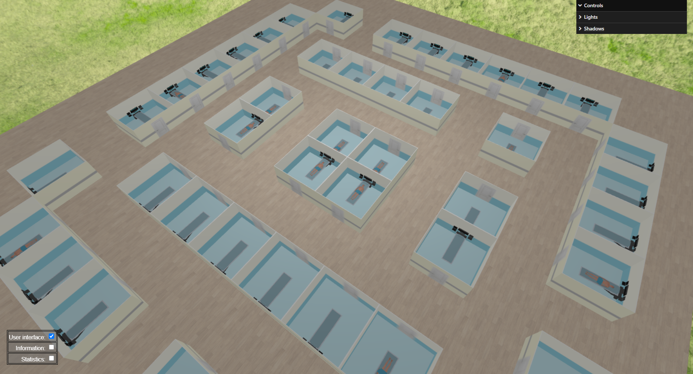

# US 6.5.1

## 1. Context

* We need to use the appointments planned in the backend to display all the surgery rooms. When the room is occupied in the current moment, a patient is displayed on the bed.

## 2. Requirements

**US 6.5.1** As a healthcare staff member, I want to see a 3D representation of the hospital/clinic floor.

Its description should be imported from a JSON (JavaScript Object Notation) formatted file. The floor must consist of several surgical  rooms. Each room must be enclosed by walls and include a door and a surgical table. There should be no representation of the ceiling. If a room is being used at any given time, a 3D model of a human body should be lying on the table. Models can either be created or imported.

## 3. Analysis

* We decided to use the "Basic Thumb Raiser" project from the classes and adapt it to fit our needs
* The robot and extra menus must be removed. 
* The textures must be adaptable, the lights adjustable and the camera must orbit the plane.

## 4. Design

### 4.1. Realization

* The rooms will be displayed through a JSON file.
* The file must have the following structure:
    ```
    "groundTextureUrl": "./textures/ground.jpg",
    "roomGroundTextureUrl": "./textures/roomGround.jpg",
    "roomWallInsideTextureUrl": "./textures/roomInside.jpg",
    "roomWallOutsideTextureUrl": "./textures/roomOutside.jpg",
    "roomWallInsideWithDoorTextureUrl": "./textures/roomDoorInside.jpg",
    "roomWallOutsideWithDoorTextureUrl": "./textures/roomDoorOutside.jpg",
    "size": { "width": 4, "height": 4 },
    "map": [
        [0, 3, 5, 0],
        [8, 0, 0, 2],
        [4, 0, 0, 6],
        [0, 5, 1, 0]
    ]
    ```
    * groundTextureUrl: Path to the ground texture where there is no room.
    * roomGroundTextureUrl: Path to the ground texture where there is a room.
    * roomWallInsideTextureUrl: Path to the inside texture for the wall of the rooms.
    * roomWallOutsideTextureUrl: Path to the outside texture for the wall of the rooms.
    * roomWallInsideWithDoorTextureUrl: Path to the inside texture for the wall with door of the rooms.
    * roomWallOutsideWithDoorTextureUrl: Path to the outside texture for the wall with door of the rooms.
    * size: Width and height of the floor.
    * map: Matrix representing the rooms with the following codes:
        * 0: no room.
        * 1: empty room facing north.
        * 2: empty room facing west.
        * 3: empty room facing south.
        * 4: empty room facing east.
        * 5: occupied room facing north.
        * 6: occupied room facing west.
        * 7: occupied room facing south.
        * 8: occupied room facing east.

### 4.4. Tests

* Testing will be done manually by changing the JSON file values and observing the results.

## 5. Implementation

* This was done through multiple js classes:
    * Ground: cycles through the JSON file map and creates a mesh with the ground texture where there is no room, and use the room ground texture where there is a room.
        ```
        const group = new THREE.Group();
        for (let i = 0; i < this.size.width; i++) {
            for (let j = 0; j < this.size.height; j++) {
                let x = (i - this.size.width / 2.0 + 0.5) * this.scale;
                let y = (j - this.size.height / 2.0 + 0.5) * -this.scale;
                if (this.map[j][i] >= 1 && this.map[j][i] <= 8) {
                    let roomGround = new THREE.Mesh(geometry, roomGroundMaterial);
                    roomGround.position.set(x, y, 0.0);
                    group.add(roomGround);
                } else {
                    let ground = new THREE.Mesh(geometry, groundMaterial);
                    ground.position.set(x, y, 0.0);
                    group.add(ground);
                }
            }
        }
        ```
    * Wall: creates a single wall with both the outside and inside textures.
        ```
        // Create the front face (a rectangle)
        let geometry = new THREE.PlaneGeometry(3.0, 3.0);
        let materialFront = new THREE.MeshPhongMaterial({ color: 0xffffff, map: texture });
        let face = new THREE.Mesh(geometry, materialFront);
        face.position.set(0.0, 1.0, 0.025);
        face.castShadow = true;
        face.receiveShadow = true;
        this.object.add(face);

        // Create the rear face (a rectangle)
        let materialBack = new THREE.MeshPhongMaterial({ color: 0xffffff, map: textureOutside });
        let faceBack = new THREE.Mesh(geometry, materialBack);
        faceBack.rotateY(Math.PI);
        faceBack.position.set(0.0, 1.0, 0);
        this.object.add(faceBack);
        ```
    * Floor: cycles through the JSON file and uses the ground mesh and the walls mesh to build rooms with the before mentioned configuration. We also used a bed model in every room and a patient model lying on the bed for each occupied room.
        ```
        let scaled_i = (i - description.size.width / 2.0) * 3;
        let scaled_j = (j - description.size.height / 2.0) * 3;

        // north wall
        wallNorthObject.position.set(scaled_i + 1.5, 0.5, scaled_j);
        this.object.add(wallNorthObject);

        // west wall
        wallWestObject.rotateY(Math.PI / 2.0);
        wallWestObject.position.set(scaled_i, 0.5, scaled_j + 1.5);
        this.object.add(wallWestObject);

        // south wall
        wallSouthObject.rotateY(Math.PI);
        wallSouthObject.position.set(scaled_i + 1.5, 0.5, scaled_j + 3.0);
        this.object.add(wallSouthObject);

        // east wall
        wallEastObject.rotateY(Math.PI / 2.0 + Math.PI);
        wallEastObject.position.set(scaled_i + 3.0, 0.5, scaled_j + 1.5);
        this.object.add(wallEastObject);

        gltfLoader.load("./models/gltf/medical_table/scene.gltf", (gltfScene) => {
            gltfScene.scene.scale.set(0.02, 0.02, 0.02);
            gltfScene.scene.position.set(scaled_i + bedX, 0, scaled_j + bedZ);
            gltfScene.scene.rotation.y = bedRotation;
            this.object.add(gltfScene.scene);
        });

        if (roomOccupied) {
            gltfLoader.load("./models/gltf/patient/scene.gltf", (gltfScene) => {
                gltfScene.scene.scale.set(0.007, 0.007, 0.007);
                gltfScene.scene.position.set(scaled_i + patientX, 0.66, scaled_j + patientZ);
                gltfScene.scene.rotation.y = bedRotation - Math.PI;
                this.object.add(gltfScene.scene);
            });
        }
        ```
    * Surgery_Rooms: main class where the scene is created, where all the objects are placed and the camera and lights are set.
        ```
        // Create a 3D scene
        this.scene3D = new THREE.Scene();

        // Create the floor
        this.floor = new Floor(this.floorParameters);

        // Create the keys
        this.keys = new Keys(this.keysParameters);

        // Create the lights
        this.lights = new Lights(this.lightsParameters);
        ```

## 6. Integration/Demonstration


