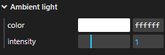
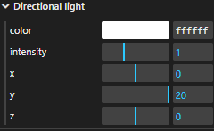
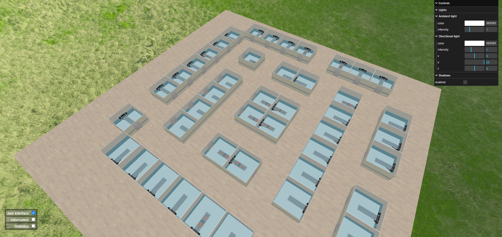

# US 6.5.3

## 1. Context

- We want to implement lights so that it ilumminates the hospital/clinic floor.

## 2. Requirements

**US 6.5.3** As a healthcare staff member, I want to see the hospital/clinic floor illuminated with ambient and directional light.

## 3. Analysis

- We decided to use the "Basic Thumb Raiser" project from the classes and adapt it to fit our needs
- The lights should be adjustable.

## 4. Design

### 4.1. Realization

- Ambient light: in the UI u can change values
    * color
    * intensity
        

- Directional light: in the UI u can change multiple values
    * color (RGB)
    * intensity (0 to 3)
    * x position (-50 to 50)
    * y position (0 to 20)
    * z position (-50 to 50)
        


### 4.4. Tests

- Testing will be done manually by adjusting values in the UI and observing the results.

## 5. Implementation

- Create ambient light in lights file (lights.js):
```
    // Create the ambient light
    this.object.ambientLight = new THREE.AmbientLight(this.ambientLight.color, this.ambientLight.intensity);
    this.object.add(this.object.ambientLight);
```
- Create directional light in lights file (lights.js):

``` 
    // Create directional light and turn on shadows for this light
    this.object.directionalLight = new THREE.DirectionalLight(this.directionalLight.color, this.directionalLight.intensity); //, this.directionalLight.distance) ;
    this.object.directionalLight.position.set(this.directionalLight.position.x, this.directionalLight.position.y, this.directionalLight.position.z);
    this.object.directionalLight.castShadow = true;

    // Set up shadow properties for this light
    this.object.directionalLight.shadow.mapSize.width = 512;
    this.object.directionalLight.shadow.mapSize.height = 512;
    this.object.directionalLight.shadow.camera.near = 5.0;
    this.object.directionalLight.shadow.camera.far = 15.0;
    this.object.add(this.object.directionalLight);
```

## 6. Integration/Demonstration


