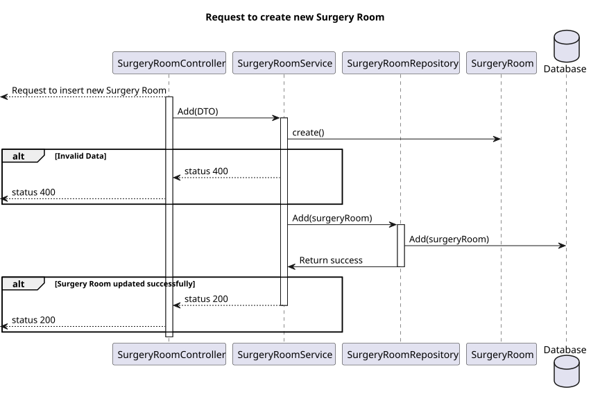
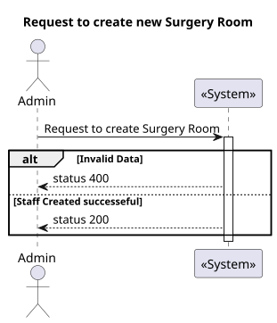
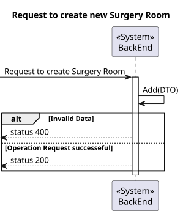
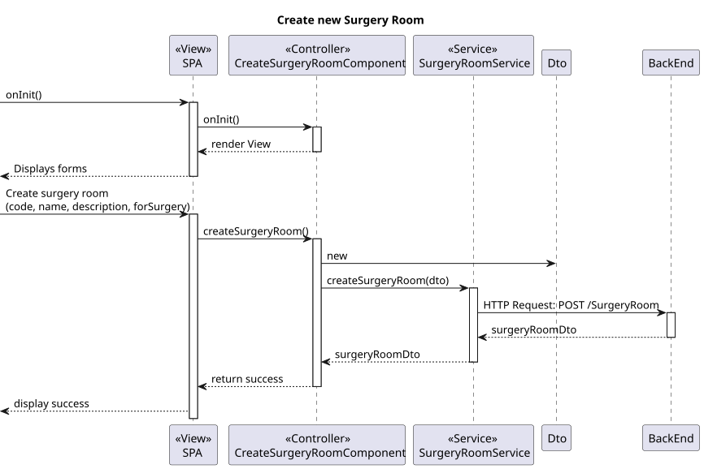
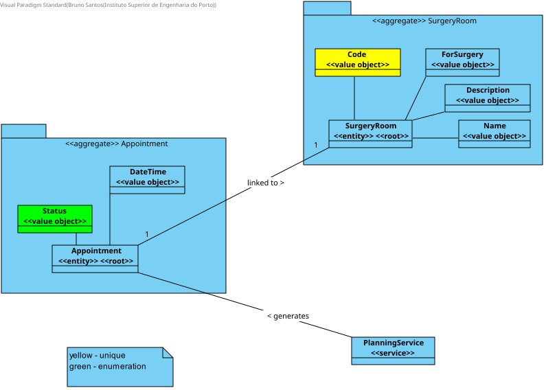
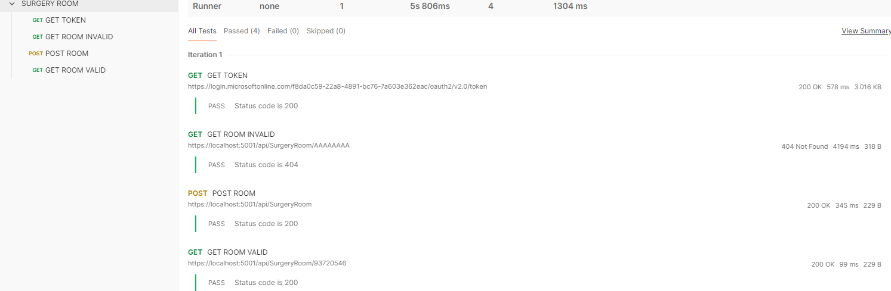

# US7.2.10 | SEM5-58

## 1. Context

* Implement functionality in the frontend and backend1 (C#) so that the admin can create new type of rooms and reflect it on the available medical procedures in the system.


## 2. Requirements

**US7.2.10** 
As an Admin, I want to add new Types of rooms, so that I can reflect on the available medical procedures in the system.

**Acceptance criteria:**

- Should contain code base on SNOMED CT(Systematized Nomenclature of Medicine - Clinical Terms) or ICD-11(International Classification of Diseases, 11th Revision.
- Should contain a code with 8 characters long, no spaces, only letters, numbers, and dashes ("-") are allowed. it must be unique
- Should contain a name.
- Should contain a longer description.
- Should contain a boolean ForSurgery.


## 3. Analysis

- **Q**: What will be the Room Type fields to input when adding?
    **R**: A room type is characterized by an internal code, a designation and an optional longer description. It also indicates if it the room type is suitable for surgeries or not 

- **Q**: With the characterization of the room type, the internal code must have a format? If so, what will be the format?
For the designation, exists any restrition (max n° of characters, is unique, etc.)? If so, what restrition?
    **R**: code is a text entered by the Admin. it must be 8 characters long, no spaces, only letters, numbers, and dashes ("-") are allowed. it must be unique.     designation. free text, alphanumeric, 100 characters max. 


## 4. Design

### 4.1. Realization

#### BackEnd1

##### Level 1


##### Level 2


##### Level 3



#### FrontEnd

##### Level 1



##### Level 2



##### Level 3



### 4.2. Class Diagram




### 4.3. Applied Patterns

Applied Patterns description in [DevelopmentPatterns](../../Global/DevelopmentPatterns/readme.md)

### 4.4. Tests

**FrontEnd**
- create-surgery-room.component.spec.ts
```
it('should create', () => {...};
it('should initialize form with default values', () => {...};
it('should update form with values', () => {...};
it('should create room dto', () => {...};
it('should call createRoom on form submit', () => {...};
it('should show success toastr on successful room creation', () => {...};
```

**BackEnd1**



- SurgeryRoomTest.cs
```
public void EnsureCodeHasCorrectLength() => {...};
public void EnsureCodeHasCorrectFormat() => {...};
public void EnsureNameIsFilled() => {...};
public void EnsureFieldsEqual() => {...};
```
- SurgeryRoomServiceTest.cs
```
public async Task AddAsync_ShouldAddSurgeryROom() => {...};
public async Task GetByIdAsync_ShouldReturnRoom() => {...};
public async Task UpdateAsync_ShouldUpdateSurgeryRoom() => {...};
```

## 5. Implementation


**FrontEnd**
- create-surgery-room.component.ts
```
 createDto() {
        const surgeryRoomDto = {
            code: this.roomForm.value.code,
            name: this.roomForm.value.name,
            description: this.roomForm.value.description,
            forSurgery: this.roomForm.value.forSurgery
        }
        return surgeryRoomDto;
    }

    createSurgeryRoom() {
        this.room = this.createDto();

        if (this.room == null)
            return alert("Room invalid, unexpected error!");

        this.service.createSurgeryRoom(this.room).subscribe({
            next: () => {
                this.toastr.success('Room created successfully', 'Success');
                this.roomForm.reset();
            },
            error: (err: HttpErrorResponse) => {
                this.toastr.error('Failed to create room: ' + err.error.message, 'Error');
            }
        })
    }
```

**BackEnd1**
- SurgeryRoomService.cs
```
public async Task<SurgeryRoomDto> AddAsync(SurgeryRoomDto dto)
        {
            SurgeryRoom surgeryRoom = new SurgeryRoom(dto.Code, dto.Name, dto.Description, dto.ForSurgery);

            try
            {
                surgeryRoom = await this._surgeryRoomRepo.AddAsync(surgeryRoom);
                await this._unitOfWork.CommitAsync();

                string newValues = surgeryRoom.ToString();
                SystemChangeLog changeLog = new SystemChangeLog(surgeryRoom.Code, TABLE_NAME, null, newValues, "Admin", "Create");
                await _changeLogRepo.AddAsync(changeLog);

                await this._unitOfWork.CommitAsync();
            }
            catch (DbUpdateException ex)
            {
                if (ex.InnerException.Message.Contains("IX_SurgeryRoom_Code"))
                    throw new DbUpdateException("Room code already exists");
                throw;
            }

            return surgeryRoom.ToDto();
        }
```

## 6. Integration/Demonstration

* To run this feature you must log in to the system as Admin.