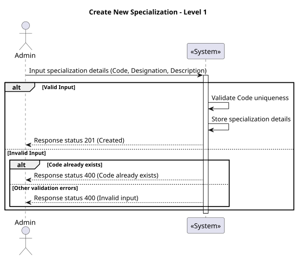
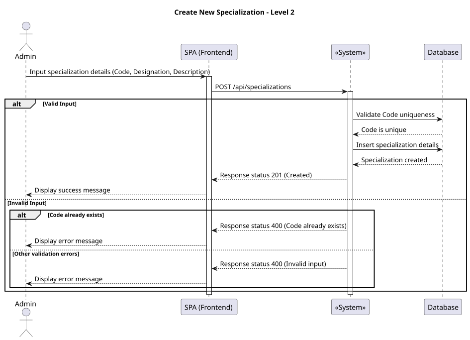
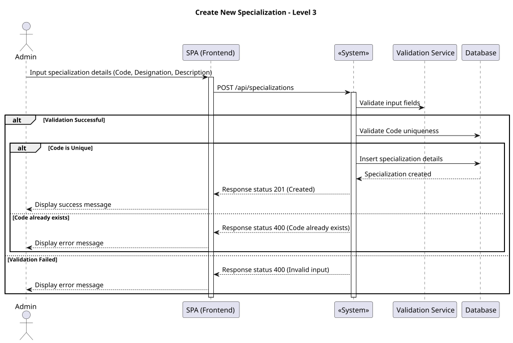

### **US 7.2.11**

#### **1. Context**

The administrator requires the ability to add new Specializations into the system. These specializations will be used both for associating with healthcare staff and for defining operation types (procedures).

#### **2. Requirements**

* **As an Admin**, I want to add new Specializations, **so that I can update or correct information about the staff and the operation types.**

##### **Acceptance Criteria:**

The Admin can input the following details for a Specialization:
- **Code**: A unique specialization code, for example, based on SNOMED CT.
- **Designation**: A short, descriptive name for the specialization.
- **Description**: A longer, optional description of the specialization.

* The system validates that:
  - **Code** is required and must be unique.
  - **Designation** is required.
  - The new Specialization is stored in the system.
  - The administrator receives clear feedback indicating success or any validation errors.

#### **3. Analysis**

**Questions and Answers:**
- **Q:** What format should the Code use?  
  **A:** The Code should follow a format based on SNOMED CT, consisting of numeric values (e.g., 123456789).

- **Q:** Does the Code need to be unique across the system?  
  **A:** Yes, the system must enforce uniqueness for the Code field to avoid duplication.

- **Q:** Is the Description field mandatory?  
  **A:** No, the Description is optional and can be left blank.

- **Q:** What feedback should the Admin receive after submitting a new Specialization?  
  **A:** The Admin should see a clear success message if the Specialization is added successfully. If the operation fails (e.g., a duplicate Code), an appropriate error message should be displayed.

### 4. Design

#### 4.1. Realization

##### Level 1



###### Level 2



###### Level 3



#### 4.2. Class Diagram


#### 4.3. Applied Patterns

Applied Patterns description in [DevelopmentPatterns](../Global/DevelopmentPatterns/readme.md)

#### 4.4. Tests

```
describe('CreateSpecializationsComponent', () => {
  it('should create the component', () => { ... });
  it('should create specialization form group', () => { ... });
  it('should create a specialization dto', () => { ... });
  it('should show success message when specialization is created successfully', fakeAsync(() => { ... }));
  it('should show error message when specialization creation fails', fakeAsync(() => { ... }));
  it('should mark all fields as touched if form is invalid', () => { ... });
});

```
### 5. Implementation

The implementation of the `CreateSpecializationsComponent` includes the following steps:

1. **Form Creation:**
   - Uses `ReactiveFormsModule` to manage the form fields: `Code`, `Designation`, and `Description`.
   - Validates `Code` (mandatory and unique) and `Designation` (mandatory).

2. **Service Integration:**
   - Uses the `createSpecialization` method to save new specializations to the backend.

3. **User Feedback:**
   - Integrates with `ngx-toastr` to provide success, error, or warning messages based on user actions or validation errors.

4. **Navigation:**
   - Redirects to the specialization search page after a successful creation.

### 6. Integration/Demonstration

The component will be integrated into the admin workflow with the following scenarios:

1. **Accessing the Component:**
   - Available in the admin panel, accessible via the route `/admin/specialization/create`.

2. **Demonstration:**
   - **Scenario 1:** Fill out the form with valid data, create a new specialization, and see a success message.
   - **Scenario 2:** Submit the form with invalid or missing data and view appropriate warning or error messages.

The component is ready for integration and will be included in the next release for testing and review.
