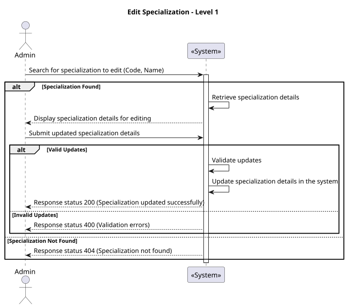
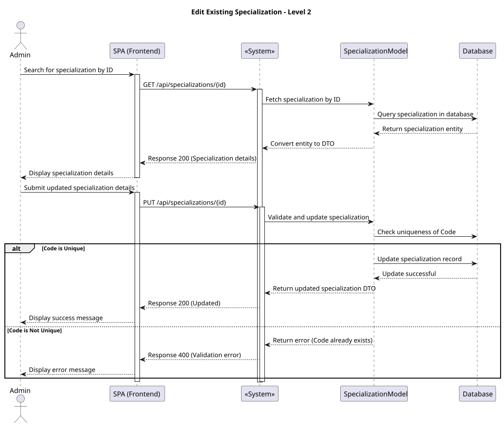
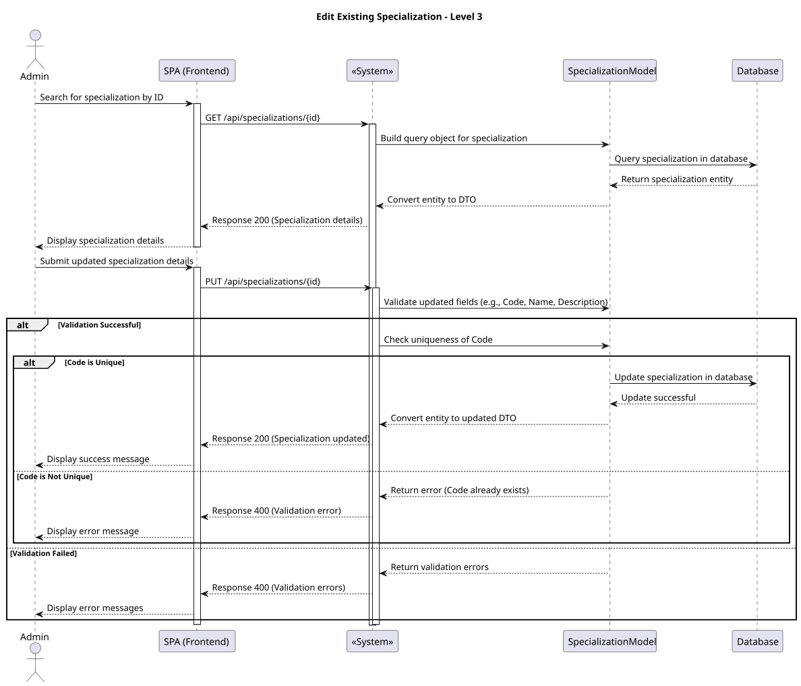

### **US 7.2.13**

#### **1. Context**

The admin needs the ability to edit existing specializations in the system. This functionality is crucial to ensure that information related to the operation type and medical staff is accurate and up to date.

#### **2. Requirements**

* **As an Admin**, I want to edit specializations, **so that I can update or correct information about the staff and the operation types.**

##### **Acceptance Criteria**

1. The admin can search for and select an existing specialization for editing.
2. Editable fields include:
   - **Code**: a unique code for the specialization.
   - **Name**: a short descriptive name.
   - **Description**: a more detailed explanation, if necessary.
3. The system validates that:
   - The **Code** field is mandatory.
   - The **Name** field is mandatory.
4. The system updates the specialization's information and reflects changes in real-time within the system.
5. Historical data remains intact, but new associations and operations will use the updated information.

#### **3. Analysis**

**Questions and Answers:**
- **Q:** Is it necessary to maintain an edit history for specializations?  
  **A:** No, only the latest version of the specialization is relevant in the system.
- **Q:** Can the code be changed?  
  **A:** No, the code is immutable to maintain the integrity of existing associations.
- **Q:** What feedback should the admin receive after editing a specialization?  
  **A:** A success message should be displayed. In case of an error, a clear message should describe the issue.

### 4. Design

#### 4.1. Realization

##### Level 1



###### Level 2



###### Level 3



#### 4.2. Class Diagram


#### 4.3. Applied Patterns

Applied Patterns description in [DevelopmentPatterns](../Global/DevelopmentPatterns/readme.md)

#### 4.4. Tests

```
describe('UpdateSpecializationsComponent', () => {
  it('should create the component', () => { ... });
  it('should initialize form with specialization data', () => { ... });
  it('should show success message on successful update', fakeAsync(() => { ... }));
  it('should show error message when update fails', fakeAsync(() => { ... }));
});

```
### 5. Implementation

The implementation of the `UpdateSpecializationsComponent` involves the following key steps:

1. **Form Creation:**
   - Uses `ReactiveFormsModule` to manage editable fields: `Name` and `Description`.
   - Validates the `Name` field as mandatory.

2. **Service Integration:**
   - Consumes the `getSpecializationById` method to load specialization data.
   - Utilizes the `updateSpecialization` method to send updates to the backend.

3. **User Feedback:**
   - Integrates with `ngx-toastr` to display success or error messages.

4. **Navigation:**
   - Redirects to the search page after a successful update.

### 6. Integration/Demonstration

The functionality will be integrated into the main application with the following workflows:

1. **Accessing the Component:**
   - Available in the admin panel, accessible via the route `/admin/specialization/edit/:id`.

2. **Demonstration:**
   - **Scenario 1:** Select an existing specialization, update the `Name` field, and save successfully.
   - **Scenario 2:** Display error messages when attempting to save with invalid data or in case of backend failure.

The component will be available in the next build for review and testing.
