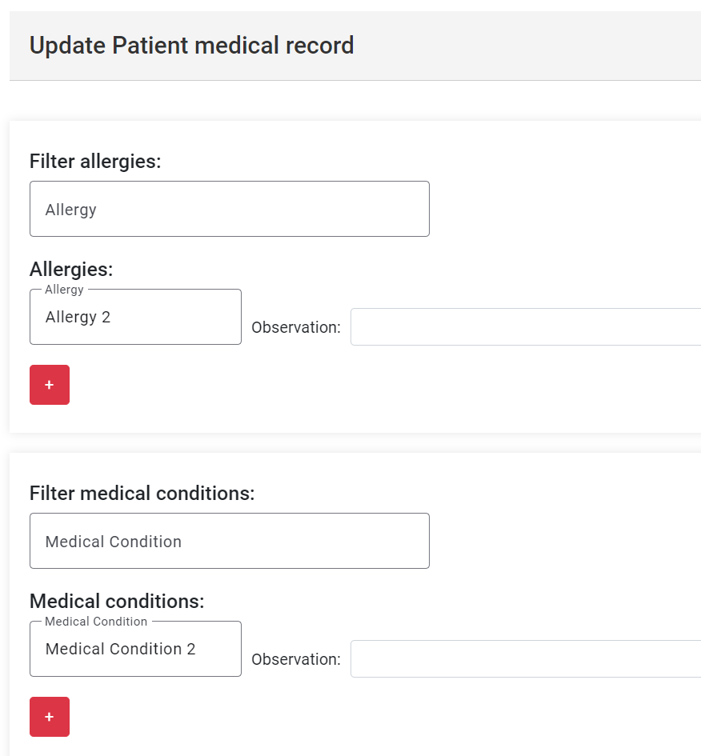

# US 7.2.14

## 1. Context

- In this user story, the medical record component must be added in the patient profile form.

## 2. Requirements

**US 7.2.14** As a Doctor, I want to include the access of the Patient Medical Record during the patient profile visualization and management, so that I manage it in that context.

**Acceptance Criteria:**

- The doctor must be able to update the specific medical record of a patient.
- The medical record updating form must be include in the patient profile visualization

**Dependencies:**

- Medical record component.
- Patient profile form.

## 3. Analysis

-   **Q**: "As a Doctor, I want to include the access of the Patient Medical Record during the patient profile visualization and management, so that I manage it in that context." This US implies that the Doctor has access to the patient profile management functionalities, but those functionalities are assigned to the Admin according to the previous Sprint. Should we give the Doctor those permissions too?
    -   **A**: For clarification, the Admin will be able to manage the user profile (as of sprint A) while the doctor will be able to manage the medical history/medical record. treat those as two separate responsibilities by two different user roles.
Keep in mind that during Sprint A, the medical record was a free text field, and now we are adding a "full-fledged" medical record management feature.

-   **Q**: If im understanding the user story correctly, when the user opens de patient profile, it should be possible to view the data from the medical record, correct? Or is this user story something else or more than this?
    -   **A**: That's correct.

## 4. Design

- The doctor will be given able to view the patients list as the patient medical record will be inside the patient form.
- The list for searching the patients must not show the update and the delete buttons when used by the doctor.
- The patient form must also have its update button removed.
- The patient medical record component will be added bellow that patient form.

## 5. Implementation

- **FrontEnd Update Patient Component**
```
<div *ngIf="!canUpdate()">
    <div class="header">
        <h1>Update Patient medical record</h1>
    </div>
    <div style="position:absolute;left:0px;width:100%">
        <app-update-medical-record></app-update-medical-record>
    </div>
</div>
```

- **FrontEnd Search Patient Component**
```
editPatient(patient: PatientModel) {
    this.router.navigate(['/admin/patient/update', patient.id]);
    if (this.tokenService.getUserRole().toLowerCase() === 'doctor') {
        this.router.navigate(['/doctor/patient/update', patient.id]);
    } else {
        this.router.navigate(['/admin/patient/update', patient.id]);
    }
}
```

## 6. Integration/Demonstration

* To use this option, you must login as Doctor and enter in the profile of a patient.

- **Medical record in patient form**
