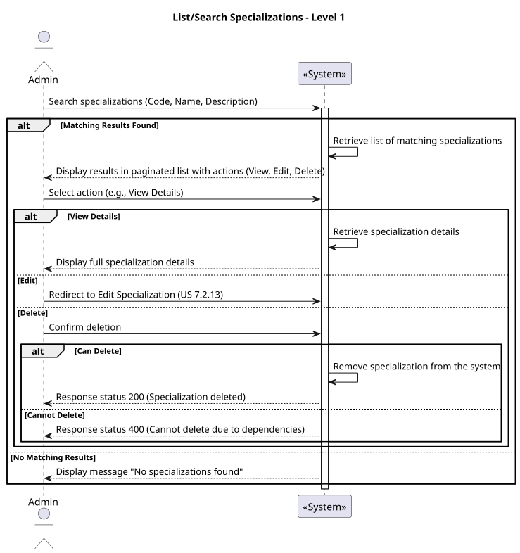
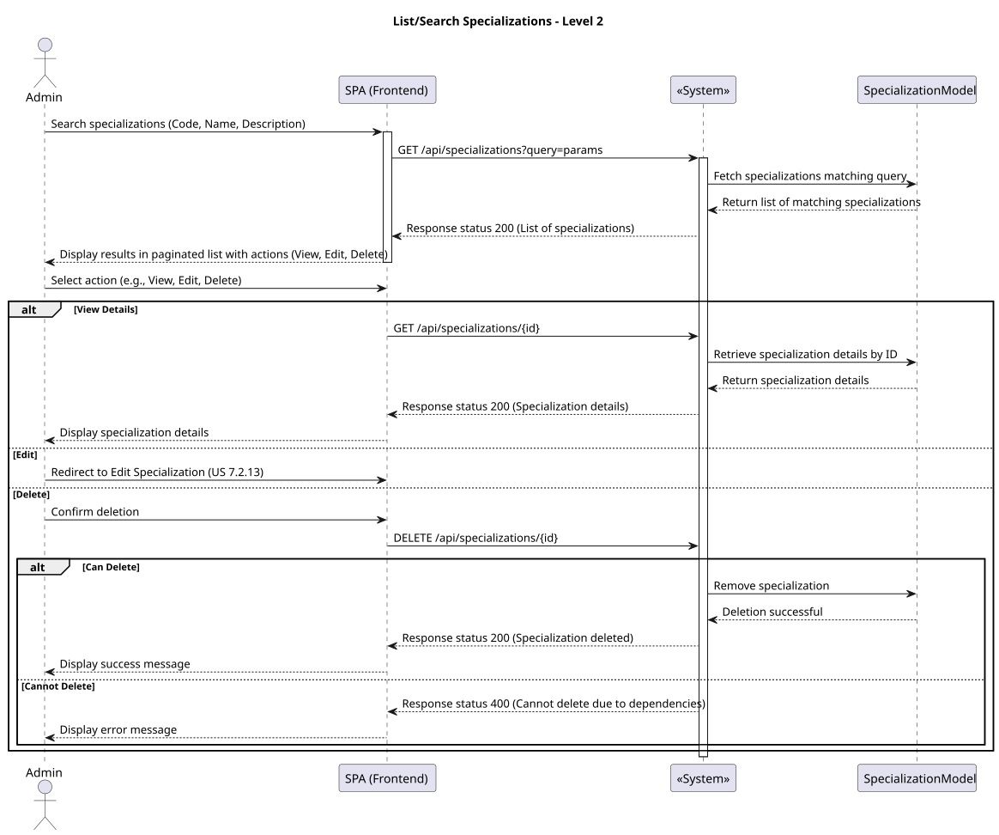
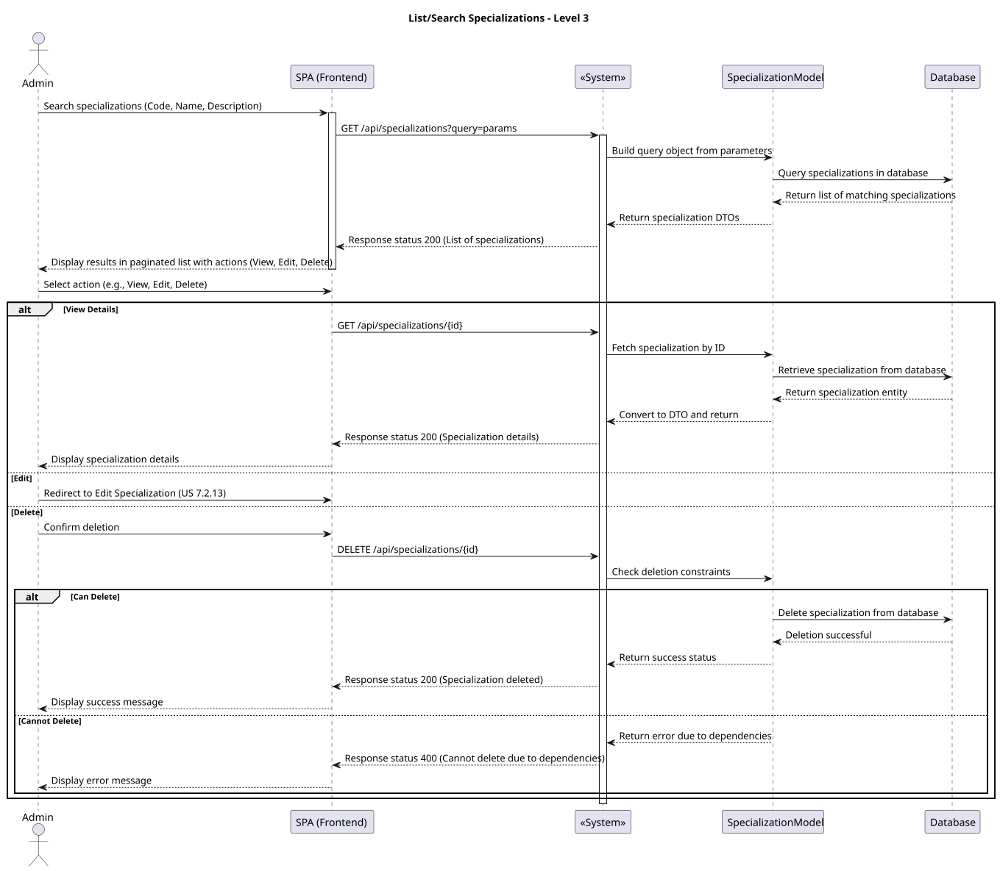
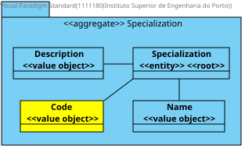

### **US 7.2.15**

#### **1. Context**

The admin needs to list and search specializations in the system to view their details and perform edit or delete actions.

#### **2. Requirements**

* **As an Admin**, I want to list and search specializations, **so that I can see the details, and edit or remove specializations.**

##### **Acceptance Criteria**

1. The admin can search for specializations by:
   - **Code**.
   - **Name**.
   - **Description**.
2. The system displays the results in a paginated list with:
   - **Code**.
   - **Name**.
   - **Description**.
3. The admin can perform the following actions for each item in the list:
   - **View Details**: displays all the information about the specialization.
   - **Edit**: redirects to the specialization edit form.
   - **Delete**: prompts a confirmation dialog before removing the specialization.
4. The system validates that:
   - Deletion can only occur if there are no dependencies related to the specialization (e.g., operations or staff associations).
5. The interface shows clear messages indicating the success or failure of the performed actions.

#### **3. Analysis**

**Questions and Answers:**
- **Q:** Which fields should be displayed in the listing?  
  **A:** **Code**, **Name**, and **Description**.
- **Q:** Can the admin delete specializations that are associated with staff or operations?  
  **A:** No. The system should block deletion and provide details on dependencies that need to be resolved.
- **Q:** Should the search be case-sensitive?  
  **A:** No, the search should be case-insensitive for ease of use.
- **Q:** What feedback should the admin receive after performing an action (edit, delete)?  
  **A:** Success or error messages should be displayed for each action.

### 4. Design

#### 4.1. Realization

##### Level 1



###### Level 2



###### Level 3



#### 4.2. Class Diagram



#### 4.3. Applied Patterns

Applied Patterns description in [DevelopmentPatterns](../Global/DevelopmentPatterns/readme.md)

#### 4.4. Tests

```
describe('SearchSpecializationsComponent', () => {
  it('should create the component', () => { ... });
  it('should initialize form with empty values', () => { ... });
  it('should handle empty search results gracefully', fakeAsync(() => { ... }));
});

```

### 5. Implementation

The implementation of the `SearchSpecializationsComponent` includes the following key steps:

1. **Form Creation:**
   - Utilizes `ReactiveFormsModule` to build a form with fields for `Code`, `Name`, and `Description`.
   - Ensures fields are optional for flexibility during search.

2. **Service Integration:**
   - Invokes the `searchSpecializations` method to retrieve matching results from the backend.

3. **Result Display:**
   - Shows results in a paginated table with `Code`, `Name`, and `Description` columns.
   - Allows actions (View Details, Edit, Delete) for each specialization in the list.

4. **Validation:**
   - Prevents deletion of specializations with dependencies and displays appropriate error messages.

5. **Feedback Mechanism:**
   - Integrates `ngx-toastr` to provide success or error notifications based on the performed actions.

### 6. Integration/Demonstration

The component will be integrated into the admin panel workflow with the following scenarios:

1. **Accessing the Component:**
   - Available via the route `/admin/specialization/search` in the admin panel.

2. **Demonstration Scenarios:**
   - **Scenario 1:** Perform a search using `Code`, `Name`, or `Description` and display matching results.
   - **Scenario 2:** Attempt to delete a specialization with dependencies and receive an error message.
   - **Scenario 3:** Successfully delete a specialization with no dependencies and view a success message.

The component will be part of the next deployment for testing and feedback.
