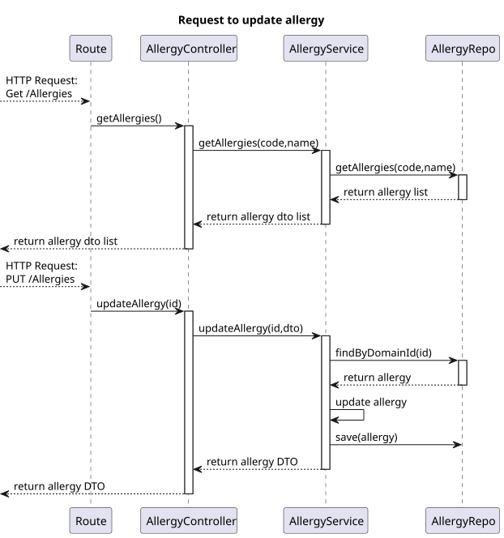
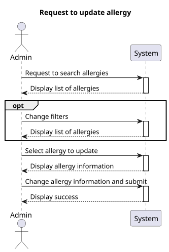
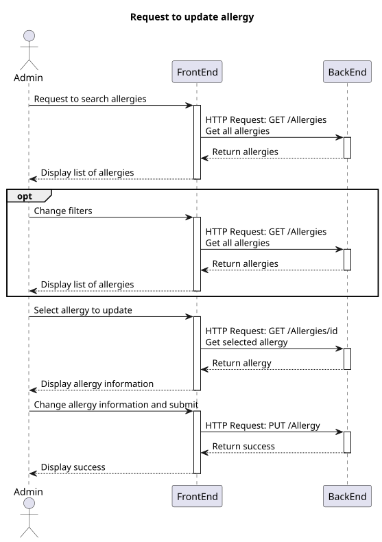
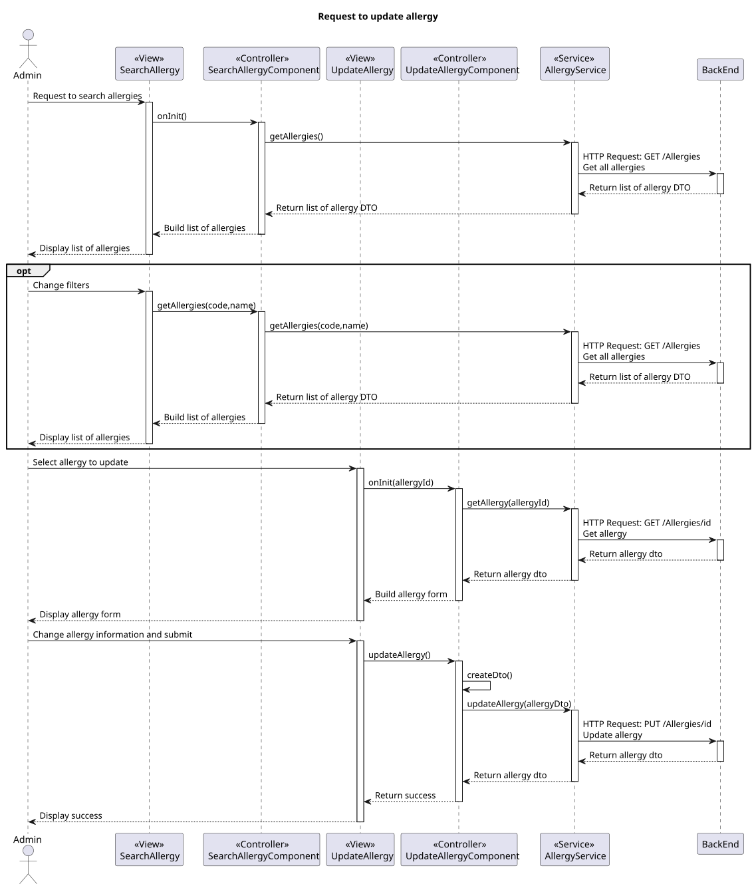

# US 7.2.16

## 1. Context

- This is the funcionality to update allergy

## 2. Requirements

**US 7.2.16** As Admin I want to update an allergy

**Acceptance Criteria:**

- To update an allergy, an allergy must exist in the system.
- In the allergy the fields designation and descriprion could be updated.


## 3. Analysis

-   **Q**: Regarding User Story 7.2.16, we would like to confirm the details for updating an allergy. Could you clarify which parameters the admin should be able to modify when performing this action?
    -   **A**: it is possible to update the designation (to fix a typo for instance) and the description.      


## 4. Design

### 4.1. Realization

#### BackEnd2

##### Level 1


##### Level 2


##### Level 3



#### FrontEnd

##### Level 1



##### Level 2



##### Level 3



### 4.2. Class Diagram


### 4.3. Applied Patterns

Applied Patterns description in [DevelopmentPatterns](../../Global/DevelopmentPatterns/readme.md)

### 4.4. Tests

- **FrontEnd**
    
    - Update allergy component test
    ```
	it('should show success message when Allergy is updated successfully', fakeAsync(() => {...};
    it('should show error message when updating fails', () => {...};
    ```
    
    - Update allergy service test
    ```
	it('should update allergy', () => {...};
    it('should handle HTTP errors', () => {...}:
    it('should get allergy', () => {...};
    ```

- **BackEnd2**
   -   Allergy
    ```
    The domain has no update because it's the service that does the updating.
    ```
    -  Controller 
    ```
    it('on update allergy and return json with right values', async function () {...};
    it('should call service on update allergy', async function () {...};
    ```
    -   Service
    ```
    it('on update allergy and return json with right values', async function () {...};
    it('should call service on update allergy', async function () {...};
    ```

## 5. Implementation

- **FrontEnd**

    - Component
    ```
    updateAllergy() {
            if (this.allergyForm.invalid) {
                this.findInvalidForm().forEach((message) => {
                    this.toastr.error(message, 'Error');
                })
                return;
            }
            let dto = this.createDto();

            if (dto != null) {
                this.service.updateAllergy(dto).subscribe({
                    next: () => {
                        this.toastr.success('Allergy updated successfully', 'Success');
                        this.sendToSearch();
                    },
                    error: (err: HttpErrorResponse) => {
                        this.toastr.error('Failed to update allergy\n' + err.error.message, 'Error');
                    },
                });
            }
    }
    ```

- **BackEnd2**

    - Controller
    ```
    public async updateAllergy(allergyId: string, req: Request, res: Response, next: NextFunction) {
            try {
                const allergyOrError = await this.allergyServiceInstance.updateAllergy(allergyId, req.body as IAllergyDTO) as Result<IAllergyDTO>;

                if (allergyOrError.isFailure) {
                    return res.status(404).send();
                }

                const allergyDTO = allergyOrError.getValue();
                return res.json(allergyDTO).status(201);
            }
            catch (e) {
                return next(e);
            }
        };
    ```

    - Service
    ```
    public async updateAllergy(allergyId: string, allergyDTO: IAllergyDTO): Promise<Result<IAllergyDTO>> {
        try {
            const allergy = await this.allergyRepo.findByDomainId(allergyId);

            if (allergy === null) {
                return Result.fail<IAllergyDTO>("Allergy not found");
            }
            else {
                allergy.code = allergyDTO.code;
                allergy.name = allergyDTO.name;
                allergy.description = allergyDTO.description;
                await this.allergyRepo.save(allergy);

                const allergyDTOResult = AllergyMap.toDTO(allergy) as IAllergyDTO;
                return Result.ok<IAllergyDTO>(allergyDTOResult)
            }
        } catch (e) {
            throw e;
        }
    }
    ```

## 6. Integration/Demonstration

* To use this functionality the user must log in with an administrator or doctor account and access the "Allergy Management" menu.


