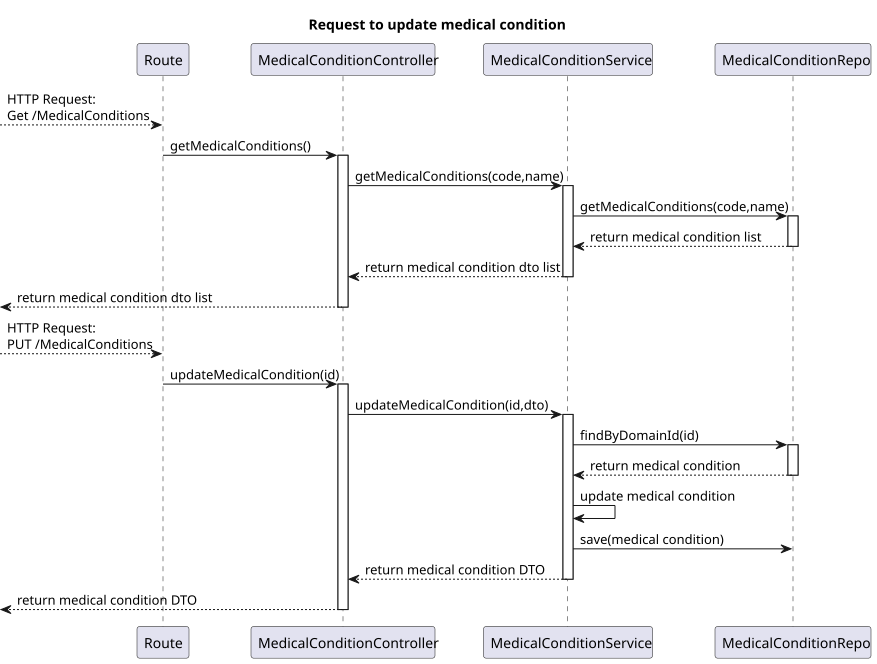
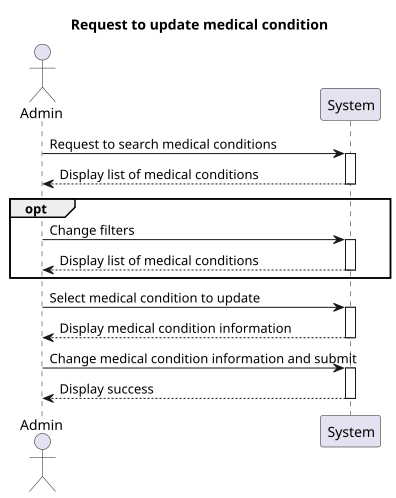
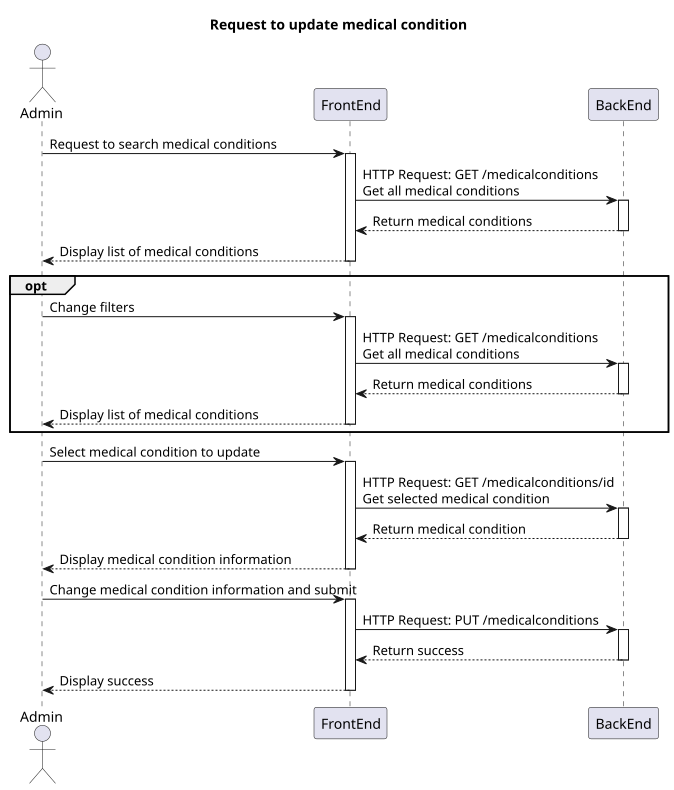
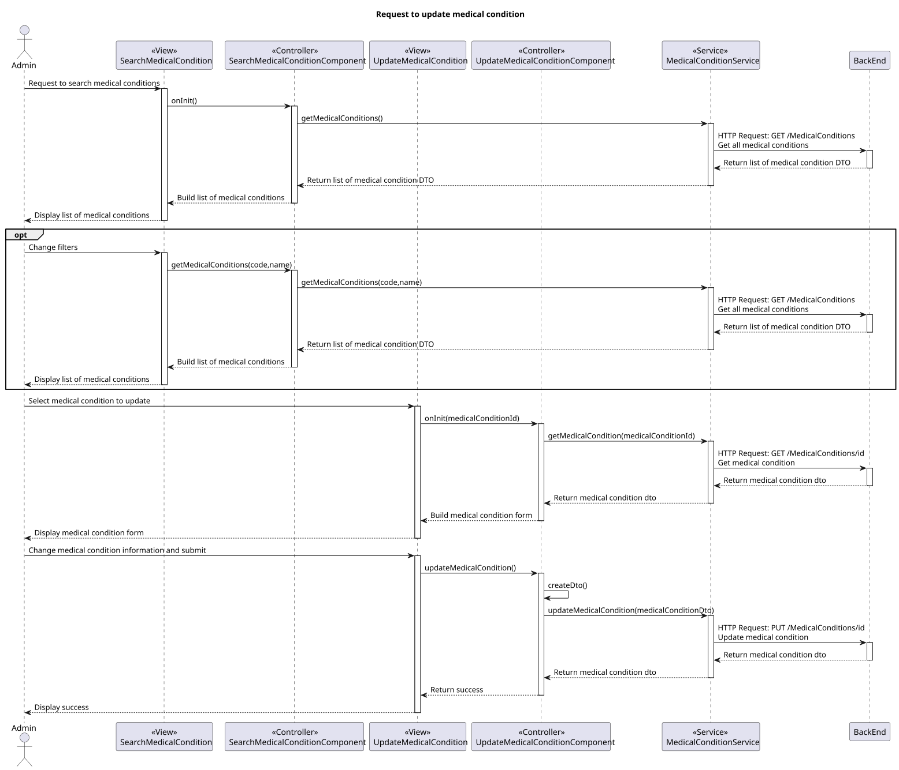

# US 7.2.17

## 1. Context

-   Implement functionality in the frontend and backend so that the admin can update medical conditions.

## 2. Requirements

**US 7.2.17** As Admin I want to update a medical condition.

**Acceptance criteria:**

-   Should contain code base on SNOMED CT (Systematized Nomenclature of Medicine - Clinical Terms) or ICD-11 (International Classification of Diseases, 11th Revision)
-   Should contain Shorter description and a longer description
-   Should contain a list of symptoms
-   Shorter description max caracters: 100
-   Description max caracters: 2048

## 3. Analysis

-   **Q**: The medical condition consist in what? Just a name or are there more fields?
    -   **A**: it consists of a code (for example following ICD (International Classification of Diseases)), a designation and a longer description as well a list of common symptoms
-   **Q**: Earlier, you said the medical condition needed a code. Is this code automatic or is writen by the admin?
    -   **A**: it must conform with the classficiation system you select, for instance, SNOMED CT (Systematized Nomenclature of Medicine - Clinical Terms) or ICD-11 (International Classification of Diseases, 11th Revision)
-   **Q**: Qual seria o tamanho máximo de uma designação e descrição de uma alergia?
    -   **A**: designação, max 100 caracteres, descrição, máximo 2048 caracteres

## 4. Design

### 4.1. Realization

#### BackEnd2

##### Level 1


##### Level 2


##### Level 3



#### FrontEnd

##### Level 1



##### Level 2



##### Level 3



### 4.2. Class Diagram


### 4.3. Applied Patterns

Applied Patterns description in [DevelopmentPatterns](../Global/DevelopmentPatterns/readme.md)

### 4.4. Tests

-   **FrontEnd**
    -   Update Medical Condition component test

    ```
    it('should Update the component', () => {...});
    it('should Update Medical Condition form group', () => {...});
    it('should Update Medical Condition dto', () => {...});
    it('should show success message when Medical Condition is updated successfully', () => {...});
    it('should show error message when updating fails', () => {...});
    ```
    -   Update Medical Condition service test
    ```
    it('should update medical condition', () => {...});
    ```
-   **BackEnd2**
    -   Medical Condition
    ```
    it('should Update Medical Condition', () => {...});
    it('should throw error on invalid Medical Condition', () => {...});
    it('should Update Medical Condition dto', () => {...});
    ```
    -  Controller 
    ```
    it('on Update medical condition and return json with right values', async function() {...});
    it('should call service on Update medical condition', async function() {...});
    it('on Update invalid medical condition return fail error', async function() {...});
    ```
    - Service
    ```
    it('should call repo on valid medical condition, () => {...});
    ```
## 5. Implementation

-   **FrontEnd**
    -   Update Medical Condition component test

    ```
    updateMedicalCondition() {
        ...
        if (dto != null) {
            this.service.updateMedicalCondition(dto).subscribe({
                next: () => {
                    this.toastr.success('Medical condition updated successfully', 'Success');
                    this.sendToSearch();
                }
        ...
    }
    ```
    -   Update Medical Condition service test
    ```
    updateMedicalCondition(medicalCondition: MedicalConditionDto): Observable<MedicalConditionDto> {
        let req: Observable<MedicalConditionDto>;
        req = this.http.put<MedicalConditionDto>(this.baseUrl + '/' + medicalCondition.id, medicalCondition);
        ...
    }
    ```
-   **BackEnd2**
    -  Controller 
    ```
    public async updateMedicalCondition(medicalConditionId: string, req: Request, res: Response, next: NextFunction) {
        ...
            const medicalConditionOrError = await this.medicalConditionServiceInstance.updateMedicalCondition(medicalConditionId, req.body as IMedicalConditionDTO) as Result<IMedicalConditionDTO>;
        ...
    }
    ```
    - Service
    ```
    public async updateMedicalCondition(medicalConditionId: string, medicalConditionDTO: IMedicalConditionDTO): Promise<Result<IMedicalConditionDTO>> {
        ...
        const medicalCondition = await this.medicalConditionRepo.findById(medicalConditionId);
            
            if (medicalCondition === null) {
                return Result.fail<IMedicalConditionDTO>('Medical condition not found');
            } else {
                medicalCondition.code = medicalConditionDTO.code;
                medicalCondition.name = medicalConditionDTO.name;
                medicalCondition.description = medicalConditionDTO.description;
                medicalCondition.symptoms = medicalConditionDTO.symptoms;
                await this.medicalConditionRepo.save(medicalCondition);
        ...
    }
    ```

## 6. Integration/Demonstration
* To execute this funcionality you need to log in as Admin.
