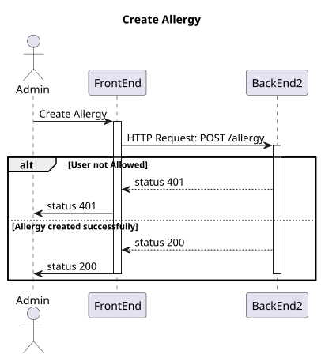
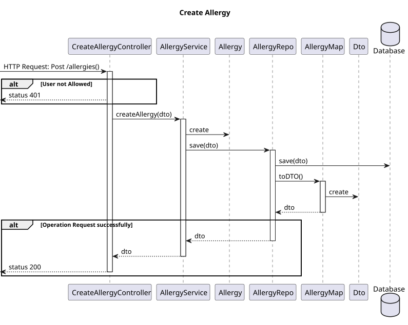
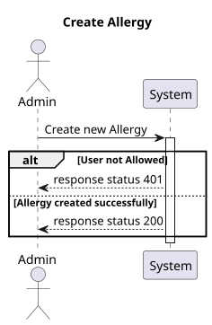
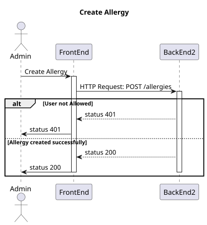
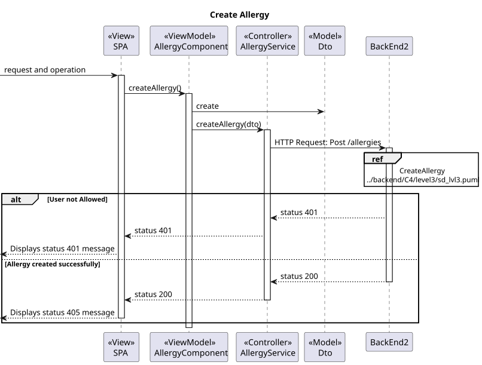

# US7.2.2 | SEM5-50

## 1. Context

- Implement functionality in the frontend and backend so that the admin can create allergies so that the doctor can update patient medical record.


## 2. Requirements

**US7.2.2** 
As an Admin, I want to add new Allergy, so that the Doctors can use it to update the Patient Medical Record.

**Acceptance criteria:**

- Should contain code base on SNOMED CT(Systematized Nomenclature of Medicine - Clinical Terms) or ICD-11(International Classification of Diseases, 11th Revision).
- Should contain a name.
- Should contain a longer description.
- Name max caracteres: 100
- Long description max caracters: 2048


## 3. Analysis

- **Q**: What information is to be known in an Allergy? Like designation, and anything more?
    **R**: it consist of a code (for instance, SNOMED CT (Systematized Nomenclature of Medicine Clinical Terms) or ICD-11 (International Classification of Diseases, 11th Revision)), a designation and an optional longer description
         

## 4. Design

### 4.1. Realization

#### BackEnd2

##### Level 1


##### Level 2



##### Level 3



#### FrontEnd

##### Level 1



##### Level 2



##### Level 3



### 4.2. Class Diagram


### 4.3. Applied Patterns

Applied Patterns description in [DevelopmentPatterns](../../Global/DevelopmentPatterns/readme.md)


### 4.4. Tests

**FrontEnd**
- Create Allergy component test
```
it('should create the component', () => {...});
it('should create Allergy form group', () => {...});
it('should create Allergy dto', () => {...});
it('should show success message when Allergy is created successfully', () => {...});
it('should show error message when creation fails', () => {...});
```
- Create Allergy service test
```
it('should create a new allergy', () => {...});
it('should handle HTTP errors', () => {...});
```
**BackEnd2**
- Allergy
```
it('should create Allergy', () => {...});
it('should throw error on invalid Allergy', () => {...});
it('should create Allergy dto', () => {...});
```
- Controller 
```
it('on create allergy and return json with right values', async function() {...});
it('should call service on create allergy', async function() {...});
it('on create invalid allergy return fail error', async function() {...});
```
- Service
```
it('should call repo on valid allergy, () => {...});
```

## 5. Implementation

**FrontEnd**

- Component
  ```
  createAllergy() {
    if(this.patientForm.invalid){
      this.findInvalidForm().forEach((message)=>{
        this.toastr.error(
          message,
          'Error'
        );
      })
      
      return;
    }
    let dto = this.createDto();

    if (dto != null) {
      this.service.createAllergy(dto).subscribe({
        next: () => {
          this.toastr.success(
            'Allergy created successfully',
            'Success'
          );
          this.patientForm.reset();
        },
        error: (err: HttpErrorResponse) => {
          this.toastr.error(
            'Failed to create allergy\n' + err.error.message,
            'Error'
          );
        },
      });
    }
  }
  ``` 

**BackEnd2**

- Domain
  ```
  public static create(allergyDTO: IAllergyDTO, id?: UniqueEntityID): Result<Allergy> {
        if (!!allergyDTO.code === false || allergyDTO.code.length === 0) {
            return Result.fail<Allergy>('Must provide an allergy code')
        }
        if (!!allergyDTO.name === false || allergyDTO.name.length === 0) {
            return Result.fail<Allergy>('Must provide an allergy name')
        }
        if (!!allergyDTO.description === false || allergyDTO.description.length === 0) {
            return Result.fail<Allergy>('Must provide an allergy description')
        }
        const allergy = new Allergy({ code: allergyDTO.code, name: allergyDTO.name, description: allergyDTO.description }, id);
        return Result.ok<Allergy>(allergy)
    }
  ```
 
- Controller
  ```
  public async createAllergy(req: Request, res: Response, next: NextFunction) {
        try {
            const allergyOrError = await this.allergyServiceInstance.createAllergy(req.body as IAllergyDTO) as Result<IAllergyDTO>;

            if (allergyOrError.isFailure) {
                return res.status(400).json({ message: allergyOrError.error })
            }

            const allergyDTO = allergyOrError.getValue();
            return res.json(allergyDTO).status(201);
        }
        catch (e) {
            return next(e);
        }
    };
  ```

- Service
  ```
  public async createAllergy(allergyDTO: IAllergyDTO): Promise<Result<IAllergyDTO>> {
        try {

            const allergyOrError = await Allergy.create(allergyDTO);

            if (allergyOrError.isFailure) {
                return Result.fail<IAllergyDTO>(allergyOrError.errorValue());
            }

            const allergyResult = allergyOrError.getValue();

            await this.allergyRepo.save(allergyResult);

            const allergyDTOResult = AllergyMap.toDTO(allergyResult) as IAllergyDTO;
            return Result.ok<IAllergyDTO>(allergyDTOResult)
        } catch (e) {
            throw e;
        }
    }
  ```

## 6. Integration/Demonstration

- To run this feature you must log in to the system as Admin or Doctor.