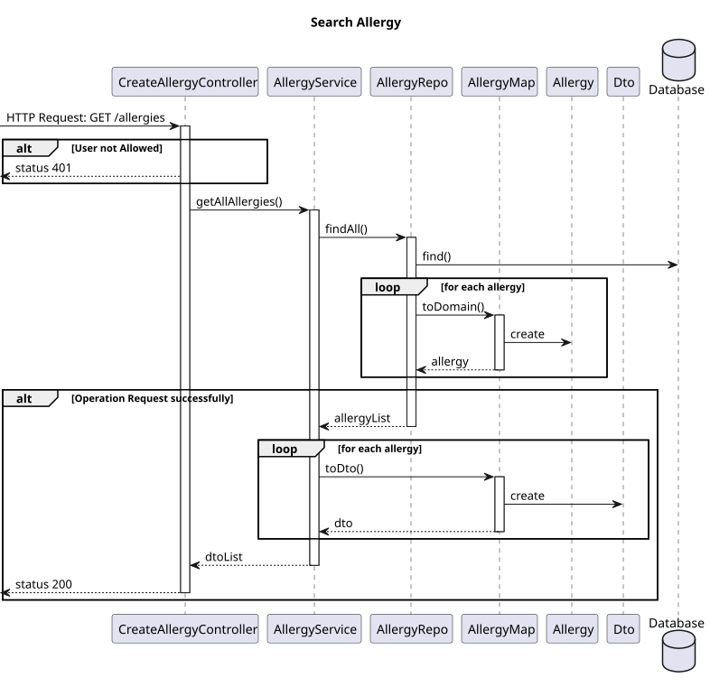
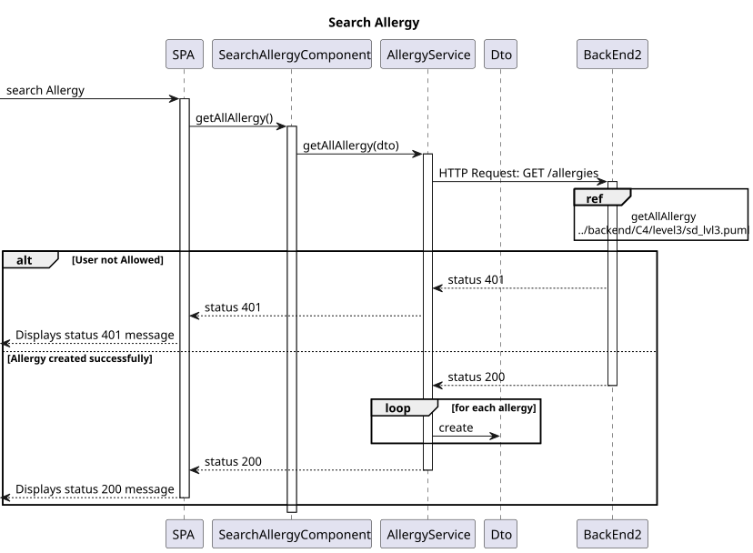
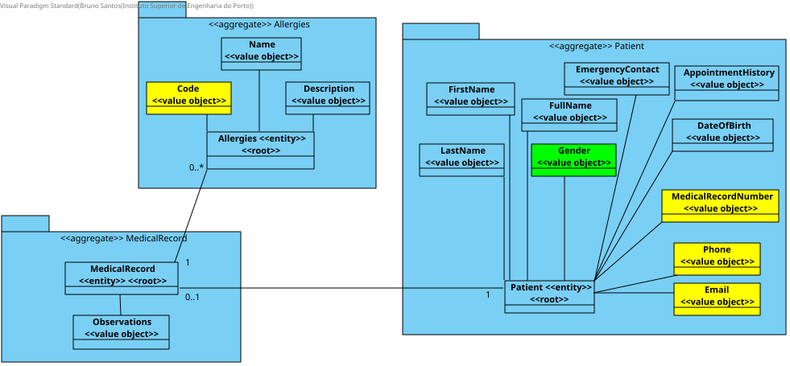

# US7.2.3 | SEM5-51

## 1. Context

- Implement functionality in the frontend and backend so that the doctor can search for allergies and use it to update patient medical record.


## 2. Requirements

**US7.2.3** 
As a Doctor, I want to search for Allergies, so that I can use it to update the Patient Medical Record.

**Acceptance criteria:**

- Must be able to search for allergy by code or name
- When updating patient medical record can select entrys of allergy from a dropdown search menu

## 3. Analysis

- **Q**: Regarding User Story 7.2.3, we would like to confirm how the allergy search functionality should operate. Should the search return all registered allergies, or should it allow searching based on a specific parameter? If it’s based on a parameter, could you specify which one?  
    **R**: This requirement is related to the adding/updating of an allergy entry in the medical record. Thus, when the doctor is adding or editing an allergy entry, they must be able to search for allergies by code or name instead of entering the "id" directly or selecting it from a drop down.  

- **Q**: We would like to ask you if there is a list of allergies that you would prefer us to use in the system by default, if so, which ones? We'd also like to ask if when you say  ‘I want to search for Allergies, so that I can use it to update the Patient Medical Record’ what the last part implies? Is the search done to immediately add to the patient profile or is it just a search done to get information about an allergy, for example?
    **R**: Consider the following sample list of allergies:
            1. Peanut allergy
            2. Shellfish allergy (e.g. prawns, lobster)
            3. Allergy to milk (dairy products)
            4. Egg allergy
            5. Allergy to nuts (e.g. almonds, walnuts)
            6. Wheat allergy
            7. Allergy to penicillin
            8. Allergy to sulfa drugs (e.g. sulphamethoxazole)
            9. Allergy to aspirin
            10. Allergy to local anaesthetics (e.g. lidocaine)
            11. Allergy to pollen (e.g. grass, ragweed)
            12. Allergy to dust mites
            13. Allergy to mould
            14. Allergy to cat dander
            15. Dog dander allergy
            16. Latex allergy
            17. Nickel allergy (common in jewellery or metal objects)
            18. Allergy to bee stings
            19. Allergy to fire ant stings
            20. Perfume allergy (sensitivity to fragrances)
- **Q**: Do you want an allergy to be deleted, inactivated or neither?
     **R**: Since the requirement 7.2.3 is about searching an allergy while updating the medical record, I'll assume, your question is about the "medical record entry - allergy" and not about "allergy". An entry in the medical record cannot be deleted. it can however be marked as "not meaningful anymore". For instance some allergies occur during childhood but disappear as the immune system matures.


## 4. Design

### 4.1. Realization

#### BackEnd2

##### Level 1


##### Level 2


##### Level 3



#### FrontEnd

##### Level 1


##### Level 2


##### Level 3



### 4.2. Class Diagram




### 4.3. Applied Patterns

Applied Patterns description in [DevelopmentPatterns](../../Global/DevelopmentPatterns/readme.md)


### 4.4. Tests

-   **FrontEnd**
    -   Search Allergy component test

    ```
    it('should create the component', () => {...});
    it('should create Allergy dto', () => {...});
    ```
    -   Search Allergy service test
    ```
    it('should get allergy', () => {...});
    it('should handle HTTP errors', () => {...});
    ```
-   **BackEnd2**
    -   Allergy
    ```
    it('should get Allergy', () => {...});
    it('should throw error on invalid Allergy', () => {...});
    it('should create Allergy dto', () => {...});
    ```
    -  Controller 
    ```
    it('should get Allergy', () => {...});
    it('should create Allergy dto', () => {...});
    ```
    - Service
    ```
    it('should call repo on valid allergy, () => {...});
    ```


## 5. Implementation

**FrontEnd**

- Component
  ```
  it('should search with filters'), () => {...};
  it('should handle empty search results'), () => {...};
  ``` 

**BackEnd2**

- Controller
  ```
  public async getAllAllergies(req: Request, res: Response, next: NextFunction) {...};
  ```

- Service
  ```
  public async getAllAllergies(code?: string, name?: string): Promise<Result<IAllergyDTO[]>> {...};
  ```

## 6. Integration/Demonstration

* To run this feature you must log in to the system as Admin or Doctor.