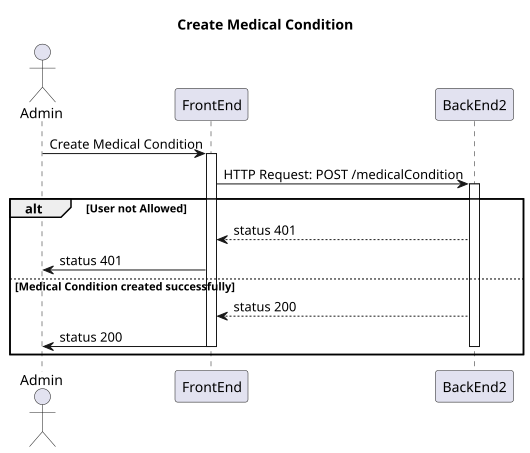
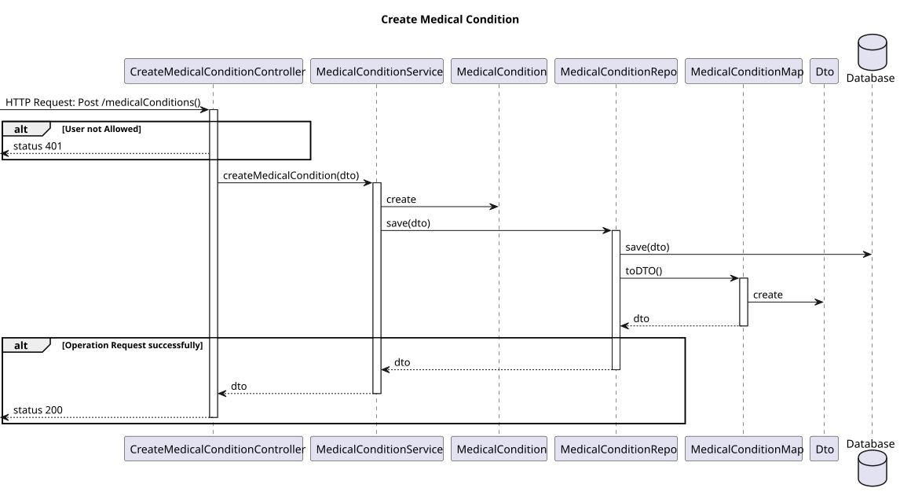
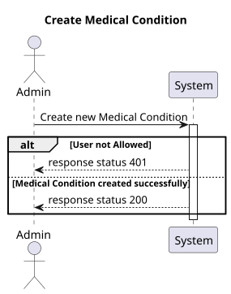
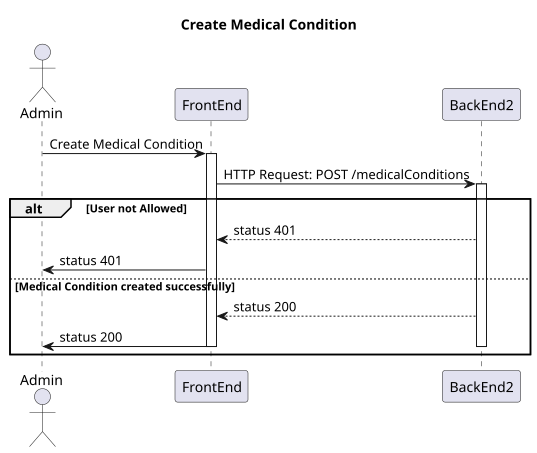
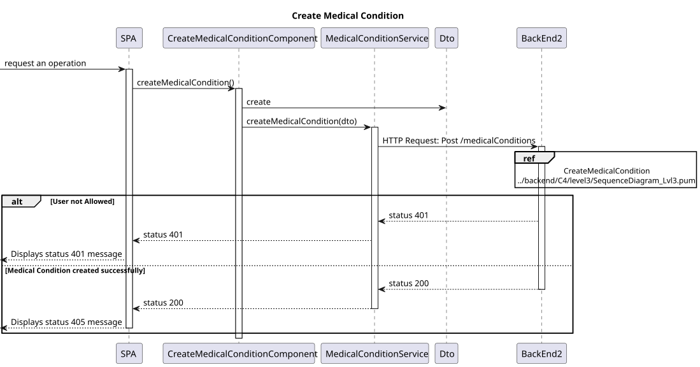

# US 7.2.4

## 1. Context

-   Implement functionality in the frontend and backend so that the admin can create medical conditions so that the doctor can update patient medical record.

## 2. Requirements

**US 7.2.4** As an Admin, I want to add new Medical Condition, so that the Doctors can use it to update the Patient Medical Record.

**Acceptance criteria:**

-   Should contain code base on SNOMED CT (Systematized Nomenclature of Medicine - Clinical Terms) or ICD-11 (International Classification of Diseases, 11th Revision)
-   Should contain Shorter description and a longer description
-   Should contain a list of symptoms
-   Shorter description max caracters: 100
-   Description max caracters: 2048

## 3. Analysis

-   **Q**: The medical condition consist in what? Just a name or are there more fields?
    -   **A**: it consists of a code (for example following ICD (International Classification of Diseases)), a designation and a longer description as well a list of common symptoms
-   **Q**: Earlier, you said the medical condition needed a code. Is this code automatic or is writen by the admin?
    -   **A**: it must conform with the classficiation system you select, for instance, SNOMED CT (Systematized Nomenclature of Medicine - Clinical Terms) or ICD-11 (International Classification of Diseases, 11th Revision)
-   **Q**: Qual seria o tamanho máximo de uma designação e descrição de uma alergia?
    -   **A**: designação, max 100 caracteres, descrição, máximo 2048 caracteres

## 4. Design

### 4.1. Realization

#### BackEnd2

##### Level 1


##### Level 2



##### Level 3



#### FrontEnd

##### Level 1



##### Level 2



##### Level 3



### 4.2. Class Diagram


### 4.3. Applied Patterns

Applied Patterns description in [DevelopmentPatterns](../Global/DevelopmentPatterns/readme.md)

### 4.4. Tests

-   **FrontEnd**
    -   Create Medical Condition component test

    ```
    it('should create the component', () => {...});
    it('should create Medical Condition form group', () => {...});
    it('should create Medical Condition dto', () => {...});
    it('should show success message when Medical Condition is created successfully', () => {...});
    it('should show error message when creation fails', () => {...});
    ```
    -   Create Medical Condition service test
    ```
    it('should create a new medical condition', () => {...});
    it('should handle HTTP errors', () => {...});
    ```
-   **BackEnd2**
    -   Medical Condition
    ```
    it('should create Medical Condition', () => {...});
    it('should throw error on invalid Medical Condition', () => {...});
    it('should create Medical Condition dto', () => {...});
    ```
    -  Controller 
    ```
    it('on create medical condition and return json with right values', async function() {...});
    it('should call service on create medical condition', async function() {...});
    it('on create invalid medical condition return fail error', async function() {...});
    ```
    - Service
    ```
    it('should call repo on valid medical condition, () => {...});
    ```
## 5. Implementation

-   **FrontEnd**
    -   Create Medical Condition component test

    ```
    createMedicalCondition() {
        ...
        if (dto != null) {
            this.service.createMedicalCondition(dto).subscribe({
                next: () => {
                    this.toastr.success(
                        'Medical condition created successfully',
                        'Success'
                    );
                    this.medicalConditionForm.reset();
                },
        ...
    }
    ```
    -   Create Medical Condition service test
    ```
    createMedicalCondition(medicalCondition: CreatingMedicalConditionDto): Observable<MedicalConditionDto> {
        let req: Observable<MedicalConditionDto>;
        req = this.http.post<MedicalConditionDto>(this.baseUrl, medicalCondition);
        ...
    }
    ```
-   **BackEnd2**
    -   Medical Condition
    ```
    public static create(medicalConditionDTO: IMedicalConditionDTO, id?: UniqueEntityID): Result<MedicalCondition> {
        if (!!medicalConditionDTO.code === false || medicalConditionDTO.code.length === 0) {
      return Result.fail<MedicalCondition>('Must provide a medical condition code')
        }
        if (!!medicalConditionDTO.name === false || medicalConditionDTO.name.length === 0) {
        return Result.fail<MedicalCondition>('Must provide a medical condition name')
        }
        if (!!medicalConditionDTO.description === false || medicalConditionDTO.description.length === 0) {
        return Result.fail<MedicalCondition>('Must provide a medical condition description')
        }
        const medicalCondition = new MedicalCondition({ code: medicalConditionDTO.code, name: medicalConditionDTO.name, description: medicalConditionDTO.description, symptoms: medicalConditionDTO.symptoms }, id);
        return Result.ok<MedicalCondition>(medicalCondition)
    }
    ```
    -  Controller 
    ```
    public async createMedicalCondition(req: Request, res: Response, next: NextFunction) {
        ...
        const medicalConditionOrError = await this.medicalConditionServiceInstance.createMedicalCondition(req.body as IMedicalConditionDTO) as Result<IMedicalConditionDTO>;
        if (medicalConditionOrError.isFailure) {
            return res.status(402).send();
        }

        const medicalConditionDTO = medicalConditionOrError.getValue();
        return res.json(medicalConditionDTO).status(201);
        ...
    }
    ```
    - Service
    ```
    public async createMedicalCondition(medicalConditionDTO: IMedicalConditionDTO): Promise<Result<IMedicalConditionDTO>> {
        ...
        const medicalConditionOrError = await MedicalCondition.create(medicalConditionDTO);

        if (medicalConditionOrError.isFailure) {
            return Result.fail<IMedicalConditionDTO>(medicalConditionOrError.errorValue());
        }

        const medicalConditionResult = medicalConditionOrError.getValue();

        await this.medicalConditionRepo.save(medicalConditionResult);

        const medicalConditionDTOResult = MedicalConditionMap.toDTO(medicalConditionResult) as IMedicalConditionDTO;
        return Result.ok<IMedicalConditionDTO>(medicalConditionDTOResult);
        ...
    }
    ```

## 6. Integration/Demonstration
* To execute this funcionality you need to log in as Admin.
