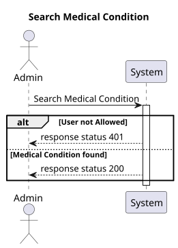
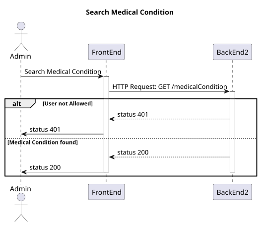
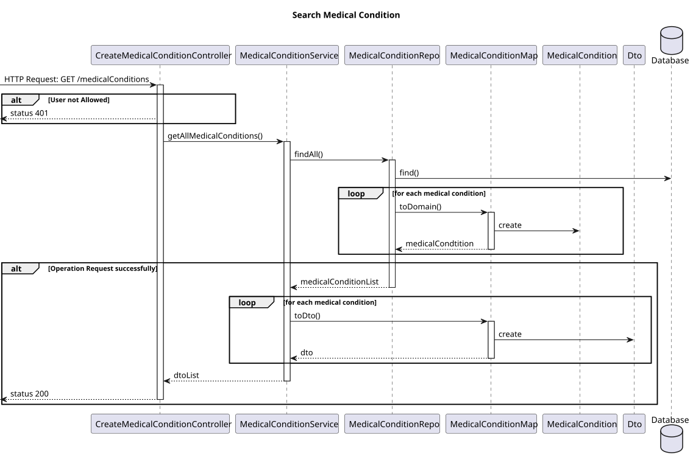
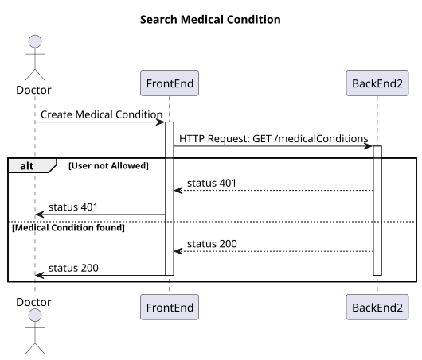
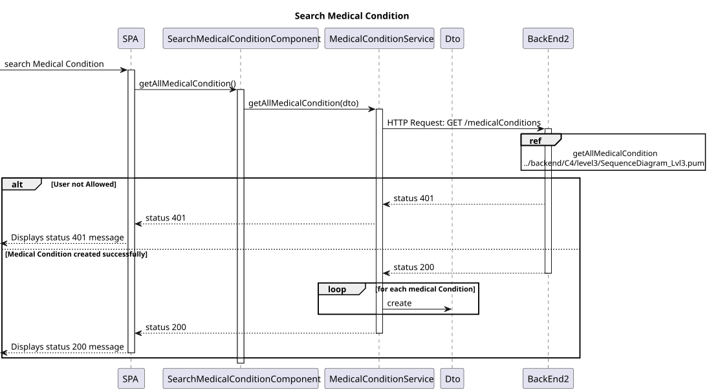

# US 7.2.5

## 1. Context

-   Implement functionality in the frontend and backend so that the doctor can search for medical conditions and use it to update patient medical record.

## 2. Requirements

**US 7.2.5** - As a Doctor, I want to search for Medical Conditions, so that I can use it to update the Patient Medical Record.

**Acceptance criteria:**

- Must be able to search for medical condition by code or designation
- When updating patient medical record can select entrys of medical condition from a dropdown search menu

## 3. Analysis

-   **Q**: Regarding User Story 7.2.5, we would like to confirm how the search for medical conditions should work. Should the search return all registered medical conditions, or should it allow filtering based on a specific parameter? If it’s based on a parameter, could you specify which one?
    -   **A**: This requirement is related to the adding/updating of an medical condition entry in the medical record. Thus, when the doctor is adding or editing a medical condition entry, they must be able to search for medical condition by code or designation instead of entering the "id" directly or selecting it from a drop down.
-   **Q**: Gostaria de lhe perguntar se existe alguma lista de medical conditions que prefere que utilizemos no sistema por default, se sim, quais?
    -   **A**:
        default medical conditions (ICD-11):
            A04.0 Cholera
            A08.0: Rotavirus enteritis
            B20: Human Immunodeficiency Virus (HIV) disease
            B50: Plasmodium falciparum malaria
            2A20.0: Malignant neoplasm of lung
            2F44.0: Malignant neoplasm of the breast
            3A01.1: Iron deficiency anemia
            4A44: Hereditary hemochromatosis
            5A11: Type 1 diabetes mellitus
            5B55: Obesity
            6A80: Major depressive disorder
            6C40: Generalized anxiety disorder
            FB20.1: Osteoporosis with pathological fracture
            FB81.1: Osteoarthritis of the knee
            FB81.2: Osteoarthritis of the hip
            FB80.1: Rheumatoid arthritis
            FA24.0: Fracture of femur
            FA22.0: Fracture of radius and ulna
            FA21.0: Dislocation of shoulder
            FB70.0: Low back pain
-   **Q**: Que a procura é feita para adicionar imediatamente ao perfil de paciente ou se é apenas uma procura feita para ir buscar a informação sobre uma medical condition por exemplo?
    -   **A**: Quando o médico está a editar o registo médico do paciente, deve ter a possibilidade de inserir entradas de alergias e/ou condições médicas através de pesquisa de alergias/condições médicas
-   **Q**: What do you define as Medical Condition? Is it an allergy?
    -   **A**: They are two different things. A Medical Condition represents a diagnosed health issue or disease. Examples: Diabetes, Hypertension, Asthma, etc.


## 4. Design

### 4.1. Realization

#### BackEnd2

##### Level 1



##### Level 2



##### Level 3



#### FrontEnd

##### Level 1


##### Level 2



##### Level 3



### 4.2. Class Diagram


### 4.3. Applied Patterns

Applied Patterns description in [DevelopmentPatterns](../Global/DevelopmentPatterns/readme.md)

### 4.4. Tests

-   **FrontEnd**
    -   Search Medical Condition component test

    ```
    it('should create the component', () => {...});
    it('should create Medical Condition dto', () => {...});
    ```
    -   Search Medical Condition service test
    ```
    it('should get medical condition', () => {...});
    it('should handle HTTP errors', () => {...});
    ```
-   **BackEnd2**
    -   Medical Condition
    ```
    it('should get Medical Condition', () => {...});
    it('should throw error on invalid Medical Condition', () => {...});
    it('should create Medical Condition dto', () => {...});
    ```
    -  Controller 
    ```
    it('should get Medical Condition', () => {...});
    it('should create Medical Condition dto', () => {...});
    ```
    - Service
    ```
    it('should call repo on valid medical condition, () => {...});
    ```
## 5. Implementation

## 6. Integration/Demonstration
